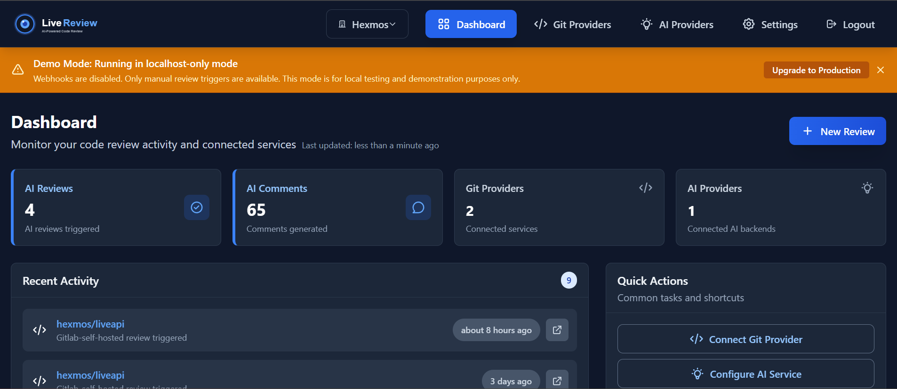

# Secure, Flexible & Affordable AI Code Reviewer

*LiveReview* is a self-hosted AI code reviewer that keeps your code private, adapts to your setup, and won’t blow your budget.



> [!NOTE]
>
> LiveReview is a proprietary developer tool by Hexmos, built to streamline code review and help teams ship faster.
>
> Guides, documentation, roadmaps, and community discussions are fully open, making it easy to get started, provide feedback, and stay informed about product evolution.

## Our Approach

1. **Security:** LiveReview runs entirely on your infrastructure—on-prem or private cloud. **Your source code and credentials never leave your environment unless you choose.** Recent breaches of cloud-hosted reviewers show how even small misconfigurations can expose entire repositories. With LiveReview, those risks are eliminated by design.**Security:** LiveReview runs on your servers, on your premises. Your code may never leave your server, without your say-so. Recent incidents around competitors show how in Cloud Based setups tiny mistakes can keep your IP/code exposed to the world
2. **Flexibility:** LiveReview adapts to your workflow instead of locking you in. **It integrates with GitHub, GitLab, and Bitbucket,** and lets you choose the AI backend that fits your needs—**Gemini, OpenAI, or self-hosted Ollama** for maximum privacy. If your setup is unusual, open an [issue](https://github.com/HexmosTech/LiveReview/issues?utm_source=chatgpt.com) and we’ll work with you—because good code reviews shouldn’t depend on rigid tooling.
3. **Affordability:** LiveReview is paid software, built for long-term sustainability. **Our pricing is straightforward and significantly lower than comparable hosted tools**, while still funding a strong engineering team focused on R&D. We invest in product improvements, not marketing hype -- so customers get maximum value for every dollar.

## How is this better than...

1. **GitHub Copilot:** Copilot only works on GitHub, with one cloud-hosted AI model. LiveReview runs across GitHub, GitLab, and Bitbucket, is self-hosted for stronger security, and lets you choose your own AI backend—so you stay in control of both costs and quality.
2. **CodeRabbit:** LiveReview is more affordable than CodeRabbit and keeps your code under your control by running self-hosted. Cloud-hosted reviewers, including CodeRabbit, have recently been compromised—allowing attackers to execute code and gain access to private repositories. LiveReview avoids this entire risk by design.
3. **Why not build our own?** Building a reliable AI code reviewer is deceptively complex. Even experienced teams quickly run into integration headaches—code host APIs, MR/PR handling, prompt tuning, webhooks, dashboards, and user management all require constant maintenance. LiveReview delivers high-quality AI reviews out of the box, with a secure, self-hosted setup—so your team stays focused on product, not infrastructure.

## Features

- Integrated Dashboard - See usage statistics, impact analysis, user activity and overall impact
- Git Provider - Connect as many git providers as you want - Github, Gitlab, Bitbucket supported already.
- AI Connector - Connect your Gemini, OpenAI or Self-Hosted Ollama Keys
- Demo and Production modes - Try it out in 5 minutes, and make it production grade quickly with built-in help
- High Quality MR Summary - which goes through all the changes in its full context and produces short and medium ize summaries of reviews
- Find a large number of technical issues in areas such as: unused variables, security vulnerabilities, performance issues, missing error handling, duplicated code detection, null pointer detection, data structure fit to problem, etc. Find a full list of both technical and business benefits in the [landing page](https://hexmos.com/livereview)

## Quick Start

Get LiveReview running in under 5 minutes with our simplified two-mode deployment system:

### Demo Mode (Recommended for First Time)

Perfect for development, testing, and evaluation - no configuration required!

```bash
# Quick demo setup (localhost only, no webhooks)
curl -fsSL https://raw.githubusercontent.com/HexmosTech/LiveReview/main/lrops.sh | bash -s -- setup-demo

# Or use the express flag (same as demo mode)
curl -fsSL https://raw.githubusercontent.com/HexmosTech/LiveReview/main/lrops.sh | bash -s -- --express
```

**Demo Mode Features:**

- 🚀 **Zero configuration** - just run and go
- 🏠 **Localhost only** - secure local development
- 🔧 **Manual triggers** - webhooks disabled for simplicity
- 📱 **Perfect for testing** - try LiveReview without any setup
- 💡 **Easy upgrade path** - switch to production mode anytime

**Access your demo installation:**

- Web UI: http://localhost:8081/
- API: http://localhost:8888/api

### Production Mode (External Access Ready)

For teams and production deployments with reverse proxy and webhooks:

```bash
# Production setup with reverse proxy support
curl -fsSL https://raw.githubusercontent.com/HexmosTech/LiveReview/main/lrops.sh | bash -s -- setup-production
```

**Production Mode Features:**

- 🌐 **External access** - ready for reverse proxy setup
- 🔗 **Webhooks enabled** - automatic code review triggers
- 🔒 **SSL/TLS ready** - secure for production use
- ⚡ **Auto-configuration** - webhook URLs derived automatically

**After production installation:**

1. Configure reverse proxy (nginx/caddy) - see `lrops.sh help nginx`
2. Set up SSL/TLS certificates - see `lrops.sh help ssl`
3. Point your domain to the server
4. Configure GitLab/GitHub webhooks (auto-populated URLs)

### Two-Mode Deployment System

LiveReview uses an intelligent two-mode system that automatically adapts based on your deployment:


| Feature           | Demo Mode                       | Production Mode               |
| ------------------- | --------------------------------- | ------------------------------- |
| **Access**        | localhost only                  | External via reverse proxy    |
| **Webhooks**      | Disabled (manual triggers)      | Enabled (automatic triggers)  |
| **Configuration** | Zero config required            | Reverse proxy setup needed    |
| **Perfect for**   | Development, testing, demos     | Teams, production deployments |
| **Upgrade**       | `LIVEREVIEW_REVERSE_PROXY=true` | Ready out of the box          |

### Switching Between Modes

**Demo → Production:**

```bash
# Edit your .env file
echo "LIVEREVIEW_REVERSE_PROXY=true" >> /opt/livereview/.env

# Restart services
lrops.sh restart

# Configure reverse proxy
lrops.sh help nginx  # or caddy, apache
```

**Production → Demo:**

```bash
# Edit your .env file  
sed -i 's/LIVEREVIEW_REVERSE_PROXY=true/LIVEREVIEW_REVERSE_PROXY=false/' /opt/livereview/.env

# Restart services
lrops.sh restart
```

This will:

1. ✅ Install LiveReview with Docker and PostgreSQL
2. ✅ Auto-detect deployment mode (demo/production)
3. ✅ Set up secure defaults and auto-generated passwords
4. ✅ Deploy to `/opt/livereview/` with persistent data storage
5. ✅ Configure environment-aware webhook URLs
6. ✅ Provide access URLs and mode-specific guidance

After installation, configure your GitLab/GitHub providers, and start reviewing code!

## Installation

### Option 1: Simplified Two-Mode Installer (Recommended)

LiveReview now features a revolutionary two-mode deployment system that adapts to your needs:

#### Quick Demo Setup (Perfect for First Time)

Zero configuration required - perfect for development and evaluation:

```bash
# Quick demo mode (localhost only, no webhooks)
lrops.sh setup-demo

# Alternative: one-line installer
curl -fsSL https://raw.githubusercontent.com/HexmosTech/LiveReview/main/lrops.sh | bash -s -- setup-demo
```

#### Production Setup (Teams & Production)

External access ready with reverse proxy and webhook support:

```bash
# Production mode (reverse proxy + webhooks)
lrops.sh setup-production  

# Alternative: one-line installer
curl -fsSL https://raw.githubusercontent.com/HexmosTech/LiveReview/main/lrops.sh | bash -s -- setup-production
```

#### Legacy Express Mode (Demo Mode)

```bash
# Express mode (same as demo mode for backward compatibility)
curl -fsSL https://raw.githubusercontent.com/HexmosTech/LiveReview/main/lrops.sh | bash -s -- --express

# Interactive installation (guided setup)  
curl -fsSL https://raw.githubusercontent.com/HexmosTech/LiveReview/main/lrops.sh | bash

# Install specific version
curl -fsSL https://raw.githubusercontent.com/HexmosTech/LiveReview/main/lrops.sh | bash -s -- --version=v1.2.3 setup-demo
```

#### What the installer does:

- ✅ **Intelligent mode detection** - automatically configures demo vs production
- ✅ **System prerequisites check** (Docker, Docker Compose)
- ✅ **Smart environment configuration** - uses LIVEREVIEW_* environment variables
- ✅ **Secure password generation** - strong defaults for database and JWT
- ✅ **Docker deployment** - PostgreSQL database included
- ✅ **Webhook auto-configuration** - URLs derived based on deployment mode
- ✅ **Management script installation** (`lrops.sh`) for ongoing operations
- ✅ **Mode-specific guidance** - next steps tailored to your deployment

**After installation**, manage LiveReview with:

```bash
lrops.sh status          # Check installation status and deployment mode
lrops.sh start           # Start services  
lrops.sh stop            # Stop services
lrops.sh restart         # Restart services (useful after mode changes)
lrops.sh logs            # View container logs
lrops.sh help ssl        # SSL setup guidance (production mode)
lrops.sh help nginx      # Nginx reverse proxy setup
lrops.sh help caddy      # Caddy reverse proxy setup (automatic SSL)
lrops.sh help backup     # Backup strategies
```

#### Environment Variables (Advanced)

The two-mode system uses these environment variables for configuration:

```bash
# Core deployment configuration
LIVEREVIEW_BACKEND_PORT=8888              # Backend API port
LIVEREVIEW_FRONTEND_PORT=8081             # Frontend UI port  
LIVEREVIEW_REVERSE_PROXY=false            # Demo mode (true = production mode)

# Database and security (auto-generated)
DB_PASSWORD=<secure-generated-password>   # PostgreSQL password
JWT_SECRET=<secure-generated-secret>      # JWT signing key
```

**Mode Detection Logic:**

- `LIVEREVIEW_REVERSE_PROXY=false` → **Demo Mode** (localhost, no webhooks)
- `LIVEREVIEW_REVERSE_PROXY=true` → **Production Mode** (reverse proxy, webhooks enabled)

### Option 2: Build from Source

```bash
# Clone the repository
git clone https://github.com/yourusername/livereview.git

# Build the binary
cd livereview
go build

# Run the binary
./livereview --help
```

### Option 3: Docker

LiveReview is available as a Docker image with support for multiple architectures (amd64, arm64).

#### Quick Start with Docker

```bash
# Pull the latest image
docker pull git.apps.hexmos.com:5050/hexmos/livereview:latest

# Run with configuration file
docker run -v $(pwd)/livereview.toml:/app/livereview.toml \
  git.apps.hexmos.com:5050/hexmos/livereview:latest
```

#### Building Docker Images

The project includes comprehensive Docker build tooling that handles versioning and multi-architecture builds:

```bash
# Build single-architecture image (current platform)
make docker-build

# Build and push single-architecture image
make docker-build-push

# Build multi-architecture image (amd64 + arm64)
make docker-multiarch

# Build and push multi-architecture image
make docker-multiarch-push

# Interactive Docker build with tag selection
make docker-interactive

# Interactive multi-architecture build
make docker-interactive-multiarch
```

#### Multi-Architecture Support

LiveReview Docker images support multiple architectures to resolve GitLab Container Registry "blob unknown" errors when creating manifest lists:

- **amd64**: For x86_64 systems
- **arm64**: For ARM64 systems (Apple Silicon, AWS Graviton, etc.)

The build process automatically:

1. Builds architecture-specific images with proper tags (e.g., `myapp:1.0.0-amd64`, `myapp:1.0.0-arm64`)
2. Pushes individual architecture images to the same repository
3. Creates and pushes a manifest list that references all architectures
4. Tags the manifest list with the main version tag (e.g., `myapp:1.0.0`, `myapp:latest`)

This approach ensures compatibility with GitLab Container Registry requirements for multi-architecture images.

## Configuration

LiveReview uses a TOML configuration file (`livereview.toml`) to store settings.

### Initialize Configuration

```bash
./livereview config init
```

This will create a `livereview.toml` file with default settings that you can customize.

### GitLab Configuration

To use LiveReview with GitLab, you need to configure your GitLab instance and provide an access token.

#### Getting a GitLab Access Token

1. **Log in to your GitLab instance** (e.g., https://git.apps.hexmos.com)
2. **Access your User Settings**:

   - Click on your avatar in the top-right corner
   - Select "Preferences" or "Settings" from the dropdown menu
3. **Navigate to Access Tokens**:

   - In the left sidebar, find and click on "Access Tokens"
   - This may be under a section called "User Settings" or directly in the sidebar
4. **Create a new token**:

   - Enter a name for your token (e.g., "LiveReview Tool")
   - Set an optional expiration date (or leave blank for a non-expiring token)
   - Select the required scopes:
     - `api` (Required for API access)
     - `read_repository` (To read repository content)
     - `write_discussion` (To post comments)
5. **Generate the token**:

   - Click the "Create personal access token" button
   - **Important**: Copy the token immediately! GitLab will only show it once.
6. **Update your configuration**:

   - Open your `livereview.toml` file
   - Replace `"your-gitlab-token"` with the actual token you just copied:

```toml
[providers.gitlab]
url = "https://git.apps.hexmos.com"
token = "glpat-xxxxxxxxxxxxxxxxx"  # Your actual token here
```

#### Alternative: Project Access Token

If you prefer to limit the token's access to specific projects:

1. Go to the project settings (Project → Settings → Access Tokens)
2. Create a project access token with appropriate permissions
3. Use this token in your configuration

#### Security Best Practices

1. **Don't commit your token**: Make sure not to commit your actual token to version control
2. **Use environment variables**: For production use, consider using environment variables:

   ```
   export LIVEREVIEW_PROVIDERS_GITLAB_TOKEN="your-token-here"
   ```
3. **Set an expiration date**: For better security, set an expiration date on your token
4. **Use minimum required scopes**: Only select the scopes you actually need

### Gemini AI Configuration

To use the Gemini AI backend, you need to provide an API key:

1. Visit [Google AI Studio](https://makersuite.google.com/) to get an API key
2. Add the key to your configuration:

```toml
[ai.gemini]
api_key = "your-gemini-api-key"  # Your actual API key here
model = "gemini-pro"
temperature = 0.2
```

## Usage

### Reviewing a Merge Request

```bash
./livereview review https://gitlab.example.com/group/project/-/merge_requests/123
```

### Options

- `--dry-run, -d`: Run review without posting comments to GitLab
- `--verbose, -v`: Enable verbose output
- `--provider, -p`: Override the default provider
- `--ai, -a`: Override the default AI backend
- `--config, -c`: Specify a different configuration file

## Architecture

LiveReview uses a modular architecture that supports multiple code hosting providers and AI backends through abstraction interfaces.

## Current Status and Known Issues

### Implementation Status

The current implementation includes:

- Basic GitLab integration with mock data
- Gemini AI provider implementation with mock review generation
- Command line interface with support for dry-run mode and verbose output

### Known Issues

1. **GitLab API Client Compatibility**: The GitLab client library (v0.3.0) uses incorrect API endpoint paths:

   - It uses `/merge_request/` (singular) instead of `/merge_requests/` (plural)
   - This causes 404 errors when trying to fetch MR details
   - Currently using mock implementations to work around this issue

### Next Steps

1. **Fix GitLab API Integration**:

   - Option A: Upgrade to a newer version of the GitLab client
   - Option B: Implement direct HTTP requests to GitLab API
   - Option C: Create a custom fork of the client with fixed endpoints
2. **Implement Real AI Integration**:

   - Connect to Gemini API with proper prompt engineering
   - Implement context-aware code review capabilities
   - Add support for different types of feedback (security, performance, style)
3. **Add Support for Other Providers**:

   - GitHub integration
   - BitBucket integration
4. **Add Daemon Mode**:

   - Implement a background service that monitors for new MRs/PRs
   - Automatically trigger reviews based on configurable rules

## License

[MIT License](LICENSE)
