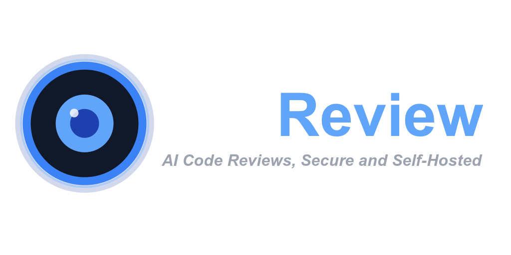
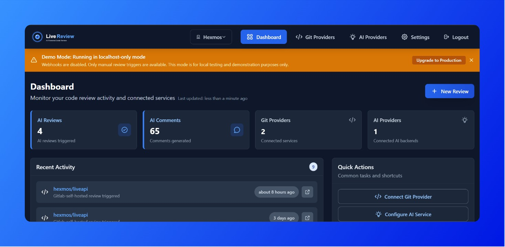
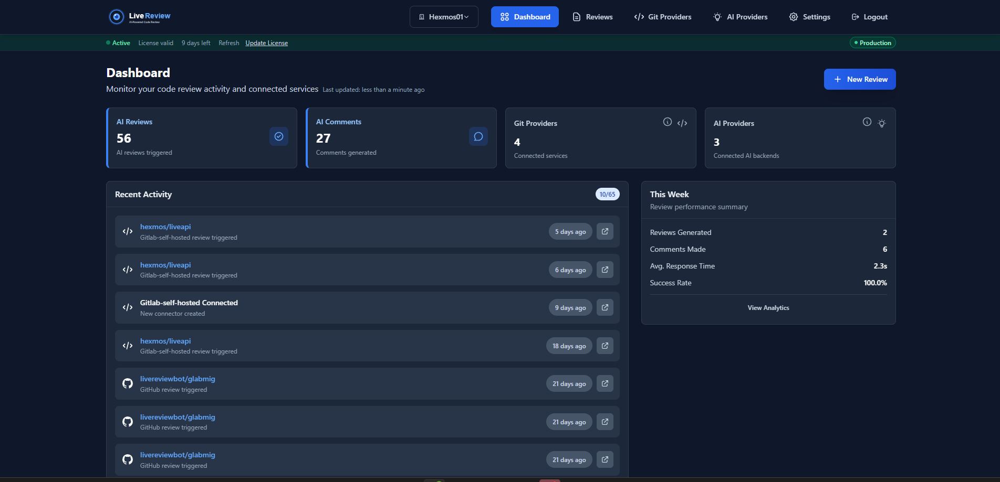
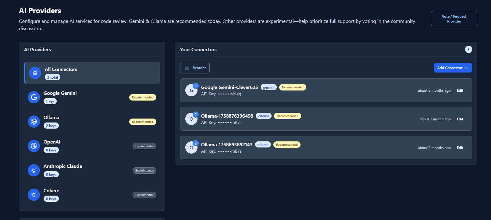
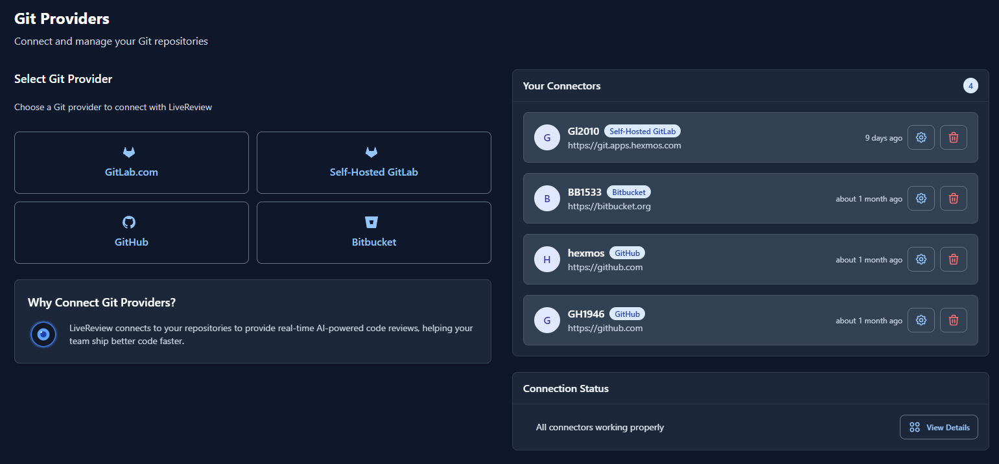
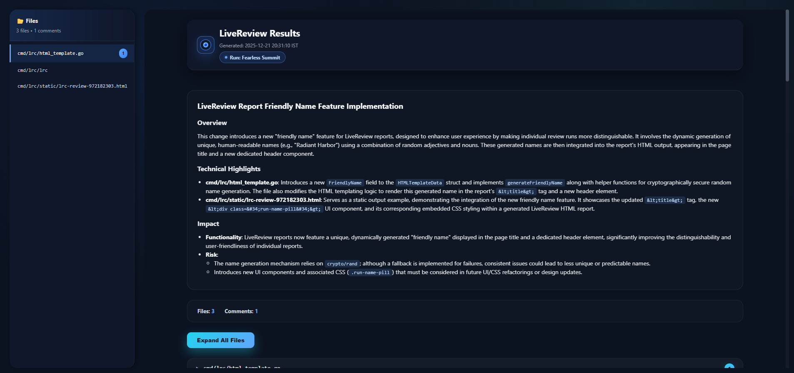
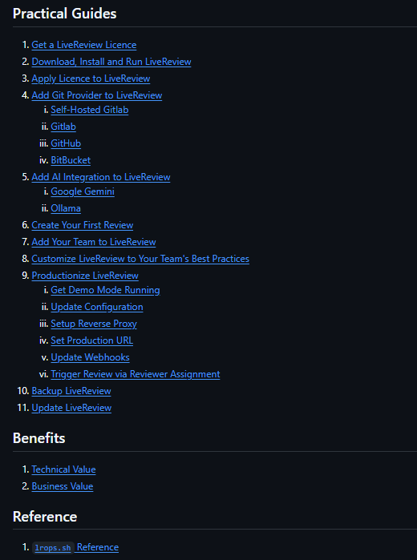

# AI Code Review with Teeth.

**A powerful and flexible AI code reviewer — light on the pocket, heavy on impact.**

<p align="center">
   
</p>

<p align="center">
   <a href="#quick-start">Quick Start</a> |
   <a href="#why-livereview">Why LiveReview</a> |
   <a href="#features">Features</a> |
   <a href="#cli">CLI</a> |
   <a href="#ide-extensions">Extensions</a> |
   <a href="#self-hosted-tiers">Tiers</a> |
   <a href="#comparisons">Comparisons</a>
</p>

<p align="center">
   <b>Self-Host for Free:</b> <a href="#quick-start">Get Started in 5 Minutes</a><br/>
   <i>Don't want to self-host?</i> <a href="https://hexmos.com/livereview">Try the Cloud Version</a>
</p>

---

<a id="quick-start"></a>
## Quick Start — Self-Hosted Community Edition (Free)

Get LiveReview running in under 5 minutes. The **Community Edition is completely free** and includes everything you need to start AI-powered code reviews.

### One-Command Install

```bash
# Quick demo setup (localhost only, no webhooks)
curl -fsSL https://raw.githubusercontent.com/HexmosTech/LiveReview/main/lrops.sh | sudo bash -s -- setup-demo
```

**Requirements:**
- `bash` shell (zsh/fish not officially supported)
- Ubuntu/MacOS
- Docker (with `docker-compose` or `docker compose`)
- `jq`

You'll need a **Free Licence** to get started — follow the guide [here](https://github.com/HexmosTech/LiveReview/wiki/Get-a-LiveReview-Licence).

**Access your installation:**
- Web UI: http://localhost:8081/
- API: http://localhost:8888/api

### What You Get for Free (Community Edition)

- ✅ **Full AI Code Reviews** — Same powerful AI review engine as paid tiers
- ✅ **All Git Providers** — GitHub, GitLab, Bitbucket, Gitea integration
- ✅ **Any AI Provider** — Gemini, OpenAI, or self-hosted Ollama
- ✅ **Dashboard & Analytics** — Track review quality and team velocity
- ✅ **Up to 3 Users** — Perfect for small teams or individual developers
- ✅ **Unlimited Reviews** — No daily limits, review as much as you need

### Production Deployment

For teams needing external access and webhooks, follow the [Productionization Guide](https://github.com/HexmosTech/LiveReview/wiki/Productionize-LiveReview).

| Feature | Demo Mode | Production Mode |
|---------|-----------|-----------------|
| **Access** | localhost only | External via reverse proxy |
| **Webhooks** | Disabled (manual triggers) | Enabled (automatic triggers) |
| **Configuration** | Zero config required | Reverse proxy setup needed |
| **Perfect for** | Development, testing, demos | Teams, production deployments |

---

<a id="why-livereview"></a>
## Why LiveReview

| | |
|---|---|
| **Git-Level Guardrails** | Unread code never sneaks in. Reviews track every commit, and deliberate skips stay in the audit trail. |
| **Works With Your Git Setup** | GitHub, GitLab, Bitbucket, Gitea, or something else—LiveReview adapts to your workflow, not the other way around. |
| **Choose Your AI** | Pick the LLMs that match quality, latency, and budget today—and swap them whenever your requirements change. |
| **Works Wherever You Do** | Web, CLI, IDE. Cloud, self-hosted, or air gapped. Same guardrails and visibility everywhere. |
| **Priced to Stay Out of the Way** | The cost of review shouldn't decide whether review happens. LiveReview stays lean so teams can use it daily. |
| **Enough Depth When You Need It** | Line-level review, real MR conversations, and durable team learnings—without the usual tool bloat. |

### Why Engineering Teams Love LiveReview

- **Accelerate Delivery Cycles** — Reduce PR review time from hours to minutes, enabling your team to ship features faster and with greater confidence
- **Save Senior Engineering Time** — Liberate senior developers from routine reviews, allowing them to focus on mentorship and high-impact architectural work
- **Drive Quality Excellence** — Build a culture of quality with metrics that highlight improvements in code standards, reduced defects, and development efficiency

---

<a id="features"></a>
## Powerful Features for Modern Engineering Teams

<p align="center">
   
</p>

### Track Engineering Excellence
Quantify your team's improvement with comprehensive metrics. Track review times, code quality trends, and team velocity to demonstrate engineering value to stakeholders.

### Pick Your AI: Gemini, OpenAI, or Self-Hosted Ollama
Bring Your Own Key (BYOK) - Use Gemini, OpenAI, or any LLM provider of your choice. Maintain complete control over your AI usage and costs while leveraging the best models for your needs.

<p align="center">
   
</p>

### Use Any Git Provider: GitHub, GitLab, Bitbucket, Gitea
Works effortlessly with GitHub, GitLab, Bitbucket, Gitea. Connect your repositories in minutes and start receiving AI-powered code reviews across all your projects.

<p align="center">
   
</p>

### View All AI Reviews in One Place
Manage all your code reviews from a single, intuitive interface. Track review status, prioritize PRs, and monitor team activity with real-time updates.

### Sharp AI-Generated Pull Request Summaries
Get detailed, actionable summaries of every pull request. Understand changes at a glance with AI-generated insights that highlight key modifications, potential issues, and improvement suggestions.

### Ask AI for Clarification or Debate Code Changes
Ask questions and get instant clarifications about code changes. The AI reviewer understands context and provides helpful explanations to speed up the review process.

### Customize Review Prompts to Fit Your Team
Tailor AI review behavior to match your team's coding standards and priorities. Create custom prompts that focus on what matters most to your organization. *(Team & Enterprise)*

### Discuss with AI in MR and See it Learn Everyday
Build an institutional knowledge base from code reviews. Capture best practices, common issues, and team learnings to continuously improve code quality. *(Team & Enterprise)*

---

<a id="cli"></a>
## Git-Native Code Review Protocol

LiveReview adds a new git subcommand: `git lrc review`. Review before every commit, explicitly skip when needed, and maintain an auditable trail in your git history.

```bash
# Typical Git Guardrails Flow
git add .
git lrc review

# Or skip explicitly (auditable in git log):
git lrc review --skip
git commit -m "message"
```

<p align="center">
   
</p>

**CLI Benefits:**
- Review becomes part of git workflow, not an afterthought
- Runs directly in your repo on uncommitted code
- Skips are explicit and tracked in commit history
- Human oversight for AI-generated code

### Quick Install

**Linux/macOS:**
```bash
curl -fsSL https://hexmos.com/lrc-install.sh | bash
```

**Windows (PowerShell):**
```powershell
iwr -useb https://hexmos.com/lrc-install.ps1 | iex
```

---

<a id="ide-extensions"></a>
## IDE Extensions

Get instant AI code reviews without leaving your editor. Available for VSCode, Cursor, and Antigravity.

| IDE | Install Link |
|-----|--------------|
| **VSCode** | [Visual Studio Marketplace](https://marketplace.visualstudio.com/items?itemName=Hexmos.livereview) |
| **Cursor** | [Open VSX Registry](https://open-vsx.org/extension/hexmos/livereview) |
| **Antigravity** | [Open VSX Registry](https://open-vsx.org/extension/hexmos/livereview) |

---

<a id="self-hosted-tiers"></a>
## Self-Hosted Tiers

LiveReview offers three tiers for self-hosted deployments. **Community Edition is free forever** and provides genuine value for small teams and individual developers.

| Feature | Community (Free) | Team | Enterprise |
|---------|:----------------:|:----:|:----------:|
| AI Code Reviews | ✅ | ✅ | ✅ |
| Git Provider Integration | ✅ | ✅ | ✅ |
| AI Provider Configuration | ✅ | ✅ | ✅ |
| Dashboard & Analytics | ✅ | ✅ | ✅ |
| **Unlimited Reviews** | ✅ | ✅ | ✅ |
| Users | Up to 3 | Unlimited | Unlimited |
| Prompt Customization | ❌ | ✅ | ✅ |
| Learnings Management | ❌ | ✅ | ✅ |
| Multiple API Keys | ❌ | ✅ | ✅ |
| Priority Support | ❌ | ✅ | ✅ |
| SSO / SAML | ❌ | ❌ | ✅ |
| Audit Logs | ❌ | ❌ | ✅ |
| Compliance Reports | ❌ | ❌ | ✅ |
| Custom Integrations | ❌ | ❌ | ✅ |

**Growing team?** Upgrade to Team or Enterprise for advanced features, priority support, and unlimited users.

[Get a License](https://hexmos.com/livereview/selfhosted-access/)

---

<a id="comparisons"></a>
## How LiveReview Compares

### vs GitHub Copilot Code Review
- **Multi-Platform Support**: Works with GitHub, GitLab, Bitbucket, AND Gitea (not just GitHub)
- **Self-Hosted Option**: Your code stays private vs cloud-only risk
- **AI Choice Freedom**: Pick your AI backend vs locked into one model
- **Cost Control**: You control both costs and quality

### vs CodeRabbit
- **More Affordable**: Significantly lower pricing
- **Zero Cloud Risk**: Self-hosted option vs cloud-only deployment
- **Complete Control**: Your code never leaves your infrastructure (with self-hosted)
- **Attack Prevention**: Eliminates entire class of cloud-based vulnerabilities

### vs Graphite / Qodo Merge / CodeAnt AI
- **Deployment Flexibility**: Cloud or self-hosted — your choice
- **AI Provider Freedom**: Bring your own keys, use any LLM
- **Git-Native Protocol**: `git lrc review` integrates directly into your workflow
- **Works Everywhere**: Web, CLI, IDE — same experience across all

### vs Building Your Own
- **Ready Out-of-Box**: Skip months of development time
- **Complex Integration Covered**: Code host APIs, webhooks, dashboards all handled
- **AI Expertise Included**: Advanced prompt engineering and review logic included
- **Ongoing Maintenance**: No need for ongoing MR/PR handling, user management
- **Focus on Product**: Your team builds features, not infrastructure

---

## Full Documentation

Visit the [Wiki](https://github.com/HexmosTech/LiveReview/wiki) for complete documentation:

<a href="https://github.com/HexmosTech/LiveReview/wiki"></a>

---

## FAQ

**How will LiveReview benefit our engineering organization?**
LiveReview provides tangible improvements in code quality and delivery speed while generating meaningful metrics that demonstrate the value of your engineering investments. Teams typically see a 70% reduction in review time and up to 40% increase in velocity.

**Is my code secure with LiveReview?**
Absolutely. With self-hosted deployment, all code stays within your infrastructure with no data sent to external servers. For teams preferring managed hosting, our [cloud version](https://hexmos.com/livereview/) uses industry-standard security practices and encryption.

**What's the difference between Community and paid tiers?**
Community Edition is fully functional with unlimited reviews, all AI providers, and all git integrations — limited to 3 users. Team and Enterprise tiers add prompt customization, learnings management, priority support, and unlimited users.

---

## License

LiveReview is distributed under a modified variant of **Sustainable Use License (SUL)**.

> [!NOTE]
>
> **What this means:**
> - ✅ **Source Available** — Full source code is available for self-hosting
> - ✅ **Business Use Allowed** — Use LiveReview for your internal business operations
> - ✅ **Modifications Allowed** — Customize for your own use
> - ❌ **No Resale** — Cannot be resold or offered as a competing service
> - ❌ **No Redistribution** — Cannot redistribute modified versions commercially
>
> This license ensures LiveReview remains sustainable while giving you full access to self-host and customize for your needs.

---

<p align="center">
   <b>Self-Host:</b> <a href="#quick-start">Get Started Free</a> | 
   <b>Cloud:</b> <a href="https://hexmos.com/livereview/">Try hexmos.com/livereview</a> | 
   <a href="https://github.com/HexmosTech/LiveReview/wiki">Documentation</a>
</p>
