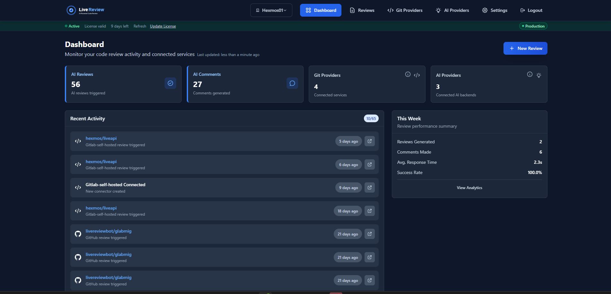
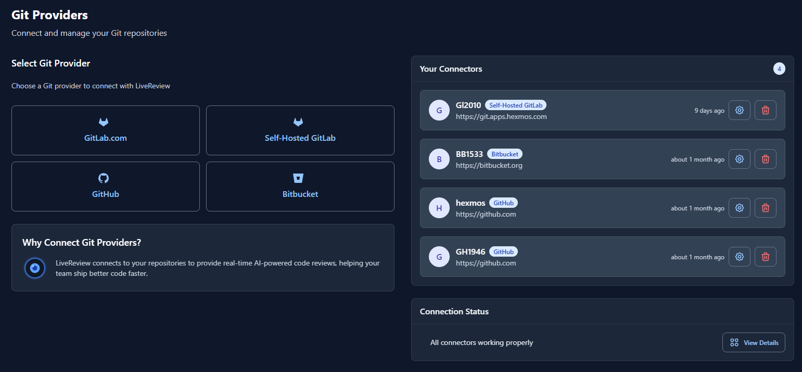
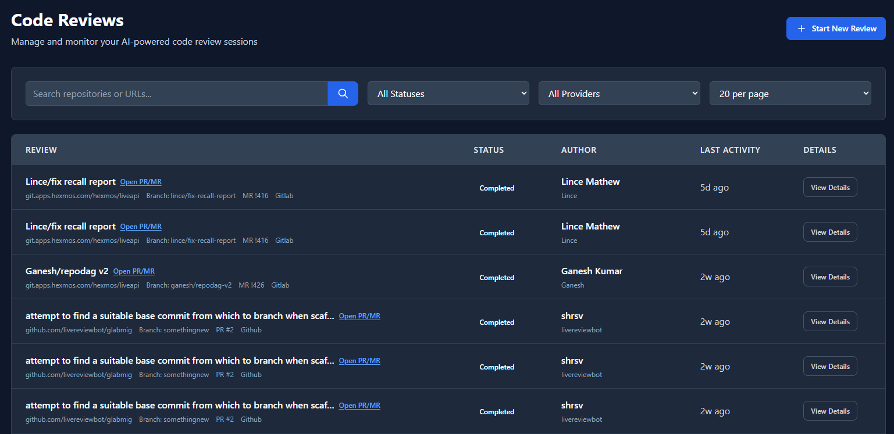
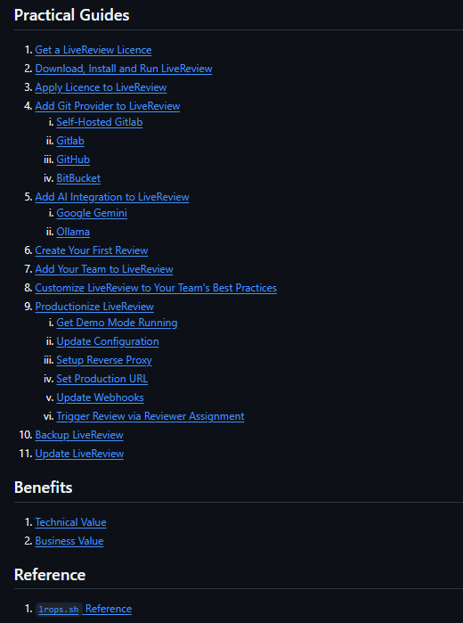

<a href="https://github.com/HexmosTech/LiveReview/actions/workflows/gitleaks.yml" target="_blank" rel="noopener noreferrer"></a>&nbsp;<a href="https://github.com/HexmosTech/LiveReview/actions/workflows/osv-scanner.yml" target="_blank" rel="noopener noreferrer"></a>&nbsp;<a href="https://github.com/HexmosTech/LiveReview/actions/workflows/govulncheck.yml" target="_blank" rel="noopener noreferrer"></a>&nbsp;<a href="https://github.com/HexmosTech/LiveReview/actions/workflows/semgrep.yml" target="_blank" rel="noopener noreferrer"></a>&nbsp;&nbsp;<a href="https://github.com/HexmosTech/LiveReview/actions/workflows/mcp-testcases.yml" target="_blank" rel="noopener noreferrer"></a>


# Blast-Radius Aware AI Code Review for Business-Critical Systems

Your team's attention is limited. Spend review effort where **business risk is highest** — not spread evenly across every diff.

https://github.com/user-attachments/assets/b7663ad5-e792-4d24-8452-18bbb9b958a0

<p align="center"><i>LiveReview's Blast Radius &amp; Review Priority scoring, live in the diff viewer.</i></p>

| The exact math, not a black box | Visualize blast radius at a glance | Every factor that feeds the score |
|:---:|:---:|:---:|
|  |  |  |

<p align="center">
   <b>Self-Host for Free:</b> <a href="#quick-start">Get Started in 5 Minutes</a><br/>
   <i>Want a guided rollout?</i> <a href="#transformation-program">Join the 14-Day Transformation Program</a>
</p>

---

## What Do You Need?

| I want to... | Go to |
|---|---|
| Try LiveReview free in under 5 minutes | [Quick Start](#quick-start) |
| Understand Blast-Radius scoring | [above ↑](#blast-radius-aware-ai-code-review-for-business-critical-systems) |
| Enforce checks at commit / push / PR / CI | [Org-Wide Harness](#org-wide-harness) |
| See what risks LiveReview actually catches | [Prevent Outages, Breaches & Technical Debt](#impact-report) |
| See what LiveReview's analytics can tell my team | [Data-Backed Decisions](#data-backed-decisions) |
| Understand how LiveReview differs from other tools | [Why LiveReview](#why-livereview) |
| See the full feature set | [Features](#features) |
| Wire reviews into every commit | [Git-Native CLI](#cli) |
| Review code without leaving my editor | [IDE Extensions](#ide-extensions) |
| Connect LiveReview to Claude, Cursor, or Windsurf | [MCP Server](#mcp-server) |
| Enforce my team's own coding standards | [Repository Rules](#repository-rules) |
| Cut AI review costs in half | [Adaptive Reviews](#adaptive-reviews) |
| Compare pricing plans | [Pricing & Enterprise](#self-hosted-tiers) |
| See how LiveReview stacks up vs Copilot / CodeRabbit / SonarQube / Claude Code | [Comparisons](#comparisons) |
| Understand LiveReview's security posture | [Security](#security) |
| Get hands-on help rolling this out to my team | [14-Day Transformation Program](#transformation-program) |

---

<a id="quick-start"></a>
## Quick Start — Self-Hosted, Free to Start

Get LiveReview running in under 5 minutes. Self-hosting starts free with a free licence — the same 30k LOC/month, bring-your-own-key plan available on the cloud — and you can scale up from there. See [Pricing & Enterprise](#self-hosted-tiers) for the full breakdown.

### One-Command Install

```bash
# Quick demo setup (localhost only, no webhooks)
curl -fsSL https://raw.githubusercontent.com/HexmosTech/LiveReview/main/lrops.sh | sudo bash -s -- setup-demo
```

**Requirements:**
- `bash` shell (zsh/fish not officially supported)
- Ubuntu/MacOS
- Docker (with `docker-compose` or `docker compose`)
- `jq`

You'll need a **Free Licence** to get started — follow the guide [here](https://github.com/HexmosTech/LiveReview/wiki/Get-a-LiveReview-Licence).

**Access your installation:**
- Web UI: http://localhost:8081/
- API: http://localhost:8888/api

### Production Deployment

For teams needing external access and webhooks, follow the [Productionization Guide](https://github.com/HexmosTech/LiveReview/wiki/Productionize-LiveReview).

| Feature | Demo Mode | Production Mode |
|---------|-----------|-----------------|
| **Access** | localhost only | External via reverse proxy |
| **Webhooks** | Disabled (manual triggers) | Enabled (automatic triggers) |
| **Configuration** | Zero config required | Reverse proxy setup needed |
| **Perfect for** | Development, testing, demos | Teams, production deployments |

---

<a id="org-wide-harness"></a>
## Enforce Your Standards on Every Line of AI-Generated Code

Activate checks at the levels that matter to you — mix and match enforcement per repository.

**Commit · Before Push · MR / PR · CI / CD · Scheduled Checks**

---

<a id="impact-report"></a>
## Prevent Outages, Breaches, and Technical Debt Before They Happen

Every commit git-lrc reviews gets checked against the same risk categories LiveReview tracks across production codebases:

| 10 | 100+ | Every Commit |
|:---:|:---:|:---:|
| Risk Categories | Failure Patterns Tracked | Scanned Automatically |

| Pillar | What it costs you | Categories checked |
|---|---|---|
| **Outages** | What takes down production — and impacts your on-call rotation | Reliability, Correctness, Performance, Scalability |
| **Breaches** | What ends up in a disclosure letter — and a board meeting | Security, Compliance & Governance |
| **Technical Debt** | What slows every future release until someone pays it down | Maintainability, Architecture |

---

<a id="data-backed-decisions"></a>
## An AI Chatbot for Your Engineering Data

Ask **Livi** a product, engineering, or ops question in plain English. It answers with a chart pulled straight from your organization's own data — no dashboards to build, no SQL to write.

> Every engineering decision becomes more data-backed, so you can act with confidence instead of guesswork.

Below is a sample of the kind of questions different roles ask Livi, rendered from the same chart specs used in the interactive demo on the live site.

### Adoption & Growth

| Persona | Question to Livi | Chart |
|---|---|---|
| Exec | "Is LiveReview adoption increasing across the org?" |  |
| Exec | "Which repositories have adopted LiveReview the most?" |  |

### Repository Analysis

| Persona | Question to Livi | Chart |
|---|---|---|
| Product | "Which repos are gaining or losing engineering velocity?" |  |
| Product | "How much code are we reviewing in each repository?" |  |

### Engineer Analysis

| Persona | Question to Livi | Chart |
|---|---|---|
| Eng Manager | "Who are our top contributors by review volume?" |  |
| Eng Manager | "How does each engineer trigger their reviews?" |  |

### Review Quality

| Persona | Question to Livi | Chart |
|---|---|---|
| Eng Manager | "What are the most concerning issue types this quarter?" |  |
| Eng Manager | "Are engineers actually incorporating reviews into their daily workflow?" |  |

### Cost & Efficiency

| Persona | Question to Livi | Chart |
|---|---|---|
| Exec | "How much does LiveReview cost us per day?" |  |
| Product | "Which AI provider gives us the best value?" |  |

### Engagement & Trust

| Persona | Question to Livi | Chart |
|---|---|---|
| Eng Manager | "Are people trusting the reviews LiveReview produces?" |  |
| Product | "Which engineers get the most value from LiveReview?" |  |

### Summary & Comparison

| Persona | Question to Livi | Chart |
|---|---|---|
| Exec | "How does this week compare to last week?" |  |
| Eng Manager | "What's the overall severity mix across all our findings?" |  |

### Trace & Investigate

| Persona | Question to Livi | Chart |
|---|---|---|
| Engineer | "Show me reviews connected to last week's production incident." |  |
| Engineer | "Which files keep showing up with issues?" |  |

*Charts above use illustrative sample data. Try the fully interactive version, with live chart drill-down, at [hexmos.com/livereview](https://hexmos.com/livereview/#data-backed-decisions).*

---

<a id="why-livereview"></a>
## Why LiveReview

### Why Engineering Teams Love LiveReview

- **Accelerate Delivery Cycles** — Reduce PR review time from hours to minutes, enabling your team to ship features faster and with greater confidence
- **Save Senior Engineering Time** — Liberate senior developers from routine reviews, allowing them to focus on mentorship and high-impact architectural work
- **Drive Quality Excellence** — Build a culture of quality with metrics that highlight improvements in code standards, reduced defects, and development efficiency

---

<a id="features"></a>
## Powerful Features for Modern Engineering Teams

<p align="center">
   
</p>

### Track Engineering Excellence
Quantify your team's improvement with comprehensive metrics. Track review times, code quality trends, and team velocity to demonstrate engineering value to stakeholders.

### Fine-Tuned LiveReview AI Model
LiveReview comes with its own fine-tuned AI model ready to use from day one. If you prefer to use your own provider — Gemini, OpenAI, AWS Bedrock, a self-hosted Ollama model, or any other LLM — you can bring your own key (BYOK) and plug it in.

<p align="center">
   
</p>

### Use Any Git Provider: GitHub, GitLab, Bitbucket, Gitea, Azure DevOps
Works effortlessly with GitHub, GitLab, Bitbucket, Gitea, Azure DevOps. Connect your repositories in minutes and start receiving AI-powered code reviews across all your projects.

<p align="center">
   
</p>

### View All AI Reviews in One Place
Manage all your code reviews from a single, intuitive interface. Track review status, prioritize PRs, and monitor team activity with real-time updates.

<p align="center">
   
</p>

### Look Under the Hood with Detailed Progress Tracking
Monitor review progress in real-time. Track which files have been reviewed, identify bottlenecks, and ensure nothing falls through the cracks.

<p align="center">
   
</p>

### Customize Review Prompts to Fit Your Team
Tailor AI review behavior to match your team's coding standards and priorities. Create custom prompts that focus on what matters most to your organization. *(Premium & Enterprise)*

<p align="center">
   
</p>

### Discuss with AI in MR and See it Learn Everyday
Build an institutional knowledge base from code reviews. Capture best practices, common issues, and team learnings to continuously improve code quality.

<p align="center">
   
</p>

### Sharp AI-Generated Pull Request Summaries
Get detailed, actionable summaries of every pull request. Understand changes at a glance with AI-generated insights that highlight key modifications, potential issues, and improvement suggestions.

<p align="center">
   
</p>

### Ask AI for Clarification or Debate Code Changes
Ask questions and get instant clarifications about code changes. The AI reviewer understands context and provides helpful explanations to speed up the review process.

<p align="center">
   
</p>

---

<a id="cli"></a>
## Two CLI Tools. One LiveReview Backend.

Install `git-lrc` for commit-time reviews in any terminal. Use `claude-lrc` when you're building inside Claude Code. Both tools share the same AI review engine and monthly LOC quota.

```bash
# Typical Git Guardrails Flow
git add .
git lrc review

# Or skip explicitly (auditable in git log):
git lrc review --skip
git commit -m "message"
```

<p align="center">
   
</p>

**`git-lrc` — git commit hook:**
- Git-native — works in any repo without a cloud platform connection
- Skips tracked in git log — auditable, not silent
- One-line install, 30k LOC free every month

**`claude-lrc` — Claude Code integration:**
- Review, vouch, and skip inside Claude Code without leaving the chat surface
- Natural language or slash commands (`/lrc:review`, `/lrc:skip`, `/lrc:vouch`)
- Bundled with `git-lrc` — no separate install needed

### Quick Install

**Linux/macOS:**
```bash
curl -fsSL https://hexmos.com/lrc-install.sh | bash
```

**Windows (PowerShell):**
```powershell
iwr -useb https://hexmos.com/lrc-install.ps1 | iex
```

---

<a id="ide-extensions"></a>
## IDE Extensions

Get instant AI code reviews without leaving your editor. Available for VSCode, Cursor, and Antigravity.

| IDE | Install Link |
|-----|--------------|
| **VSCode** | [Visual Studio Marketplace](https://marketplace.visualstudio.com/items?itemName=Hexmos.livereview) |
| **Cursor** | [Open VSX Registry](https://open-vsx.org/extension/hexmos/livereview) |
| **Antigravity** | [Open VSX Registry](https://open-vsx.org/extension/hexmos/livereview) |

---

<a id="mcp-server"></a>
## Get Actionable Engineering Intelligence with MCP and APIs

Every code review LiveReview performs adds to a growing source of **engineering intelligence**. Instead of manually piecing together pull requests, comments, and reviews, generate custom reports, identify your strongest contributors, uncover quality and security trends, or drill into engineering activity — in minutes instead of hours — via the MCP server or REST API.

### Getting your API Key

1. Go to LiveReview
2. Click on Settings
3. Navigate to API Keys
4. Generate and copy a new API key

### Configuration

Add the following block to your MCP client's configuration file:

- For eg: Claude Desktop: claude_desktop_config.json
- Other clients: Check the client's documentation for the equivalent file.

```json
{
  "mcpServers": {
    "livereview": {
      "command": "npx",
      "args": [
        "-y",
        "mcp-remote",
        "https://livereview.hexmos.com/api/mcp",
        "--header",
        "X-API-KEY: ${LIVEREVIEW_API_KEY}"
      ],
      "env": {  
        "LIVEREVIEW_API_KEY": "<YOUR_LIVEREVIEW_API_KEY>"  
      }                       
    }
  }
}
```

Replace `<YOUR_LIVEREVIEW_API_KEY>` with your actual LiveReview API key.

### What you can do

Once connected to the MCP server, you can ask your assistant to interact with LiveReview.

#### Code Reviews
| Tool | Description | Example Prompt |
|------|-------------|----------------|
| `post_api_v1_connectors_trigger-review` | Trigger a new code review for a repo URL | *"Trigger a review for https://github.com/user/repo/pull/123"* |
| `get_api_v1_reviews` | List recent reviews | *"List our recent completed reviews"* |
| `get_api_v1_reviews_id_summary` | Get the AI summary and insights for a specific review | *"Summarize the review ID xyz"* |
| `get_api_v1_reviews_id_accounting` | Get the token and LOC accounting for a review | *"Show the token usage for review ID xyz"* |

#### Learnings & Prompts
| Tool | Description | Example Prompt |
|------|-------------|----------------|
| `get_api_v1_learnings` | List existing team learnings | *"List our team's active learnings"* |
| `get_api_v1_learnings_id` | Get details of a specific learning | *"Show details for learning ID abc"* |
| `put_api_v1_learnings_id` | Update an existing learning | *"Update learning ID abc to enforce snake_case"* |
| `get_api_v1_prompts_catalog` | List available prompt catalogs | *"Show the catalog of prompt rules"* |
| `get_api_v1_prompts_key_variables` | Get required variables for a prompt template | *"What variables does the base prompt need?"* |
| `get_api_v1_prompts_key_render` | Render a prompt preview with provided variables | *"Render the prompt key 'system' with..."* |

#### Billing & Quotas
| Tool | Description | Example Prompt |
|------|-------------|----------------|
| `get_api_v1_billing_status` | Check current billing status of the organization | *"What is our current billing status?"* |
| `get_api_v1_quota_status` | Check current LOC status and quota | *"How much LOC quota do we have left?"* |
| `get_api_v1_billing_usage_summary` | Get billing usage summary | *"Show a summary of our billing usage"* |
| `get_api_v1_billing_usage_operations` | Get recent billable review operations | *"List the most recent billable operations"* |
| `get_api_v1_billing_usage_members` | Get member-wise LOC usage information | *"Show the usage broken down by team member"* |
| `post_api_v1_billing_upgrade_preview` | Generate an upgrade preview for a target plan | *"Preview the cost of upgrading to team_32usd"* |

#### Integrations
| Tool | Description | Example Prompt |
|------|-------------|----------------|
| `get_api_v1_connectors` | List configured Git connectors | *"List our configured Git connectors"* |
| `get_api_v1_aiconnectors` | List configured AI provider connections | *"Which AI providers are currently active?"* |

---

<a id="repository-rules"></a>
## Enforce Your Team's Engineering Standards with Repository Rules

A good reviewer doesn't just know your language and framework — it knows *your* repository: which patterns your team prefers, which dependencies are off-limits, and which files don't need a second look. LiveReview enforces your team's engineering standards through repository rules — drop a `.lrc/` directory in your repo and LiveReview reads it on every review.

```
.lrc/
├── ignore               # files the reviewer never sees
├── rules/
│   ├── INSTRUCTIONS.md  # read first, every review
│   ├── security.md
│   └── style.md
└── policy/
    └── tools.toml       # which checks are allowed to run
```

| | |
|---|---|
| **Repository Rules** | Write down the handful of decisions that come up in every review — "prefer direct SQL over ORM abstractions", "avoid new infrastructure dependencies". `INSTRUCTIONS.md` is read first, every other `rules/*.md` file follows in order. |
| **Ignore File** | Point the reviewer away from generated code, vendored dependencies, and anything else that doesn't need a second look. Gitignore syntax, matched from your repo root — ignored files don't count toward billable lines. |
| **Policies** *(coming soon)* | Decide which tools and checks are allowed to run on this repo. Machine-readable settings that LiveReview reads directly — never sent to the AI model. |
| **Static Checks** *(coming soon)* | Pair AI review with static analyzers like semgrep and eslint, authorized through policy and run as part of the same commit-time flow. |

---

<a id="adaptive-reviews"></a>
## Cut AI Review Costs by 50% Without Compromising Quality

**Adaptive Reviews** saves 40-50% of AI inference costs using a multi-model technique: a powerful Leader Model detects complex issues, while a cost-efficient Helper Model explains them — delivering the same review quality at half the price.

| | |
|---|---|
| **Reduce Costs by 40-50%** | Use a cost-efficient Helper Model for explanations instead of a single expensive model for everything. |
| **Double Review Volume** | Review up to 2x more code with the same budget — no need to constantly monitor limits. |
| **Leader + Helper Architecture** | The Leader Model is solely dedicated to finding complex issues; the Helper Model expands those findings into detailed explanations. |
| **Maintain Review Quality** | Because issue detection is still driven by the high-end Leader Model, there's no degradation in accuracy. |

---

<a id="self-hosted-tiers"></a>
## Pricing & Enterprise

LiveReview's pricing scales with **reviewed workload, not headcount**:

| Plan | Price | Includes |
|---|---|---|
| **Individual** (Free) | Free — 30k LOC/month | Bring your own AI keys, unlimited projects, git-native CLI (`git-lrc`), dedicated VS Code extension |
| **Premium** | From $32/month for 100k LOC, scaling to $1024/month for 3.2M LOC | Unlimited team members, AI-generated review summaries, custom review prompts, engineering insights dashboard, full API access |
| **Enterprise** | Contact us | Multiple organizations, self-hosted deployment, SSO/SAML & directory sync, custom domain, full data privacy |

LOC (Lines of Code) refers to the code shown in the reviewed diff, not your total repository size. Paid plans keep users unlimited, so cost tracks reviewed workload instead of seats.

### LiveReview Enterprise

Custom deployments, SSO integration, dedicated AI keys, and priority SLA support for scaling engineering organizations:

- **Security & Ops** — Self-hosted deployment (optional), support for multiple organizations, custom domain hosting, SSO & User Directory integration (SAML/OIDC), and full data privacy
- **Flexible AI & Models** — Connect to private cloud LLMs or opt for fully self-hosted AI models using Ollama or your private infrastructure to guarantee no code leaves your network
- **Custom Integrations** — Custom API access, bespoke workflow integrations, and engineering insights dashboards tailored to your development tooling
- **Dedicated SLA Support** — Prioritized support channel with dedicated SLAs, custom development, and professional onboarding

[Get a Self-Hosted License](https://hexmos.com/livereview/selfhosted-access/) · [Explore Self-Hosted Enterprise](https://hexmos.com/livereview/enterprise-selfhosted)

---

<a id="comparisons"></a>
## How LiveReview Compares

### vs CodeRabbit
LiveReview starts free with 30k LOC per month. Paid usage then scales through fixed monthly bands: 100k LOC for $32, 200k for $64, 400k for $128, 800k for $256, 1.6M for $512, and 3.2M for $1024 — users stay unlimited, so the bill tracks reviewed workload instead of headcount. CodeRabbit charges per seat, so cost rises as the team grows even when workload does not, and applies hourly rate limits per developer per repository. LiveReview is also source-available — you can browse the entire codebase and security scanning reports on GitHub — and enforces code quality at the git level regardless of which editor or OS your team uses.

### vs GitHub Copilot Code Review
LiveReview's pricing tracks reviewed LOC, not seats, so cost stays tied to review workload rather than headcount. Copilot caps premium requests at 300 on the Pro plan; LiveReview's main limit is monthly reviewed LOC, with capacity available across unlimited users and projects inside that envelope. Copilot is also GitHub-only — if your team uses GitLab, Gitea, Bitbucket, or Azure DevOps, you'd need separate products. LiveReview works across all of them through unified git-level integration with no additional setup.

### vs SonarQube
SonarQube's Community Edition is source-available but feature-limited, while the Developer and Enterprise editions are closed. LiveReview's entire codebase is source-available. Setting up and maintaining a SonarQube server can be a burden due to its resource intensity and dependency management overhead; with LiveReview, you can self-host on your own infrastructure with a single command in under 5 minutes.

### vs Claude Code
Claude Code is token-metered, so a few complex reviews can create costs that are hard to forecast; LiveReview's LOC-based pricing is predictable and directly tied to reviewed code. Claude Code is a closed product that sends your source code to Anthropic's cloud; LiveReview is source-available and can be self-hosted on the Enterprise plan, keeping your data within your own network. Claude Code is a CLI tool built for individual developers tackling specific tasks, not for enforcing code standards across an entire organization — LiveReview enforces quality at the git level across GitHub, GitLab, Gitea, Bitbucket, and Azure DevOps, regardless of which IDE your team uses.

### vs Cursor / Antigravity in-editor review
In-editor review from tools like Cursor and Antigravity is only visible to the individual using them, which makes it hard to enforce common code quality standards when team members use different IDEs. Because LiveReview operates at the git level, it works regardless of which IDE your team uses, and it automatically triggers analysis during commits — catching buggy or non-production-ready code before it gets pushed, with organization-wide visibility into what was found.

---

## Full Documentation

Visit the [Wiki](https://github.com/HexmosTech/LiveReview/wiki) for complete documentation:

<a href="https://github.com/HexmosTech/LiveReview/wiki"></a>

---

<a id="security"></a>
## Security

### Built for security review

LiveReview documents the answers enterprise teams ask first: deployment model differences, code/data handling, AI safeguards, supply-chain visibility, and clear security response timelines.

- Separate guidance for self-hosted/Ollama and cloud LLM deployments
- Explicit data handling: what leaves your network, when it happens, and retention/deletion expectations
- Prompt-injection and unsafe-output mitigations, automated scanners, SBOM visibility, and transparent GitHub source with responsive disclosure policy

[Open Security Page](https://hexmos.com/livereview/security) · [Read SECURITY.md](https://github.com/HexmosTech/LiveReview/blob/master/SECURITY.md) · [Report a Vulnerability](https://github.com/HexmosTech/LiveReview/security/advisories/new)

### Security FAQ

**What data is collected, stored, and used in LiveReview?**
When you run a review, LiveReview only sends the diff to the AI model — nothing else. We do not store your code, and we never train any AI models on your code. We regularly run scans on our own codebase — Gitleaks, OSV Scanner, Govulncheck, and Semgrep — through GitHub Actions, and a Bill of Materials is generated and published with every release.

**How does self-hosted deployment differ from cloud in terms of security?**
In self-hosted mode, your team runs the entire application stack and database, and your infrastructure team controls all data storage, backups, retention, and network access. In cloud/provider-integrated mode, LiveReview sends data to configured external provider endpoints for AI inference and git provider operations.

**Does LiveReview provide a Software Bill of Materials (SBOM)?**
Yes. An SBOM is automatically generated on every release using Syft and published to the GitHub release assets.

**Is LiveReview SOC 2 Type II certified?**
Not at this time. The full security documentation, scan history, SBOM, and source code are publicly available for review, giving enterprise buyers direct visibility into the security posture of the product.

For complete details, see [SECURITY.md](SECURITY.md).

### Security Scans

LiveReview includes local security scan targets in the Makefile:

```bash
make security-govulncheck
make security-govulncheck-json
make security-osv
make security-gitleaks
make security-triage
```

Scan artifacts are written under `security_issues/`.

#### Ported Workflows Are Disabled By Default

The following workflows are present but gated off by default:

- `.github/workflows/gitleaks.yml`
- `.github/workflows/osv-scanner.yml`
- `.github/workflows/govulncheck.yml`

They only run when GitHub repository variable `ENABLE_SECURITY_WORKFLOWS` is set to `true`.

Enable later:

1. Open repository settings in GitHub.
2. Go to Secrets and variables > Actions > Variables.
3. Add `ENABLE_SECURITY_WORKFLOWS` with value `true`.

Disable again:

- Set `ENABLE_SECURITY_WORKFLOWS=false` or remove the variable.

---

## FAQ

**What is Blast-Radius scoring, exactly?**
It's a per-hunk score built from call-graph reach, cross-package impact, persistent-state mutation, cyclomatic/cognitive complexity, and test coverage gaps. It tells you which parts of a diff can do the most damage if something's wrong, so reviewers spend their limited attention where it matters most.

**What is LOC in LiveReview?**
LOC stands for Lines of Code. In LiveReview pricing, it refers to the code shown in the reviewed diff, not the total size of your repository.

**How much LOC is available on the premium plan?**
Premium starts at 100,000 LOC per month for $32. Higher paid bands are 200,000 LOC for $64, 400,000 LOC for $128, 800,000 LOC for $256, 1.6M LOC for $512, and 3.2M LOC for $1024. All paid bands keep users unlimited and refresh every month.

**What does the enterprise plan offer?**
Multiple organization support, SSO & directory sync (SAML/OIDC), self-hosted deployment within your own infrastructure, a custom domain, and full data privacy over where your code and review data are stored.

**Is my code secure with LiveReview?**
When you run a review, LiveReview only sends the diff to the AI model — nothing else. We do not store your code, and we never train any AI model on it. See the [Security](#security) section above for full details.

**What's the difference between self-hosting this repo and the cloud version?**
This repository is the self-hosted product itself — Docker-based, running entirely on your infrastructure. The [cloud version](https://hexmos.com/livereview/) is the same review engine as a managed service, so you don't have to run the stack yourself.

---

## License

LiveReview is distributed under a modified variant of **Sustainable Use License (SUL)**.

> [!NOTE]
>
> **What this means:**
> - ✅ **Source Available** — Full source code is available for self-hosting
> - ✅ **Business Use Allowed** — Use LiveReview for your internal business operations
> - ✅ **Modifications Allowed** — Customize for your own use
> - ❌ **No Resale** — Cannot be resold or offered as a competing service
> - ❌ **No Redistribution** — Cannot redistribute modified versions commercially
>
> This license ensures LiveReview remains sustainable while giving you full access to self-host and customize for your needs.

For detailed terms, examples of permitted and prohibited uses, and definitions, see the full
[LICENSE.md](LICENSE.md).

---

<a id="transformation-program"></a>
## Want Hands-On Help Rolling This Out?

Self-hosting gets you the tool. The **14-Day Transformation Program** gets your whole team — from execs to individual contributors — actually using it well: onboarding, workflow integration, and measurable before/after engineering metrics.

<p align="center">
   <a href="https://hexmos.com/livereview/transform/">
      
   </a>
</p>

<p align="center">
   <a href="https://hexmos.com/livereview/transform/"><b>Join the 14-Day Transformation Program →</b></a>
</p>

---

<p align="center">
   <b>Self-Host:</b> <a href="#quick-start">Get Started Free</a> | 
   <b>Cloud:</b> <a href="https://hexmos.com/livereview/">Try hexmos.com/livereview</a> | 
   <a href="https://github.com/HexmosTech/LiveReview/wiki">Documentation</a>
</p>
