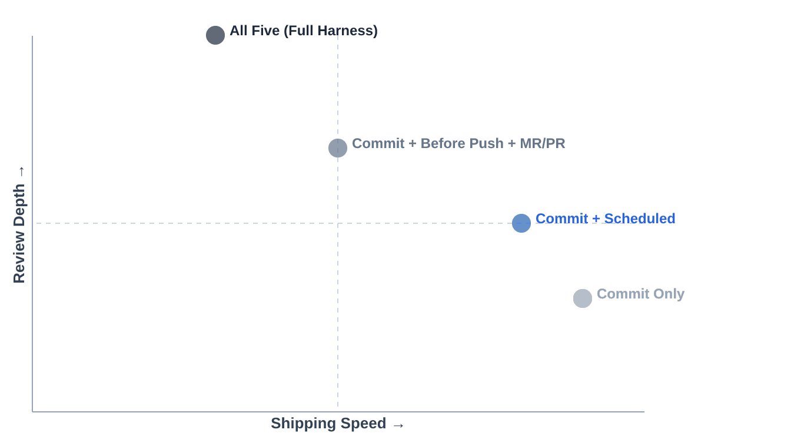
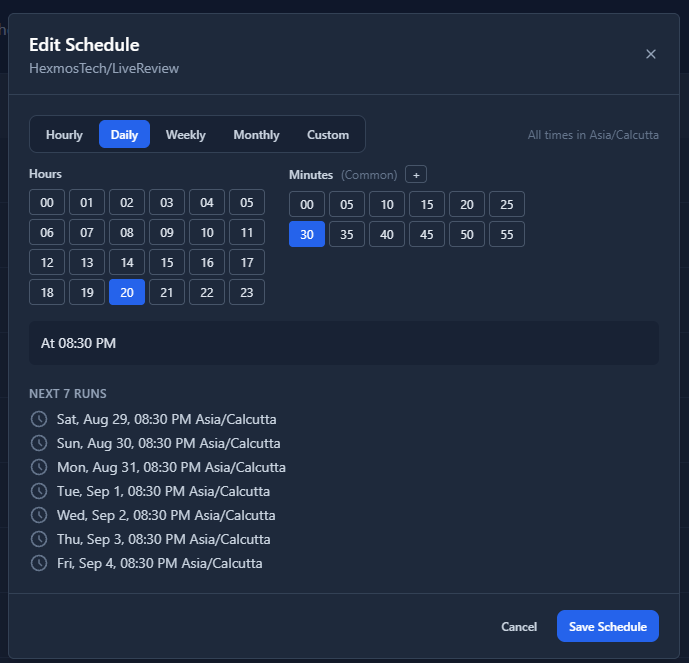

<a href="https://github.com/HexmosTech/LiveReview/actions/workflows/gitleaks.yml" target="_blank" rel="noopener noreferrer"></a>&nbsp;<a href="https://github.com/HexmosTech/LiveReview/actions/workflows/osv-scanner.yml" target="_blank" rel="noopener noreferrer"></a>&nbsp;<a href="https://github.com/HexmosTech/LiveReview/actions/workflows/govulncheck.yml" target="_blank" rel="noopener noreferrer"></a>&nbsp;<a href="https://github.com/HexmosTech/LiveReview/actions/workflows/semgrep.yml" target="_blank" rel="noopener noreferrer"></a>&nbsp;&nbsp;<a href="https://github.com/HexmosTech/LiveReview/actions/workflows/mcp-testcases.yml" target="_blank" rel="noopener noreferrer"></a>

# LiveReview: Blast-Radius Aware AI Code Review for Business-Critical Systems

LiveReview is an AI code reviewer that scores every hunk of a diff by **blast radius**: how far a change reaches through your call graph, how much persistent state it touches, and how well-tested it is. A 3-line change to a shared auth check can outrank a 300-line UI tweak. Your team's attention goes to the highest-risk code first, not spread evenly across every diff.

https://github.com/user-attachments/assets/b7663ad5-e792-4d24-8452-18bbb9b958a0

<p align="center"><i>LiveReview's Blast Radius &amp; Review Priority scoring, live in the diff viewer.</i></p>

| The exact math, not a black box | Visualize blast radius at a glance | Every factor that feeds the score |
|:---:|:---:|:---:|
|  |  |  |

<details>
<summary>How does Blast Radius scoring work? (a more technical explanation)</summary>

**Here's the goal:**
- A 3-line fix in a function used by 40 other files, that also writes to a database, should score high.
- A 300-line UI change in one file, fully covered by tests and used by nothing else, should score low, even though it's the bigger diff.

To get there, LiveReview gives each hunk two scores, then combines them into one and ranks every hunk in the diff by it.

- **Blast Radius**: how far a change can reach through your code.
  - How many other places call this code, directly or a few steps removed
  - Whether it writes to a database or other long-term storage
  - Whether those callers live in other parts of the codebase, not just nearby files
- **Review Priority**: how much scrutiny a change warrants, based on its complexity, subtlety, and potential for important details to be missed.
  - How many different paths the logic can take, and how hard it is to follow
  - How deeply loops sit nested inside other loops
  - How many other functions or symbols this code itself calls into
  - Whether the code has tests

LiveReview may add new signals over time. The two questions behind them stay the same: how far, and how much scrutiny.

</details>

<p align="center">
   <b>Self-Host for Free:</b> <a href="#quick-start">Get Started in 5 Minutes</a><br/>
   <i>Want a guided rollout?</i> <a href="#transformation-program">Join the 14-Day Transformation Program</a>
</p>

## What Do You Need?

**🚀 Get Started**

| I want to... | Go to |
|---|---|
| Try LiveReview free in under 5 minutes | [Quick Start](#quick-start) |
| Understand Blast-Radius scoring | [above ↑](#livereview-blast-radius-aware-ai-code-review-for-business-critical-systems) |
| Enforce checks at commit / push / PR / CI | [Org-Wide Harness](#org-wide-harness) |

**📊 See the Product In Action**

| I want to... | Go to |
|---|---|
| See what risks LiveReview actually catches | [Prevent Outages, Breaches & Technical Debt](#impact-report) |
| See what LiveReview's analytics can tell my team | [Data-Backed Decisions](#data-backed-decisions) |
| Understand how LiveReview differs from other tools | [Why LiveReview](#why-livereview) |
| See the full feature set | [Features](#features) |

**🔌 Integrate LiveReview**

| I want to... | Go to |
|---|---|
| Wire reviews into every commit | [Git-Native CLI](#cli) (`git-lrc`) |
| Review from inside Claude Code | [Git-Native CLI](#cli) (`claude-lrc`) |
| Review code without leaving my editor | [IDE Extensions](#ide-extensions) |
| Connect LiveReview to Claude, Cursor, or Windsurf | [MCP Server](#mcp-server) |
| Automate LiveReview in CI/CD, scripts, or bots | [REST API](#mcp-server) |
| Enforce my team's own coding standards | [Repository Rules](#repository-rules) |
| Cut AI review costs in half | [Adaptive Reviews](#adaptive-reviews) |

**💰 Pricing & Trust**

| I want to... | Go to |
|---|---|
| Compare pricing plans | [Pricing & Enterprise](#self-hosted-tiers) |
| See how LiveReview stacks up vs Copilot / CodeRabbit / SonarQube / Claude Code | [Comparisons](#comparisons) |
| Understand LiveReview's security posture | [Security](#security) |
| Read the full setup and API docs | [Full Documentation](#full-documentation) |

**🤝 Get Hands-On Help**

| I want to... | Go to |
|---|---|
| Get hands-on help rolling this out to my team | [14-Day Transformation Program](#transformation-program) |

<a id="quick-start"></a>
## Quick Start: Self-Hosted, Free to Start

Get LiveReview running in under 5 minutes. Self-hosting starts free, with the same 30k LOC/month, bring-your-own-key plan available on the cloud. You can scale up from there. See [Pricing & Enterprise](#self-hosted-tiers) for the full breakdown.

### One-Command Install

```bash
# Quick demo setup (localhost only, no webhooks)
curl -fsSL https://raw.githubusercontent.com/HexmosTech/LiveReview/master/lrops.sh | sudo bash -s -- setup-demo
```

**Requirements:**
- `bash` shell (zsh/fish not officially supported)
- Ubuntu/MacOS
- Docker (with `docker-compose` or `docker compose`)
- `jq`

You'll need a **Free Licence** to get started. Follow the guide [here](https://hexmos.com/livereview/docs/livereview/self-hosted/get-a-livereview-licence/).

**Access your installation:**
- Web UI: http://localhost:8081/
- API: http://localhost:8888/api

### Production Deployment

For teams needing external access and webhooks, follow the [Productionization Guide](https://hexmos.com/livereview/docs/livereview/self-hosted/productionize-livereview/).

| Feature | Demo Mode | Production Mode |
|---------|-----------|-----------------|
| **Access** | localhost only | External via reverse proxy |
| **Webhooks** | Disabled (manual triggers) | Enabled (automatic triggers) |
| **Configuration** | Zero config required | Reverse proxy setup needed |
| **Perfect for** | Development, testing, demos | Teams, production deployments |

<a id="org-wide-harness"></a>
## Org-Wide Harness: Enforce Your Standards on Every Line of AI-Generated Code

AI writes code faster than any human can review it by hand. LiveReview gives you a checkpoint at every stage where that code could reach production. Turn on the stages that matter to you, per repository.

| Stage | What happens |
|---|---|
| **Commit** | `git lrc review` checks your staged changes before the commit happens, right in your terminal. No context switch. |
| **Before Push** | LiveReview catches issues one last time before code leaves your machine. Skips are explicit (`git lrc review --skip`) and stay in the git log, so nothing slips through silently. |
| **MR / PR** | LiveReview posts a full AI review as comments on the pull or merge request. Every hunk gets a Blast Radius and Review Priority score. Works across GitHub, GitLab, Bitbucket, Gitea, and Azure DevOps. |
| **CI / CD** | In production deployments, a webhook triggers a review on every push. Merges can wait on review completion instead of relying on someone to ask for one. See [Automate Code Reviews in CI/CD with LiveReview MCP](https://hexmos.com/livereview/demo?v=ar4B6IrDrqk). |
| **Scheduled Checks** | Periodic sweeps scan your repositories for drift and new hotspots, even in code nobody has touched recently. See [Scheduled Reviews](#scheduled-reviews) below, or watch it in action: [Automatically Review Your Production Code with Scheduled Reviews](https://hexmos.com/livereview/demo?v=45EfHmXe_Dw). |

### Pick the Right Review Depth Based on Your Need for Shipping Speed

Not every repo needs the same amount of scrutiny. Turn on more checkpoints where the blast radius of a bad change is high, and fewer where speed matters most.

<p align="center">
   
</p>

- **Commit Only**: fastest, lightest net. Fine for low-stakes, throwaway repos.
- **Commit + Scheduled**: the startup pick. Near-zero friction day-to-day, plus a daily sweep that catches anything that slipped past commit-time checks.
- **Commit + Before Push + MR/PR**: the standard team flow. A human sees every change before it merges.
- **All Five (Full Harness)**: Commit, Before Push, MR/PR, CI/CD, and Scheduled together, for repos where a bad change is expensive: payments, auth, core infra.

There's no single right answer, only the right trade-off for a given repository, team, or organization. Mix and match per repository, and change your mind any time.

Setting up MR/PR reviews for your provider? See the step-by-step guides for [GitHub](https://hexmos.com/livereview/docs/livereview/self-hosted/github/), [GitLab](https://hexmos.com/livereview/docs/livereview/self-hosted/gitlab/), [Bitbucket](https://hexmos.com/livereview/docs/livereview/self-hosted/bitbucket/), [Gitea](https://hexmos.com/livereview/docs/livereview/self-hosted/gitea/), and [Azure DevOps](https://hexmos.com/livereview/docs/livereview/self-hosted/azure-devops/).

<a id="impact-report"></a>
## Prevent Outages, Breaches, and Technical Debt Before They Happen

Every commit git-lrc reviews gets checked against the same risk categories LiveReview tracks across production codebases:

| 10 | 100+ | Every Commit |
|:---:|:---:|:---:|
| Risk Categories | Failure Patterns Tracked | Scanned Automatically |

<p align="center">
   
</p>

See it live: [Analyze Findings with the Impact Report](https://hexmos.com/livereview/demo?v=xjUISiSSKEk) and [Export Impact Reports as PDF or CSV](https://hexmos.com/livereview/demo?v=kN6o6lognxA).

### 🔥 Outages: what takes down production, and impacts your on-call rotation

> **Correctness → Business Rule Violations**
> A discount, limit, or policy nobody approved gets applied automatically, at scale.

<details>
<summary>Show all 40 tracked risks (Reliability, Correctness, Performance, Scalability)</summary>

| Reliability *(10 risks)* | Correctness *(10 risks)* | Performance *(10 risks)* | Scalability *(10 risks)* |
|---|---|---|---|
| Error Handling | Logic Errors | Database Efficiency | Horizontal Scaling |
| Fault Tolerance | Edge Cases | Algorithmic Complexity | Vertical Scaling |
| Retry Logic | Data Validation | Memory Usage | Distributed Systems |
| Timeout Management | State Management | CPU Utilization | Load Balancing |
| Resilience Patterns | Concurrency Bugs | Network Efficiency | Capacity Planning |
| Availability Risks | Business Rule Violations | Caching | Bottleneck Risks |
| Data Integrity | Numerical Accuracy | Concurrency | Concurrency Limits |
| Race Conditions | Null Handling | Resource Contention | Service Growth Constraints |
| Resource Cleanup | Type Safety | Rendering Performance | Database Scaling |
| Failure Recovery | API Contract Violations | Startup Performance | Queue Backpressure |

</details>

### 🛡️ Breaches: what ends up in a disclosure letter, and a board meeting

> **Security → Authentication**
> A weak login flow is an open door, and attackers check every door.

<details>
<summary>Show all 20 tracked risks (Security, Compliance & Governance)</summary>

| Security *(10 risks)* | Compliance & Governance *(10 risks)* |
|---|---|
| Authentication | Privacy |
| Authorization | Regulatory Compliance |
| Secrets Management | Auditability |
| Input Validation | Data Retention |
| Injection Vulnerabilities | Data Residency |
| Cryptography | Licensing |
| Dependency Vulnerabilities | Policy Enforcement |
| Data Exposure | Access Controls |
| Session Management | Change Management |
| Security Logging & Auditing | Governance Standards |

</details>

### 🧱 Technical Debt: what slows every future release until someone pays it down

> **Maintainability → Code Complexity**
> Code only one person understands is a single point of failure with a name and a vacation schedule.

<details>
<summary>Show all 44 tracked risks (Maintainability, Architecture, Developer Experience, Cost)</summary>

| Maintainability *(12 risks)* | Architecture *(10 risks)* | Developer Experience *(12 risks)* | Cost *(10 risks)* |
|---|---|---|---|
| Code Complexity | Separation of Concerns | Testing | Cloud Resource Waste |
| Readability | Modularity | CI/CD | Infrastructure Overprovisioning |
| Documentation | Coupling | Build System | Storage Optimization |
| Code Duplication | Cohesion | Local Development | Database Cost Optimization |
| Dead Code | Layering Violations | Debuggability | Excessive API Usage |
| Naming Quality | Dependency Management | Observability | Third-Party Service Costs |
| Testability | Service Boundaries | Deployment Process | Redundant Computation |
| Technical Debt | Domain Modeling | Automation | LLM Token Consumption |
| Refactoring Opportunities | API Design | Developer Tooling | Caching Opportunities |
| Configuration Management | Extensibility | Documentation Quality | Data Transfer Costs |
| UI/UX | | UI/UX | |
| Accessibility | | Accessibility | |

</details>

<a id="data-backed-decisions"></a>
## Data-Backed Decisions: An AI Chatbot for Your Engineering Data

Ask **Livi** a product, engineering, or ops question in plain English. Livi answers with a chart pulled straight from your organization's own data. No dashboards to build, no SQL to write.

> Every engineering decision becomes more data-backed, so you can act with confidence instead of guesswork.

The same 7 categories also power a one-click **Onboarding Report**, exportable as HTML or PDF, with real charts pulled from your own review history:

<p align="center">
   
</p>

Livi's answers reach you where you already work: watch [Generate Engineering Reports via Slack](https://hexmos.com/livereview/demo?v=IncD8C2CzlI) and [Get Engineering Reports in MS Teams](https://hexmos.com/livereview/demo?v=mOZ7lbXEJVg). For the reasoning behind this, see [Understand Engineering Decisions](https://hexmos.com/livereview/docs/livereview/mcp/usecases/understand-engineering-decisions/) and [Generate Engineering Reports](https://hexmos.com/livereview/docs/livereview/mcp/usecases/generate-engineering-reports/) in the MCP docs.

Below is a sample of the questions different roles ask Livi. Each chart uses the same specs as the interactive demo on the live site.

### Adoption & Growth

| Persona | Question to Livi | Chart |
|---|---|---|
| Exec | "Is LiveReview adoption increasing across the org?" |  |
| Exec | "Which repositories have adopted LiveReview the most?" |  |

### Repository Analysis

| Persona | Question to Livi | Chart |
|---|---|---|
| Product | "Which repos are gaining or losing engineering velocity?" |  |
| Product | "How much code are we reviewing in each repository?" |  |

<details>
<summary>Show 12 more examples (Engineer Analysis, Review Quality, Cost & Efficiency, Engagement & Trust, Summary & Comparison, Trace & Investigate)</summary>

### Engineer Analysis

| Persona | Question to Livi | Chart |
|---|---|---|
| Eng Manager | "Who are our top contributors by review volume?" |  |
| Eng Manager | "How does each engineer trigger their reviews?" |  |

### Review Quality

| Persona | Question to Livi | Chart |
|---|---|---|
| Eng Manager | "What are the most concerning issue types this quarter?" |  |
| Eng Manager | "Are engineers actually incorporating reviews into their daily workflow?" |  |

### Cost & Efficiency

| Persona | Question to Livi | Chart |
|---|---|---|
| Exec | "How much does LiveReview cost us per day?" |  |
| Product | "Which AI provider gives us the best value?" |  |

### Engagement & Trust

| Persona | Question to Livi | Chart |
|---|---|---|
| Eng Manager | "Are people trusting the reviews LiveReview produces?" |  |
| Product | "Which engineers get the most value from LiveReview?" |  |

### Summary & Comparison

| Persona | Question to Livi | Chart |
|---|---|---|
| Exec | "How does this week compare to last week?" |  |
| Eng Manager | "What's the overall severity mix across all our findings?" |  |

### Trace & Investigate

| Persona | Question to Livi | Chart |
|---|---|---|
| Engineer | "Show me reviews connected to last week's production incident." |  |
| Engineer | "Which files keep showing up with issues?" |  |

</details>

*Charts above use sample data, for illustration only. Try the fully interactive version, with live chart drill-down, at [hexmos.com/livereview](https://hexmos.com/livereview/#data-backed-decisions).*

<a id="why-livereview"></a>
## Why LiveReview

Most AI review tools flag style nits and treat every line the same. LiveReview is built around three things most tools skip:

- **Blast-Radius scoring**: every hunk is ranked by how much of the system it can actually break, so reviewers spend their limited time on the change that could take down production, not the one that renamed a variable.
- **A named taxonomy of 104 failure patterns** across Reliability, Correctness, Security, Compliance, Maintainability, and Cost (see [Prevent Outages, Breaches, and Technical Debt](#impact-report)), checked on every commit, not just at PR time.
- **Livi, an AI chatbot for your engineering data**: ask any question in plain English — adoption, cost, quality, who's actually incorporating review feedback — and get a data-backed chart back, not a guess. See [Data-Backed Decisions](#data-backed-decisions).

Blast-Radius scoring and the failure taxonomy change what gets reviewed. Livi changes what gets *decided*: every rollout, staffing, or process call is backed by real numbers pulled from your own review history, not gut feel. That combination is what leads teams to keep it turned on:

- **Accelerate Delivery Cycles**: Cut PR review time from hours to minutes, because reviewers see what matters first instead of reading top to bottom.
- **Save Senior Engineering Time**: Free senior developers from routine reviews. Let them focus on mentorship and high-impact architecture work.
- **Drive Quality Excellence**: Track metrics that show improvements in code standards, fewer defects, and better development efficiency.
- **Decide with Confidence, Not Guesswork**: Ask Livi instead of guessing. Every engineering, staffing, or process decision gets a chart pulled from real review history behind it.

<a id="features"></a>
## Powerful Features for Modern Engineering Teams

<p align="center">
   
</p>

### Review Pipeline and Issue Distribution Charts
See where reviews get stuck (Sankey flow from open to merged) and where issues cluster by category (treemap), pulled from your own review history.

| Review pipeline, at a glance | Issue distribution by category |
|:---:|:---:|
|  |  |

### Fine-Tuned LiveReview AI Model
LiveReview comes with its own fine-tuned AI model, ready from day one. Prefer your own provider? Bring your own key (BYOK) for Gemini, OpenAI, AWS Bedrock, a self-hosted Ollama model, or any other LLM. See the [AI Integration guide](https://hexmos.com/livereview/docs/livereview/self-hosted/add-ai-integration-to-livereview/), or watch [Connect Google Gemini and Gemini Enterprise](https://hexmos.com/livereview/demo?v=P0jRFmf_FKE), [Connect Amazon Bedrock](https://hexmos.com/livereview/demo?v=zVf2O9z_370), or [Connect DeepSeek, OpenRouter, OpenAI, and Ollama](https://hexmos.com/livereview/demo?v=omtGw_SIJKs).

<p align="center">
   
</p>

### Use Any Git Provider: GitHub, GitLab, Bitbucket, Gitea, Azure DevOps
Connect a repository from GitHub, GitLab, Bitbucket, Gitea, or Azure DevOps, and LiveReview reviews it the same way, with the same Blast Radius scoring. Watch [Connect GitHub to LiveReview](https://hexmos.com/livereview/demo?v=zkWf98OvJQA) or [Connect Self-Hosted GitLab](https://hexmos.com/livereview/demo?v=6svc4MSnqjw), or see the full [Git Provider setup guide](https://hexmos.com/livereview/docs/livereview/self-hosted/adding-git-providers-to-livereview/).

<p align="center">
   
</p>

### Explore Every Repository and Pull Request, Across Every Provider
Browse every repository and merge or pull request LiveReview can see, in one list, no matter which git provider it lives on. Trigger a review straight from that list — see [Trigger PR Reviews from the Dashboard](https://hexmos.com/livereview/demo?v=Dvm-ixzuO8E).

| Every connected repository | Every merge/pull request |
|:---:|:---:|
|  |  |

<details id="scheduled-reviews">
<summary>Show 7 more features (review list, progress tracking, custom prompts, team learnings, PR summaries, AI clarification, scheduled reviews)</summary>

### View All AI Reviews in One Place
See every review's status, from queued to complete, and jump straight into the ones that need attention. See [Trigger Manual Pull Request Reviews](https://hexmos.com/livereview/demo?v=ReHJfGbeUCo).

<p align="center">
   
</p>

### Track Which Files Are Reviewed, Live
Watch a review work through your diff file by file, so you know exactly what's covered and what's still queued.

<p align="center">
   
</p>

### Customize Review Prompts to Fit Your Team
Custom Prompts apply org-wide, to every repo LiveReview reviews, so keep them to the handful of standards that really are universal across your org. *(Premium & Enterprise)* For anything specific to one repo, use [Repository Rules](#repository-rules) instead — most teams should start there. Watch [Customize AI Review Prompts for Your Team](https://hexmos.com/livereview/demo?v=PA0hQWo_6nE), or read [Customize LiveReview to Your Team's Best Practices](https://hexmos.com/livereview/docs/livereview/self-hosted/customize-livereview-to-your-teams-best-practices/).

<p align="center">
   
</p>

### Discuss with AI in MR and See it Learn Everyday
Every discussion in a merge request becomes a stored "learning": a best practice, a recurring issue, or a team convention the AI applies to every future review. See it in [Improve Reviews with Organizational Learning](https://hexmos.com/livereview/demo?v=t78Fajj74ZI).

<p align="center">
   
</p>

### Sharp AI-Generated Pull Request Summaries
Every pull request gets a summary of what changed, why it matters, and what risks were flagged, so reviewers don't have to read the whole diff to know where to look. See [Ask Questions About Code via Inline PR Comments](https://hexmos.com/livereview/demo?v=7BtjZ3VS8Mo).

<p align="center">
   
</p>

### Ask AI for Clarification or Debate Code Changes
Reply to any AI comment in the merge request to ask why it flagged something, or push back on it. The AI has the full diff context, not just the one line it commented on. Watch [Reply to AI Review Comments and Get Guidance](https://hexmos.com/livereview/demo?v=FX9nfubMh68), and [Auto-Fix Review Issues with Claude Code or AI Agents](https://hexmos.com/livereview/demo?v=DV2qt28TMmo).

<p align="center">
   
</p>

### Scheduled Reviews: A Safety Net for the Code Nobody Reviewed

Not every change goes through a full review:

- A hotfix might land straight on the main branch.
- A dependency bump might merge on its own.

For a small, fast-moving team, that's often the right call, you can't review every line by hand and still ship fast. **Scheduled Reviews** are the safety net for exactly that gap.

- **Checks on its own schedule.** LiveReview reviews your default branch even when nobody asked it to, and catches anything that got in outside your normal commit, push, or PR checks.
- **Per-repository control.** Turn it on with one toggle.
- **Your own cadence.** Pick how often it runs, in plain cron syntax, or leave it blank and LiveReview checks once a day.
- **Always visible.** See the last time it ran and the next time it will, right in the schedule list.
- **Zero upkeep.** Runs by itself in the background, nobody has to remember to trigger it.

> For most teams, once a day on the main branch is enough to keep quality high without slowing anyone down.

| The schedule list, per repository | Editing a repository's schedule |
|:---:|:---:|
|  |  |

</details>

<a id="cli"></a>
## Two CLI Tools. One LiveReview Backend.

Install `git-lrc` for commit-time reviews in any terminal. Use `claude-lrc` when you build inside Claude Code. Both tools share the same AI review engine and the same monthly LOC quota.

```bash
# Typical Git Guardrails Flow
git add .
git lrc review

# Or skip explicitly (auditable in git log):
git lrc review --skip
git commit -m "message"
```

**`git-lrc` (git commit hook):**
- Git-native, works in any repo without a cloud platform connection
- Skips tracked in git log, auditable, not silent
- One-line install, 30k LOC free every month

**`claude-lrc` (Claude Code integration):**
- Review, vouch, and skip inside Claude Code without leaving the chat surface
- Natural language or slash commands (`/lrc:review`, `/lrc:skip`, `/lrc:vouch`)
- Bundled with `git-lrc`, no separate install needed

Full CLI docs: [Getting Started](https://hexmos.com/livereview/docs/git-lrc/get-started/intro/) · [Reviewer Workflow](https://hexmos.com/livereview/docs/git-lrc/concepts/workflow/) · [Repository Rules](https://hexmos.com/livereview/docs/git-lrc/configure/repository-rules/) · [Security](https://hexmos.com/livereview/docs/git-lrc/git-lrc-security/)

### Quick Install

**Linux/macOS:**
```bash
curl -fsSL https://hexmos.com/lrc-install.sh | bash
```

**Windows (PowerShell):**
```powershell
iwr -useb https://hexmos.com/lrc-install.ps1 | iex
```

Watch the [One-Line Installer for LiveReview Self-Hosted](https://hexmos.com/livereview/demo?v=E1UBI_NtSKU) demo, or follow the full [install guide](https://hexmos.com/livereview/docs/git-lrc/get-started/install/).

### Prefer the Web UI? Paste a URL Instead

No local setup needed. Paste a merge or pull request URL into LiveReview and it runs the same review, with the same Blast Radius scoring.

<p align="center">
   
</p>

### git-lrc and claude-lrc in Action

`git-lrc` and `claude-lrc` are the two CLI tools above, in motion. Both plug into the same LiveReview backend.

**git-lrc catching real issues on commit:** leaked credentials, expensive cloud calls, and sensitive data in log statements, all flagged before the commit lands.

https://github.com/user-attachments/assets/cc4aa598-a7e3-4a1d-998c-9f2ba4b4c66e

**claude-lrc reviewing a diff inside Claude Code:** no separate terminal, no context switch, just a slash command or a plain-English request.

https://github.com/user-attachments/assets/bff8595b-fcf0-47a2-b0af-859e6af656e3

**Issue Navigator:** every finding, filterable by severity, category, and subcategory, with a one-click send to your AI agent.

<p align="center">
   
</p>

**Summary Deck:** a 60-second slide summary of what changed, why, and what risks were flagged, generated automatically for every review.

<p align="center">
   
</p>

**Risk-Scored View:** every hunk ranked by blast radius and customer-impact potential, with the full signal breakdown behind each score.

| Score badge, with breakdown | Whole diff, ranked by risk |
|:---:|:---:|
|  |  |

**Connector management:** switch AI providers, or reorder them to set review priority, from one screen.

<p align="center">
   
</p>

<details>
<summary>Show 2 more git-lrc videos (setup walkthrough, review UI walkthrough)</summary>

**Setup, start to finish:** one command, two browser sign-ins (LiveReview API key, free Gemini API key), about a minute total.

https://github.com/user-attachments/assets/392a4605-6e45-42ad-b2d9-6435312444b5

**The review UI, end to end:** GitHub-style diff, inline AI comments with severity badges, staged file list, and the review summary, all in the browser window that opens after `git commit`.

https://github.com/user-attachments/assets/b579d7c6-bdf6-458b-b446-006ca41fe47d

</details>

<a id="ide-extensions"></a>
## IDE Extensions

Get AI code reviews without leaving your editor. Available for VSCode, Cursor, and Antigravity.

| IDE | Install Link |
|-----|--------------|
| **VSCode** | [Visual Studio Marketplace](https://marketplace.visualstudio.com/items?itemName=Hexmos.livereview) |
| **Cursor** | [Open VSX Registry](https://open-vsx.org/extension/hexmos/livereview) |
| **Antigravity** | [Open VSX Registry](https://open-vsx.org/extension/hexmos/livereview) |

<a id="mcp-server"></a>
## Get Actionable Engineering Intelligence with MCP and the REST API

Every code review LiveReview performs adds to a growing source of **engineering intelligence**. LiveReview exposes this two separate ways, for two separate purposes:

- **MCP Server** — for AI assistants and agents (Claude, Cursor, Windsurf) that need to ask questions and take action conversationally.
- **REST API** — for scripts, CI/CD pipelines, and custom integrations that need direct HTTP calls with no AI agent in the loop.

Both let you:

- Generate custom reports
- Identify your strongest contributors
- Uncover quality and security trends
- Drill into engineering activity in minutes, not hours

Real use cases from teams already doing this: [Prevent Production Issues](https://hexmos.com/livereview/docs/livereview/mcp/usecases/prevent-production-issues/), [Turn Findings into Tickets](https://hexmos.com/livereview/docs/livereview/mcp/usecases/turn-findings-into-tickets/), [Keep Project Management in Sync](https://hexmos.com/livereview/docs/livereview/mcp/usecases/keep-project-management-in-sync/), and [Generate Release Notes](https://hexmos.com/livereview/docs/livereview/mcp/usecases/generate-release-notes/) — see the [full MCP use-case list](https://hexmos.com/livereview/docs/livereview/mcp/usecases/).

### Getting your API Key

The same key authenticates both the MCP server and the REST API.

1. Go to LiveReview
2. Click on Settings
3. Navigate to API Keys
4. Generate and copy a new API key

<p align="center">
    API Keys: generate and manage keys for the lrc CLI and MCP server" width="80%"/>
</p>

Watch [Create and Manage API Keys](https://hexmos.com/livereview/demo?v=kW_Fhx4AJfk).

### MCP Server

For AI assistants and agents: Claude Desktop, Claude Code, Cursor, Windsurf, or anything else that speaks MCP.

#### Configuration

Add the following block to your MCP client's configuration file:

- For eg: Claude Desktop: claude_desktop_config.json
- Other clients: Check the client's documentation for the equivalent file.

```json
{
  "mcpServers": {
    "livereview": {
      "command": "npx",
      "args": [
        "-y",
        "mcp-remote",
        "https://livereview.hexmos.com/api/mcp",
        "--header",
        "X-API-KEY: ${LIVEREVIEW_API_KEY}"
      ],
      "env": {  
        "LIVEREVIEW_API_KEY": "<YOUR_LIVEREVIEW_API_KEY>"  
      }                       
    }
  }
}
```

Replace `<YOUR_LIVEREVIEW_API_KEY>` with your actual LiveReview API key. See the [MCP Configuration docs](https://hexmos.com/livereview/docs/livereview/mcp/mcp-configuration/), or watch [Connect LiveReview MCP Server to AI Coding Assistants](https://hexmos.com/livereview/demo?v=sUTU0qS73_4).

Running an AI agent in your CI/CD pipeline instead of a chat assistant? The MCP server works there too: [Automate Code Reviews in CI/CD with LiveReview MCP](https://hexmos.com/livereview/demo?v=ar4B6IrDrqk).

#### What you can do

Once connected to the MCP server, you can ask your assistant to interact with LiveReview. Each MCP tool below wraps one REST API endpoint (its name follows the endpoint's method and path), but the tool itself is only reachable through the MCP server, not by calling the endpoint directly.

#### Code Reviews
| Tool | Description | Example Prompt |
|------|-------------|----------------|
| `post_api_v1_connectors_trigger-review` | Trigger a new code review for a repo URL | *"Trigger a review for https://github.com/user/repo/pull/123"* |
| `get_api_v1_reviews` | List recent reviews | *"List our recent completed reviews"* |
| `get_api_v1_reviews_id_summary` | Get the AI summary and insights for a specific review | *"Summarize the review ID xyz"* |
| `get_api_v1_reviews_id_accounting` | Get the token and LOC accounting for a review | *"Show the token usage for review ID xyz"* |

<details>
<summary>Show all MCP tools (Learnings & Prompts, Billing & Quotas, Integrations)</summary>

#### Learnings & Prompts
| Tool | Description | Example Prompt |
|------|-------------|----------------|
| `get_api_v1_learnings` | List existing team learnings | *"List our team's active learnings"* |
| `get_api_v1_learnings_id` | Get details of a specific learning | *"Show details for learning ID abc"* |
| `put_api_v1_learnings_id` | Update an existing learning | *"Update learning ID abc to enforce snake_case"* |
| `get_api_v1_prompts_catalog` | List available prompt catalogs | *"Show the catalog of prompt rules"* |
| `get_api_v1_prompts_key_variables` | Get required variables for a prompt template | *"What variables does the base prompt need?"* |
| `get_api_v1_prompts_key_render` | Render a prompt preview with provided variables | *"Render the prompt key 'system' with..."* |

#### Billing & Quotas
| Tool | Description | Example Prompt |
|------|-------------|----------------|
| `get_api_v1_billing_status` | Check current billing status of the organization | *"What is our current billing status?"* |
| `get_api_v1_quota_status` | Check current LOC status and quota | *"How much LOC quota do we have left?"* |
| `get_api_v1_billing_usage_summary` | Get billing usage summary | *"Show a summary of our billing usage"* |
| `get_api_v1_billing_usage_operations` | Get recent billable review operations | *"List the most recent billable operations"* |
| `get_api_v1_billing_usage_members` | Get member-wise LOC usage information | *"Show the usage broken down by team member"* |
| `post_api_v1_billing_upgrade_preview` | Generate an upgrade preview for a target plan | *"Preview the cost of upgrading to team_32usd"* |

#### Integrations
| Tool | Description | Example Prompt |
|------|-------------|----------------|
| `get_api_v1_connectors` | List configured Git connectors | *"List our configured Git connectors"* |
| `get_api_v1_aiconnectors` | List configured AI provider connections | *"Which AI providers are currently active?"* |

</details>

Full MCP reference: [MCP Usage docs](https://hexmos.com/livereview/docs/livereview/mcp/mcp-usage/)

### REST API

For scripts, CI/CD pipelines, and custom integrations that call LiveReview directly over HTTP, with no AI agent or MCP client involved. Same API key as above, sent as the `X-API-KEY` header. Covers reviews, reports, learnings, billing, connectors, and more.

Full REST API reference: [hexmos.com/livereview/docs/livereview/api](https://hexmos.com/livereview/docs/livereview/api/)

<a id="repository-rules"></a>
## Enforce Your Team's Engineering Standards with Repository Rules

A good reviewer knows your language and framework. A great reviewer also knows *your* repository: which patterns your team prefers, which dependencies are off-limits, and which files don't need a second look. Drop a `.lrc/` directory in your repo, and LiveReview reads it on every review.

This is per-repo, and stacks on top of any org-wide [Custom Prompts](#features) — reach for Repository Rules first; it's how most teams should scope their standards, since each team keeps its own rules without affecting anyone else's repo.

```
.lrc/
├── ignore               # files the reviewer never sees
├── rules/
│   ├── INSTRUCTIONS.md  # read first, every review
│   ├── security.md
│   └── style.md
└── policy/
    └── tools.toml       # which checks are allowed to run
```

| | |
|---|---|
| **Repository Rules** | Write down the decisions that come up in every review, such as "prefer direct SQL over ORM abstractions" or "avoid new infrastructure dependencies". LiveReview reads `INSTRUCTIONS.md` first, then every other `rules/*.md` file, in order. |
| **Ignore File** | Point the reviewer away from generated code, vendored dependencies, and anything else that doesn't need a second look. Uses gitignore syntax, matched from your repo root. Ignored files don't count toward billable lines. |
| **Policies** *(coming soon)* | Decide which tools and checks can run on this repo. Machine-readable settings that LiveReview reads directly. Never sent to the AI model. |
| **Static Checks** *(coming soon)* | Pair AI review with static analyzers like semgrep and eslint. Authorized through policy, run as part of the same commit-time flow. |

Full reference: [Repository Rules docs](https://hexmos.com/livereview/docs/git-lrc/configure/repository-rules/) · [Set Review Rules](https://hexmos.com/livereview/docs/git-lrc/configure/set-review-rules/)

<a id="adaptive-reviews"></a>
## Adaptive Reviews: Cut AI Review Costs by 50% Without Compromising Quality

**Adaptive Reviews** uses two AI models instead of one: a powerful Leader Model finds complex issues, and a cost-efficient Helper Model explains them. Same review quality, at half the price.

| | |
|---|---|
| **Reduce Costs by 40-50%** | A cost-efficient Helper Model writes the explanations, instead of one expensive model doing everything. |
| **Double Review Volume** | Review up to 2x more code on the same budget. No need to monitor limits constantly. |
| **Leader + Helper Architecture** | The Leader Model finds complex issues. The Helper Model expands those findings into detailed explanations. |
| **Maintain Review Quality** | The high-end Leader Model still drives issue detection, so accuracy does not drop. |

See it explained: [Adaptive Reviews: Cut AI Costs by 40-50%](https://hexmos.com/livereview/demo?v=6Kh4ieFj6s8).

<a id="self-hosted-tiers"></a>
## Pricing & Enterprise

LiveReview's pricing tracks **reviewed workload, not headcount**:

| Plan | Price | Includes |
|---|---|---|
| **Individual** (Free) | Free (30k LOC/month) | Bring your own AI keys, unlimited projects, git-native CLI (`git-lrc`), dedicated VS Code extension |
| **Premium** | From $32/month for 100k LOC, scaling to $1024/month for 3.2M LOC | Unlimited team members, AI-generated review summaries, custom review prompts, engineering insights dashboard, full API access |
| **Enterprise** | [Contact us](https://hexmos.com/livereview?modal=start-free) | Multiple organizations, self-hosted deployment, SSO/SAML & directory sync, custom domain, full data privacy |

LOC (Lines of Code) means the code shown in the reviewed diff, not your total repository size. Paid plans keep users unlimited, so cost tracks reviewed workload, not seats.

### LiveReview Enterprise

Custom deployments, SSO integration, dedicated AI keys, and priority SLA support, for scaling engineering organizations:

- **Security & Ops**: Self-hosted deployment (optional), support for multiple organizations, custom domain hosting, SSO & User Directory integration (SAML/OIDC), and full data privacy
- **Flexible AI & Models**: Connect to private cloud LLMs or opt for fully self-hosted AI models using Ollama or your private infrastructure to guarantee no code leaves your network
- **Custom Integrations**: Custom API access, bespoke workflow integrations, and engineering insights dashboards tailored to your development tooling
- **Dedicated SLA Support**: Prioritized support channel with dedicated SLAs, custom development, and professional onboarding

[Get a Self-Hosted License](https://hexmos.com/livereview/selfhosted-access/) · [Explore Self-Hosted Enterprise](https://hexmos.com/livereview/enterprise-selfhosted) · [Apply a Licence](https://hexmos.com/livereview/docs/livereview/self-hosted/apply-licence-to-livereview/)

Watch [Enterprise License Management](https://hexmos.com/livereview/demo?v=hL_pfwo8CnI) in action.

<a id="comparisons"></a>
## How LiveReview Compares

### vs CodeRabbit

| | LiveReview | CodeRabbit |
|---|---|---|
| **Source code** | Source-available, browse the full codebase and scan reports on GitHub | Closed source |
| **Enforcement point** | Git level, same for every editor and OS | Varies by integration |
| **Rate limits** | None per developer | Hourly rate limits per developer per repository |
| **Pricing model** | Free up to 30k LOC/month, then fixed LOC bands ($32 for 100k, up to $1024 for 3.2M) | Per-seat pricing |
| **Cost as team grows** | Stays flat; tracks reviewed workload, not headcount | Rises with headcount, even if workload does not |

### vs GitHub Copilot Code Review

| | LiveReview | GitHub Copilot |
|---|---|---|
| **Git provider support** | GitHub, GitLab, Bitbucket, Gitea, Azure DevOps | GitHub only |
| **Setup for other providers** | None needed, works out of the box | Requires a separate product |
| **Pricing model** | Tracks reviewed LOC, not seats | Caps premium requests at 300 on the Pro plan |
| **Users and projects** | Unlimited, inside your monthly LOC quota | Limited by plan tier |

<details>
<summary>Show more comparisons (SonarQube, Claude Code, Cursor / Antigravity)</summary>

### vs SonarQube

| | LiveReview | SonarQube |
|---|---|---|
| **Source availability** | Entire codebase is source-available | Only Community Edition is source-available; Developer and Enterprise editions are closed |
| **Self-host setup** | One command, under 5 minutes | Resource-intensive server, heavier dependency management |

### vs Claude Code

| | LiveReview | Claude Code |
|---|---|---|
| **Intended use** | Enforces standards org-wide, at the git level, across GitHub, GitLab, Gitea, Bitbucket, and Azure DevOps | CLI tool built for individual developers on specific tasks |
| **Source and data** | Source-available, self-hostable on Enterprise, data stays on your network | Closed product; sends your source code to Anthropic's cloud |
| **Pricing model** | LOC-based, predictable, tied to reviewed code | Token-metered; a few complex reviews can create hard-to-forecast costs |

### vs Cursor / Antigravity in-editor review

| | LiveReview | Cursor / Antigravity |
|---|---|---|
| **Visibility** | Organization-wide, everyone sees the same findings | Visible only to the individual using the tool |
| **Enforcement point** | Git level, same for every IDE, triggers automatically on commit | In-editor only; hard to enforce consistently across different IDEs |

</details>

<a id="full-documentation"></a>
## Full Documentation

The [LiveReview Docs](https://hexmos.com/livereview/docs/) go far deeper than this README. A sample of what's there:

**Self-Hosted Setup**
- [Wiki Overview](https://hexmos.com/livereview/docs/livereview/self-hosted/) · [Download, Install and Run LiveReview](https://hexmos.com/livereview/docs/livereview/self-hosted/download-install-and-run-livereview/) · [Productionize LiveReview](https://hexmos.com/livereview/docs/livereview/self-hosted/productionize-livereview/) · [lrops.sh Reference](https://hexmos.com/livereview/docs/livereview/self-hosted/lrops-sh-reference/)
- [Get a Licence](https://hexmos.com/livereview/docs/livereview/self-hosted/get-a-livereview-licence/) · [Apply a Licence](https://hexmos.com/livereview/docs/livereview/self-hosted/apply-licence-to-livereview/) · [Backup LiveReview](https://hexmos.com/livereview/docs/livereview/self-hosted/backup-livereview/) · [Update LiveReview](https://hexmos.com/livereview/docs/livereview/self-hosted/update-livereview/)
- [Create Your First Review](https://hexmos.com/livereview/docs/livereview/self-hosted/create-your-first-review/) · [Add Your Team](https://hexmos.com/livereview/docs/livereview/self-hosted/add-your-team-to-livereview/) · [Run a Secure Self-Hosted AI Code Review Powered by Ollama](https://hexmos.com/livereview/docs/livereview/self-hosted/run-a-secure-self-hosted-ai-code-review-powered-by-ollama/)

**Git & AI Provider Integration**
- [Adding Git Providers](https://hexmos.com/livereview/docs/livereview/self-hosted/adding-git-providers-to-livereview/): [GitHub](https://hexmos.com/livereview/docs/livereview/self-hosted/github/) · [GitLab](https://hexmos.com/livereview/docs/livereview/self-hosted/gitlab/) · [Bitbucket](https://hexmos.com/livereview/docs/livereview/self-hosted/bitbucket/) · [Gitea](https://hexmos.com/livereview/docs/livereview/self-hosted/gitea/) · [Azure DevOps](https://hexmos.com/livereview/docs/livereview/self-hosted/azure-devops/)
- [Add AI Integration](https://hexmos.com/livereview/docs/livereview/self-hosted/add-ai-integration-to-livereview/): [Google Gemini](https://hexmos.com/livereview/docs/livereview/self-hosted/google-gemini/)

**Git-Native CLI (`git-lrc` / `claude-lrc`)**
- [Getting Started](https://hexmos.com/livereview/docs/git-lrc/get-started/intro/) · [Install](https://hexmos.com/livereview/docs/git-lrc/get-started/install/) · [Concepts: Workflow](https://hexmos.com/livereview/docs/git-lrc/concepts/workflow/), [Roles](https://hexmos.com/livereview/docs/git-lrc/concepts/roles/), [Collaboration](https://hexmos.com/livereview/docs/git-lrc/concepts/collaboration/)
- [Repository Rules](https://hexmos.com/livereview/docs/git-lrc/configure/repository-rules/) · [Set Review Rules](https://hexmos.com/livereview/docs/git-lrc/configure/set-review-rules/) · [Integrations](https://hexmos.com/livereview/docs/git-lrc/configure/integrations/) · [git-lrc Security](https://hexmos.com/livereview/docs/git-lrc/git-lrc-security/)

**MCP Server** (for AI assistants and agents)
- [MCP Configuration](https://hexmos.com/livereview/docs/livereview/mcp/mcp-configuration/) · [MCP Usage](https://hexmos.com/livereview/docs/livereview/mcp/mcp-usage/)
- Use cases: [Prevent Production Issues](https://hexmos.com/livereview/docs/livereview/mcp/usecases/prevent-production-issues/) · [Turn Findings into Tickets](https://hexmos.com/livereview/docs/livereview/mcp/usecases/turn-findings-into-tickets/) · [Keep Project Management in Sync](https://hexmos.com/livereview/docs/livereview/mcp/usecases/keep-project-management-in-sync/) · [Generate Release Notes](https://hexmos.com/livereview/docs/livereview/mcp/usecases/generate-release-notes/) · [Generate Engineering Reports](https://hexmos.com/livereview/docs/livereview/mcp/usecases/generate-engineering-reports/) · [Understand Engineering Decisions](https://hexmos.com/livereview/docs/livereview/mcp/usecases/understand-engineering-decisions/) — [full list](https://hexmos.com/livereview/docs/livereview/mcp/usecases/)

**REST API** (for scripts, CI/CD, and custom integrations, no AI agent required)
- [Full API Reference](https://hexmos.com/livereview/docs/livereview/api/): reviews, reports, learnings, billing, connectors, and more

**Video Library**
- [hexmos.com/livereview/demo](https://hexmos.com/livereview/demo/) has dozens of short, focused demos, filterable by role (Developer, Engineering Manager, CTO, CEO): setup, every git and AI provider integration, review workflows, reporting and Slack/Teams automation, and team administration.

**FAQ & Security**
- [Docs FAQ](https://hexmos.com/livereview/docs/faq/) · [Full Security Documentation](https://hexmos.com/livereview/docs/livereview/livereview-security/)

<a id="security"></a>
## Security

### Built for security review

LiveReview documents the questions enterprise teams ask first: deployment model differences, code and data handling, AI safeguards, supply-chain visibility, and security response timelines.

- Separate guidance for self-hosted/Ollama and cloud LLM deployments
- Explicit data handling: what leaves your network, when it happens, and retention/deletion expectations
- Prompt-injection and unsafe-output mitigations, automated scanners, SBOM visibility, and transparent GitHub source with responsive disclosure policy

[Open Security Page](https://hexmos.com/livereview/security) · [Read SECURITY.md](https://github.com/HexmosTech/LiveReview/blob/master/SECURITY.md) · [Report a Vulnerability](https://github.com/HexmosTech/LiveReview/security/advisories/new)

### Security FAQ

**What data is collected, stored, and used in LiveReview?**
- Only the diff is sent to the AI model. Nothing else.
- Your code is never stored, and never used to train any AI model.
- Own codebase is scanned continuously with Gitleaks, OSV Scanner, Govulncheck, and Semgrep, via GitHub Actions.
- A Bill of Materials (SBOM) is published with every release.

**How does self-hosted deployment differ from cloud in terms of security?**
- **Self-hosted**: your team runs the entire stack and database. Your infra team controls storage, backups, retention, and network access.
- **Cloud / provider-integrated**: LiveReview sends data to configured external provider endpoints for AI inference and git provider operations.

**Does LiveReview provide a Software Bill of Materials (SBOM)?**
Yes, generated automatically on every release using Syft, published to GitHub release assets.

**Is LiveReview SOC 2 Type II certified?**
Not at this time. Security docs, scan history, SBOM, and source code are all public instead, so enterprise buyers can review the actual posture rather than take a certification on faith.

For complete details, including local security scan commands and how to enable the gated-off scanning workflows, see [SECURITY.md](SECURITY.md). For pricing, LOC, and general product questions, see the [FAQ](#faq) below.

<a id="faq"></a>
## FAQ

**What is Blast-Radius scoring, exactly?**
A per-hunk score combining:
- Call-graph reach and cross-package impact
- Persistent-state mutation
- Cyclomatic and cognitive complexity
- Test coverage gaps

Shows which parts of a diff can do the most damage if something is wrong, so reviewers spend their limited attention where it matters most.

**What is LOC in LiveReview?**
Lines of Code shown in the reviewed diff — not your total repository size.

**How much LOC is available on the premium plan?**
| LOC / month | Price |
|---|---|
| 100,000 | $32 |
| 200,000 | $64 |
| 400,000 | $128 |
| 800,000 | $256 |
| 1,600,000 | $512 |
| 3,200,000 | $1024 |

All paid bands keep users unlimited and refresh every month.

**What does the enterprise plan offer?**
- Multiple organization support
- SSO & directory sync (SAML/OIDC)
- Self-hosted deployment within your own infrastructure
- A custom domain
- Full data privacy over where your code and review data are stored

**Is my code secure with LiveReview?**
Only the diff is sent to the AI model, nothing else. Your code is never stored or used to train any model. See [Security](#security) above for full details.

**What's the difference between self-hosting this repo and the cloud version?**
- **This repo**: the self-hosted product itself, Docker-based, runs entirely on your infrastructure.
- **[Cloud version](https://hexmos.com/livereview/)**: the same review engine as a managed service, so you don't run the stack yourself.

## License

LiveReview is distributed under a modified variant of **Sustainable Use License (SUL)**.

> [!NOTE]
>
> **What this means:**
> - ✅ **Source Available**: Full source code is available for self-hosting
> - ✅ **Business Use Allowed**: Use LiveReview for your internal business operations
> - ✅ **Modifications Allowed**: Customize for your own use
> - ❌ **No Resale**: Cannot be resold or offered as a competing service
> - ❌ **No Redistribution**: Cannot redistribute modified versions commercially
>
> This license ensures LiveReview remains sustainable while giving you full access to self-host and customize for your needs.

For detailed terms, examples of permitted and prohibited uses, and definitions, see the full
[LICENSE.md](LICENSE.md).

<a id="transformation-program"></a>
## Want Hands-On Help Rolling This Out?

Self-hosting gets you the tool. The **14-Day Transformation Program** gets your whole team, from execs to individual contributors, actually using it well. It covers onboarding, workflow integration, and measurable before/after engineering metrics.

<p align="center">
   <a href="https://hexmos.com/livereview/transform/">
      
   </a>
</p>

<p align="center">
   <a href="https://hexmos.com/livereview/transform/"><b>Join the 14-Day Transformation Program →</b></a>
</p>

<p align="center">
   <b>Self-Host:</b> <a href="#quick-start">Get Started Free</a> | 
   <b>Cloud:</b> <a href="https://hexmos.com/livereview/">Try hexmos.com/livereview</a> | 
   <a href="https://hexmos.com/livereview/docs/">Documentation</a>
</p>
