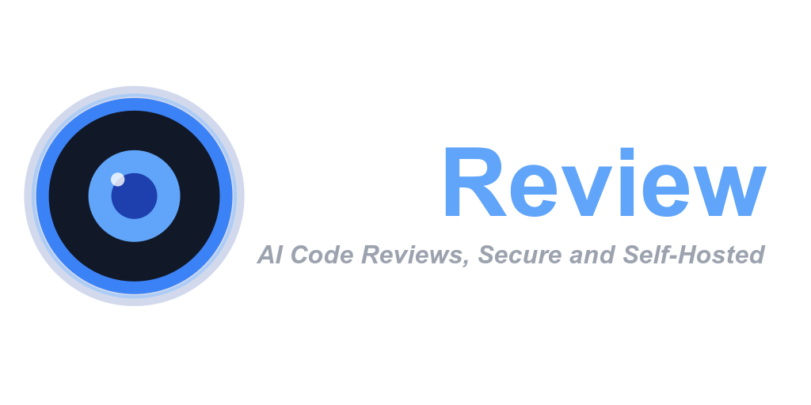

<a href="https://github.com/HexmosTech/LiveReview/actions/workflows/gitleaks.yml" target="_blank" rel="noopener noreferrer"></a>&nbsp;<a href="https://github.com/HexmosTech/LiveReview/actions/workflows/osv-scanner.yml" target="_blank" rel="noopener noreferrer"></a>&nbsp;<a href="https://github.com/HexmosTech/LiveReview/actions/workflows/govulncheck.yml" target="_blank" rel="noopener noreferrer"></a>&nbsp;<a href="https://github.com/HexmosTech/LiveReview/actions/workflows/semgrep.yml" target="_blank" rel="noopener noreferrer"></a>&nbsp;&nbsp;<a href="https://github.com/HexmosTech/LiveReview/actions/workflows/mcp-testcases.yml" target="_blank" rel="noopener noreferrer"></a>

# LiveReview: Blast-Radius Aware AI Code Review for Business-Critical Systems

Your team's attention is limited. Spend it where **business risk is highest**, not spread evenly across every diff.

https://github.com/user-attachments/assets/b7663ad5-e792-4d24-8452-18bbb9b958a0

<p align="center"><i>LiveReview's Blast Radius &amp; Review Priority scoring, live in the diff viewer.</i></p>

| The exact math, not a black box | Visualize blast radius at a glance | Every factor that feeds the score |
|:---:|:---:|:---:|
| 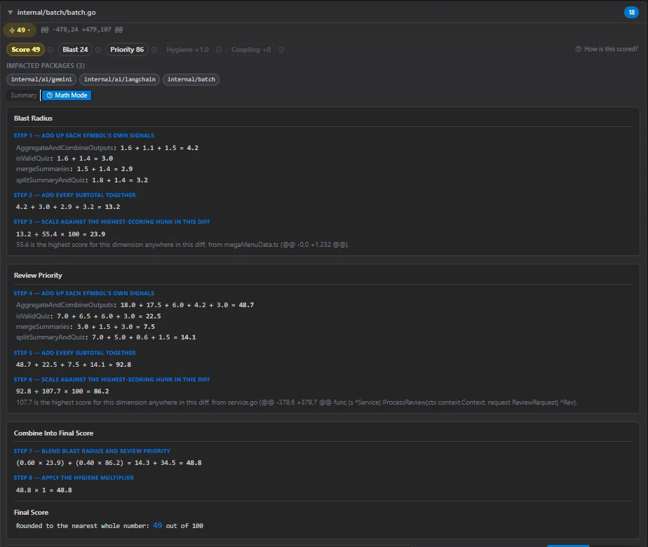 | 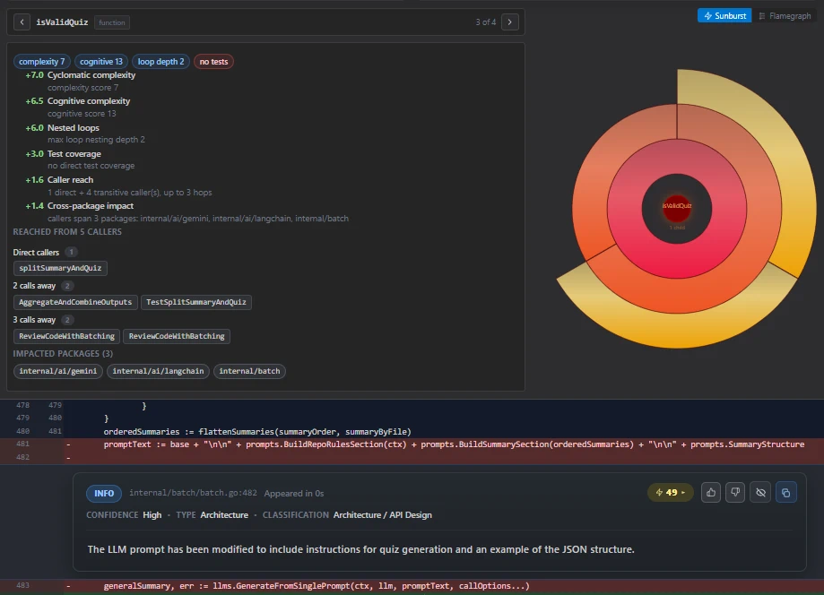 | 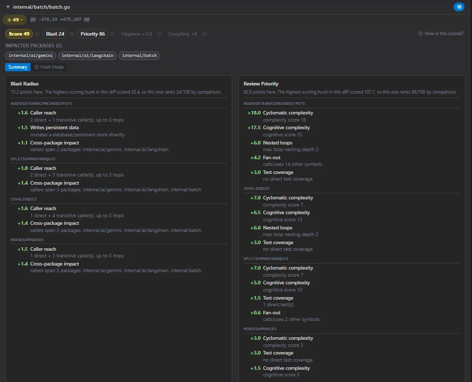 |

<p align="center">
   <b>Self-Host for Free:</b> <a href="#quick-start">Get Started in 5 Minutes</a><br/>
   <i>Want a guided rollout?</i> <a href="#transformation-program">Join the 14-Day Transformation Program</a>
</p>

## What Do You Need?

**🚀 Get Started**

| I want to... | Go to |
|---|---|
| Try LiveReview free in under 5 minutes | [Quick Start](#quick-start) |
| Understand Blast-Radius scoring | [above ↑](#livereview-blast-radius-aware-ai-code-review-for-business-critical-systems) |
| Enforce checks at commit / push / PR / CI | [Org-Wide Harness](#org-wide-harness) |

**📊 See the Product In Action**

| I want to... | Go to |
|---|---|
| See what risks LiveReview actually catches | [Prevent Outages, Breaches & Technical Debt](#impact-report) |
| See what LiveReview's analytics can tell my team | [Data-Backed Decisions](#data-backed-decisions) |
| Understand how LiveReview differs from other tools | [Why LiveReview](#why-livereview) |
| See the full feature set | [Features](#features) |

**🔌 Integrate LiveReview**

| I want to... | Go to |
|---|---|
| Wire reviews into every commit | [Git-Native CLI](#cli) |
| Review code without leaving my editor | [IDE Extensions](#ide-extensions) |
| Connect LiveReview to Claude, Cursor, or Windsurf | [MCP Server](#mcp-server) |
| Enforce my team's own coding standards | [Repository Rules](#repository-rules) |
| Cut AI review costs in half | [Adaptive Reviews](#adaptive-reviews) |

**💰 Pricing & Trust**

| I want to... | Go to |
|---|---|
| Compare pricing plans | [Pricing & Enterprise](#self-hosted-tiers) |
| See how LiveReview stacks up vs Copilot / CodeRabbit / SonarQube / Claude Code | [Comparisons](#comparisons) |
| Understand LiveReview's security posture | [Security](#security) |

**🤝 Get Hands-On Help**

| I want to... | Go to |
|---|---|
| Get hands-on help rolling this out to my team | [14-Day Transformation Program](#transformation-program) |

<a id="quick-start"></a>
## Quick Start: Self-Hosted, Free to Start

Get LiveReview running in under 5 minutes. Self-hosting starts free, with the same 30k LOC/month, bring-your-own-key plan available on the cloud. You can scale up from there. See [Pricing & Enterprise](#self-hosted-tiers) for the full breakdown.

### One-Command Install

```bash
# Quick demo setup (localhost only, no webhooks)
curl -fsSL https://raw.githubusercontent.com/HexmosTech/LiveReview/main/lrops.sh | sudo bash -s -- setup-demo
```

**Requirements:**
- `bash` shell (zsh/fish not officially supported)
- Ubuntu/MacOS
- Docker (with `docker-compose` or `docker compose`)
- `jq`

You'll need a **Free Licence** to get started. Follow the guide [here](https://hexmos.com/livereview/docs/livereview/self-hosted/get-a-livereview-licence/).

**Access your installation:**
- Web UI: http://localhost:8081/
- API: http://localhost:8888/api

### Production Deployment

For teams needing external access and webhooks, follow the [Productionization Guide](https://hexmos.com/livereview/docs/livereview/self-hosted/productionize-livereview/).

| Feature | Demo Mode | Production Mode |
|---------|-----------|-----------------|
| **Access** | localhost only | External via reverse proxy |
| **Webhooks** | Disabled (manual triggers) | Enabled (automatic triggers) |
| **Configuration** | Zero config required | Reverse proxy setup needed |
| **Perfect for** | Development, testing, demos | Teams, production deployments |

<a id="org-wide-harness"></a>
## Enforce Your Standards on Every Line of AI-Generated Code

AI writes code faster than any human can review it by hand. LiveReview gives you a checkpoint at every stage where that code could reach production. Turn on the stages that matter to you, per repository.

| Stage | What happens |
|---|---|
| **Commit** | `git lrc review` checks your staged changes before the commit happens, right in your terminal. No context switch. |
| **Before Push** | LiveReview catches issues one last time before code leaves your machine. Skips are explicit (`git lrc review --skip`) and stay in the git log, so nothing slips through silently. |
| **MR / PR** | LiveReview posts a full AI review as comments on the pull or merge request. Every hunk gets a Blast Radius and Review Priority score. Works across GitHub, GitLab, Bitbucket, Gitea, and Azure DevOps. |
| **CI / CD** | In production deployments, a webhook triggers a review on every push. Merges can wait on review completion instead of relying on someone to ask for one. |
| **Scheduled Checks** | Periodic sweeps scan your repositories for drift and new hotspots, even in code nobody has touched recently. |

<p align="center">
   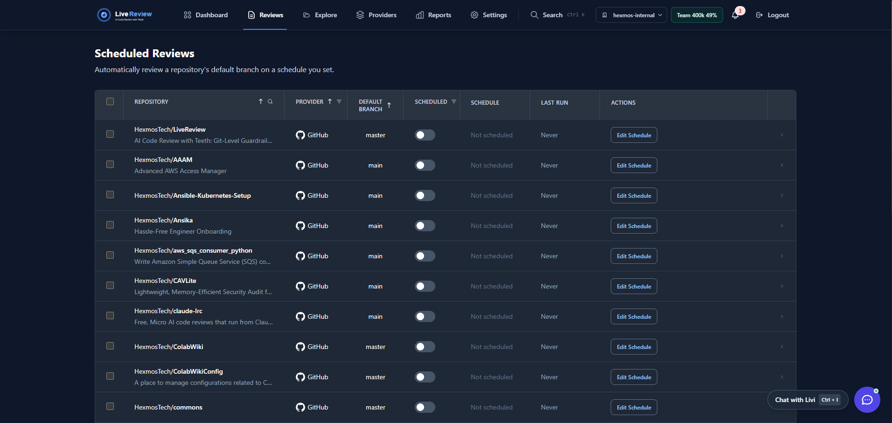
</p>

<a id="impact-report"></a>
## Prevent Outages, Breaches, and Technical Debt Before They Happen

Every commit git-lrc reviews gets checked against the same risk categories LiveReview tracks across production codebases:

| 10 | 100+ | Every Commit |
|:---:|:---:|:---:|
| Risk Categories | Failure Patterns Tracked | Scanned Automatically |

<p align="center">
   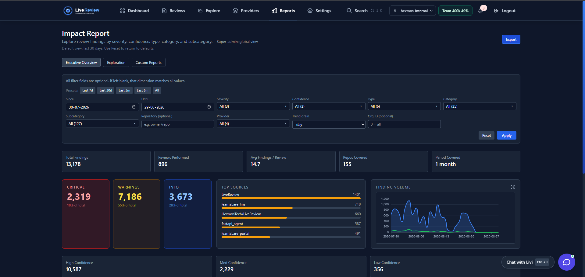
</p>

### 🔥 Outages: what takes down production, and impacts your on-call rotation

> **Correctness → Business Rule Violations**
> A discount, limit, or policy nobody approved gets applied automatically, at scale.

<details>
<summary>Show all 40 tracked risks (Reliability, Correctness, Performance, Scalability)</summary>

| Reliability *(10 risks)* | Correctness *(10 risks)* | Performance *(10 risks)* | Scalability *(10 risks)* |
|---|---|---|---|
| Error Handling | Logic Errors | Database Efficiency | Horizontal Scaling |
| Fault Tolerance | Edge Cases | Algorithmic Complexity | Vertical Scaling |
| Retry Logic | Data Validation | Memory Usage | Distributed Systems |
| Timeout Management | State Management | CPU Utilization | Load Balancing |
| Resilience Patterns | Concurrency Bugs | Network Efficiency | Capacity Planning |
| Availability Risks | Business Rule Violations | Caching | Bottleneck Risks |
| Data Integrity | Numerical Accuracy | Concurrency | Concurrency Limits |
| Race Conditions | Null Handling | Resource Contention | Service Growth Constraints |
| Resource Cleanup | Type Safety | Rendering Performance | Database Scaling |
| Failure Recovery | API Contract Violations | Startup Performance | Queue Backpressure |

</details>

### 🛡️ Breaches: what ends up in a disclosure letter, and a board meeting

> **Security → Authentication**
> A weak login flow is an open door, and attackers check every door.

<details>
<summary>Show all 20 tracked risks (Security, Compliance & Governance)</summary>

| Security *(10 risks)* | Compliance & Governance *(10 risks)* |
|---|---|
| Authentication | Privacy |
| Authorization | Regulatory Compliance |
| Secrets Management | Auditability |
| Input Validation | Data Retention |
| Injection Vulnerabilities | Data Residency |
| Cryptography | Licensing |
| Dependency Vulnerabilities | Policy Enforcement |
| Data Exposure | Access Controls |
| Session Management | Change Management |
| Security Logging & Auditing | Governance Standards |

</details>

### 🧱 Technical Debt: what slows every future release until someone pays it down

> **Maintainability → Code Complexity**
> Code only one person understands is a single point of failure with a name and a vacation schedule.

<details>
<summary>Show all 44 tracked risks (Maintainability, Architecture, Developer Experience, Cost)</summary>

| Maintainability *(12 risks)* | Architecture *(10 risks)* | Developer Experience *(12 risks)* | Cost *(10 risks)* |
|---|---|---|---|
| Code Complexity | Separation of Concerns | Testing | Cloud Resource Waste |
| Readability | Modularity | CI/CD | Infrastructure Overprovisioning |
| Documentation | Coupling | Build System | Storage Optimization |
| Code Duplication | Cohesion | Local Development | Database Cost Optimization |
| Dead Code | Layering Violations | Debuggability | Excessive API Usage |
| Naming Quality | Dependency Management | Observability | Third-Party Service Costs |
| Testability | Service Boundaries | Deployment Process | Redundant Computation |
| Technical Debt | Domain Modeling | Automation | LLM Token Consumption |
| Refactoring Opportunities | API Design | Developer Tooling | Caching Opportunities |
| Configuration Management | Extensibility | Documentation Quality | Data Transfer Costs |
| UI/UX | | UI/UX | |
| Accessibility | | Accessibility | |

</details>

<a id="data-backed-decisions"></a>
## An AI Chatbot for Your Engineering Data

Ask **Livi** a product, engineering, or ops question in plain English. Livi answers with a chart pulled straight from your organization's own data. No dashboards to build, no SQL to write.

> Every engineering decision becomes more data-backed, so you can act with confidence instead of guesswork.

The same 7 categories also power a one-click **Onboarding Report**, exportable as HTML or PDF, with real charts pulled from your own review history:

<p align="center">
   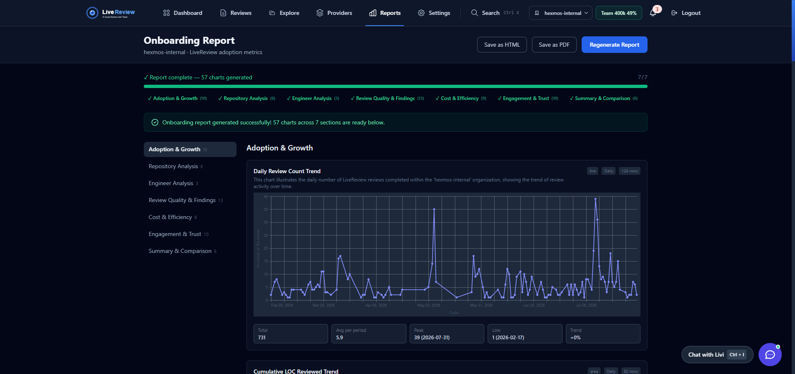
</p>

Below is a sample of the questions different roles ask Livi. Each chart uses the same specs as the interactive demo on the live site.

### Adoption & Growth

| Persona | Question to Livi | Chart |
|---|---|---|
| Exec | "Is LiveReview adoption increasing across the org?" | 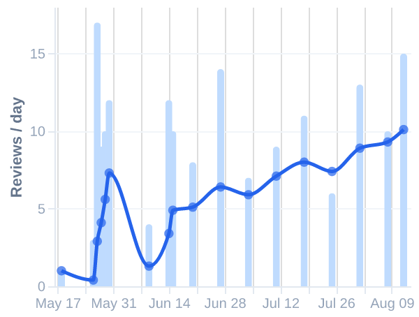 |
| Exec | "Which repositories have adopted LiveReview the most?" | 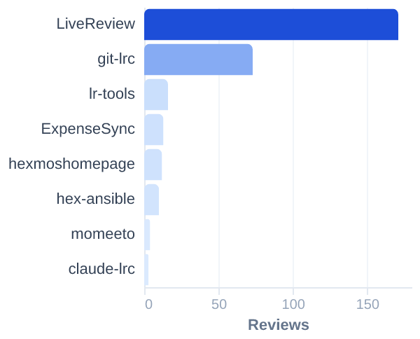 |

### Repository Analysis

| Persona | Question to Livi | Chart |
|---|---|---|
| Product | "Which repos are gaining or losing engineering velocity?" | 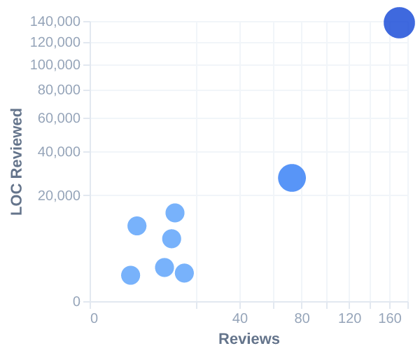 |
| Product | "How much code are we reviewing in each repository?" | 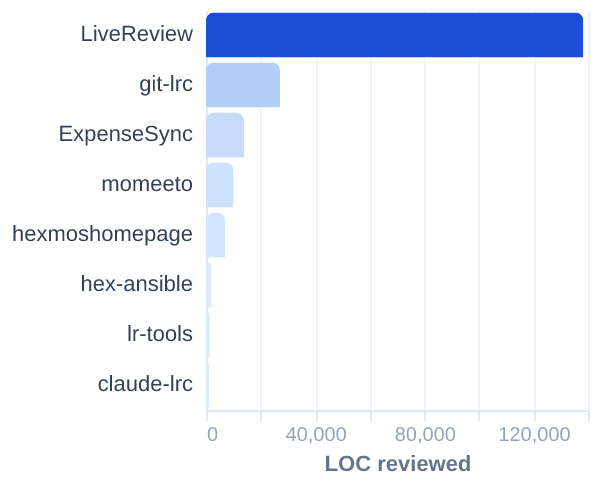 |

<details>
<summary>Show 12 more examples (Engineer Analysis, Review Quality, Cost & Efficiency, Engagement & Trust, Summary & Comparison, Trace & Investigate)</summary>

### Engineer Analysis

| Persona | Question to Livi | Chart |
|---|---|---|
| Eng Manager | "Who are our top contributors by review volume?" | 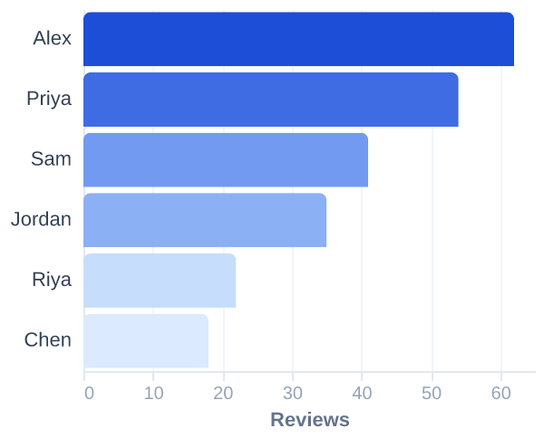 |
| Eng Manager | "How does each engineer trigger their reviews?" | 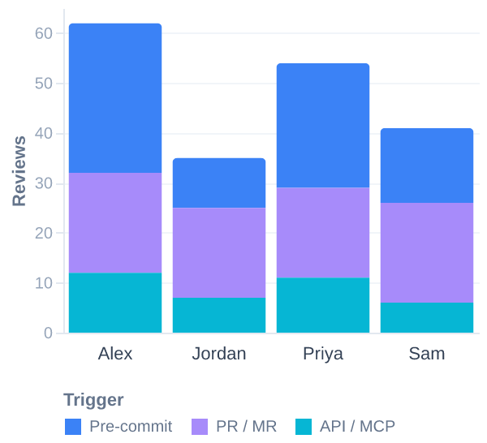 |

### Review Quality

| Persona | Question to Livi | Chart |
|---|---|---|
| Eng Manager | "What are the most concerning issue types this quarter?" | 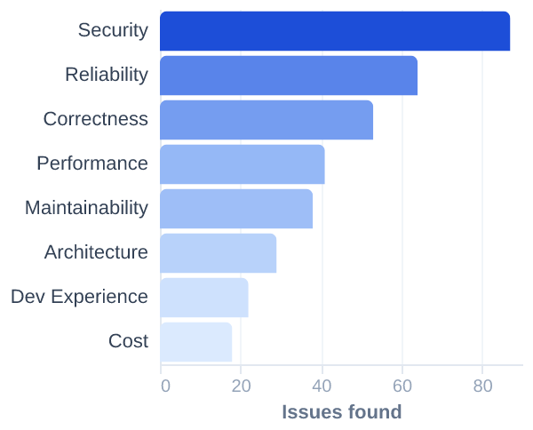 |
| Eng Manager | "Are engineers actually incorporating reviews into their daily workflow?" | 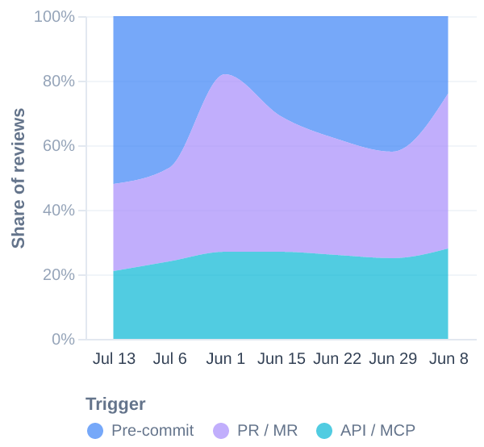 |

### Cost & Efficiency

| Persona | Question to Livi | Chart |
|---|---|---|
| Exec | "How much does LiveReview cost us per day?" | 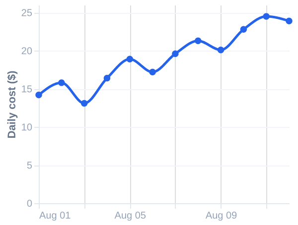 |
| Product | "Which AI provider gives us the best value?" | 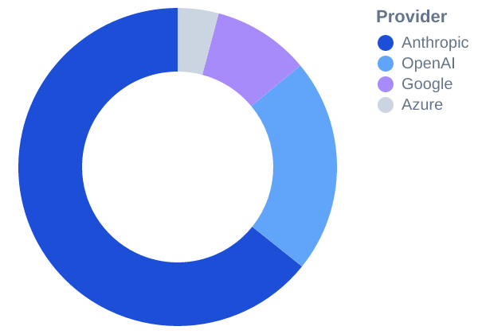 |

### Engagement & Trust

| Persona | Question to Livi | Chart |
|---|---|---|
| Eng Manager | "Are people trusting the reviews LiveReview produces?" | 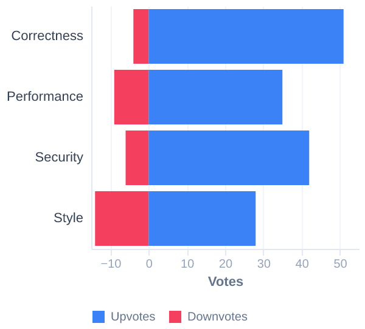 |
| Product | "Which engineers get the most value from LiveReview?" | 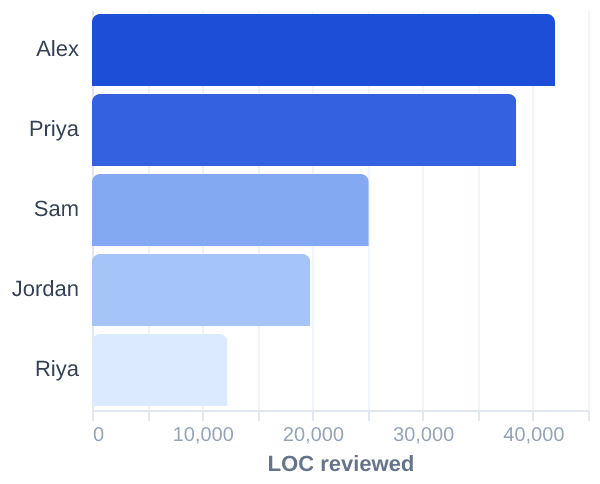 |

### Summary & Comparison

| Persona | Question to Livi | Chart |
|---|---|---|
| Exec | "How does this week compare to last week?" | 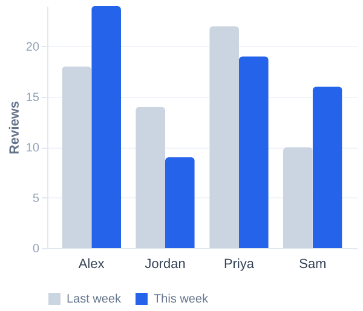 |
| Eng Manager | "What's the overall severity mix across all our findings?" | 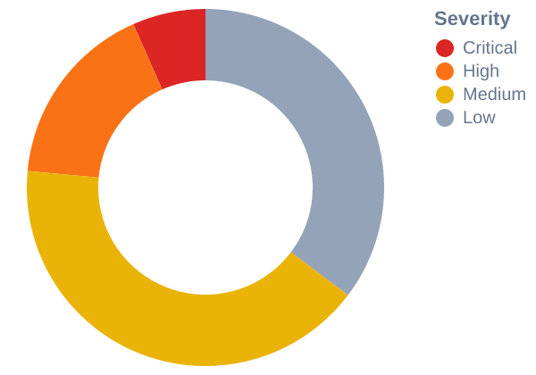 |

### Trace & Investigate

| Persona | Question to Livi | Chart |
|---|---|---|
| Engineer | "Show me reviews connected to last week's production incident." | 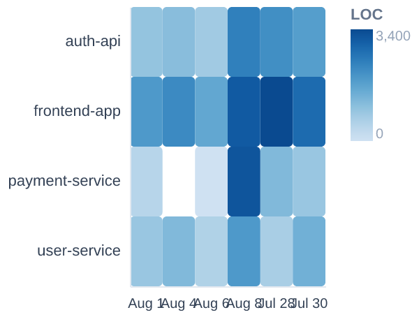 |
| Engineer | "Which files keep showing up with issues?" | 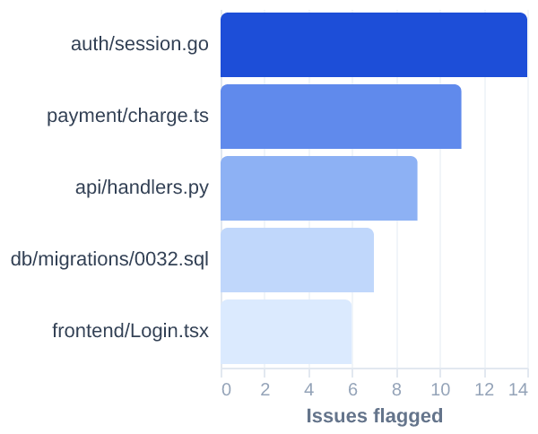 |

</details>

*Charts above use sample data, for illustration only. Try the fully interactive version, with live chart drill-down, at [hexmos.com/livereview](https://hexmos.com/livereview/#data-backed-decisions).*

<a id="why-livereview"></a>
## Why LiveReview

### Why Engineering Teams Love LiveReview

- **Accelerate Delivery Cycles**: Cut PR review time from hours to minutes. Ship features faster, with more confidence.
- **Save Senior Engineering Time**: Free senior developers from routine reviews. Let them focus on mentorship and high-impact architecture work.
- **Drive Quality Excellence**: Track metrics that show improvements in code standards, fewer defects, and better development efficiency.

<a id="features"></a>
## Powerful Features for Modern Engineering Teams

<p align="center">
   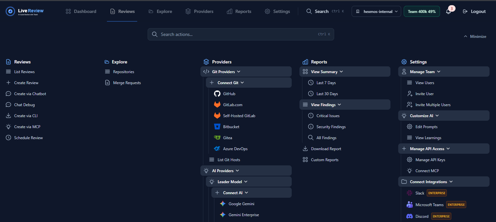
</p>

### Track Engineering Excellence
Quantify your team's improvement with comprehensive metrics. Track review times, code quality trends, and team velocity to demonstrate engineering value to stakeholders.

| Review pipeline, at a glance | Issue distribution by category |
|:---:|:---:|
| 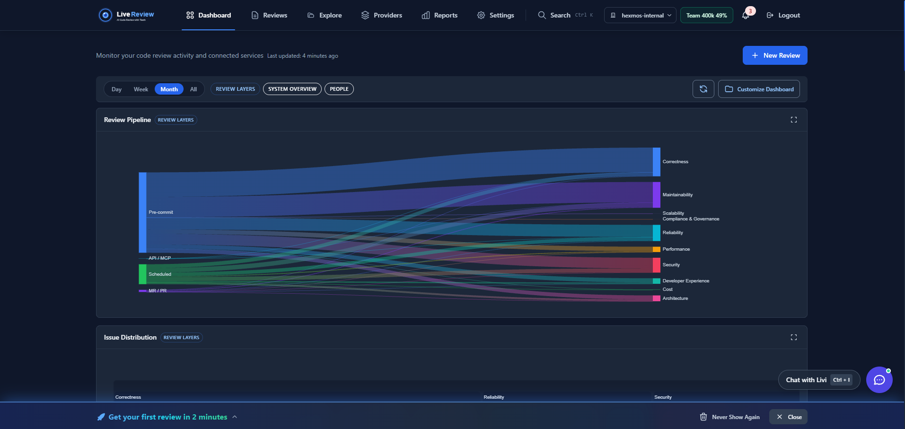 | 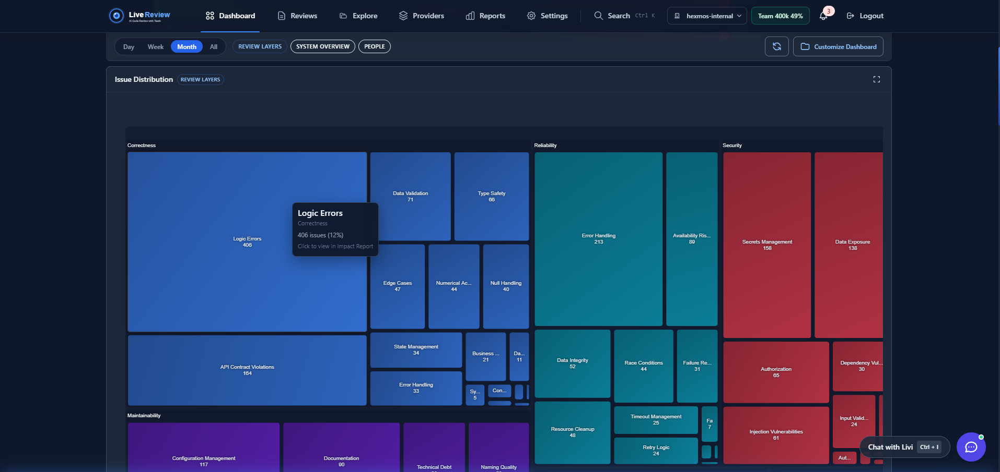 |

### Fine-Tuned LiveReview AI Model
LiveReview comes with its own fine-tuned AI model, ready from day one. Prefer your own provider? Bring your own key (BYOK) for Gemini, OpenAI, AWS Bedrock, a self-hosted Ollama model, or any other LLM.

<p align="center">
   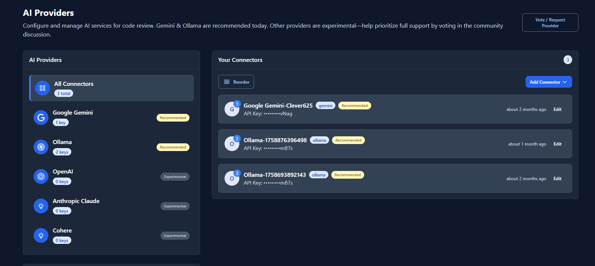
</p>

### Use Any Git Provider: GitHub, GitLab, Bitbucket, Gitea, Azure DevOps
Works effortlessly with GitHub, GitLab, Bitbucket, Gitea, Azure DevOps. Connect your repositories in minutes and start receiving AI-powered code reviews across all your projects.

<p align="center">
   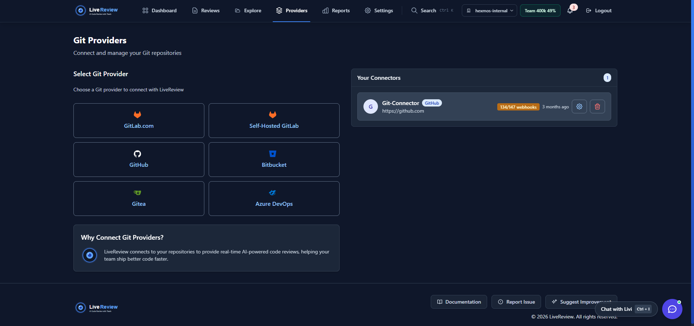
</p>

### Explore Every Repository and Pull Request, Across Every Provider
Browse every repository and merge or pull request LiveReview can see, in one list, no matter which git provider it lives on. Trigger a review straight from that list.

| Every connected repository | Every merge/pull request |
|:---:|:---:|
| 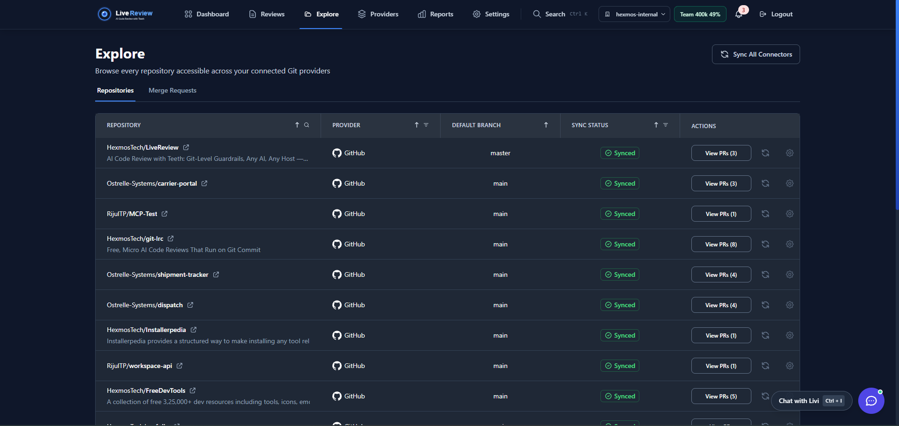 | 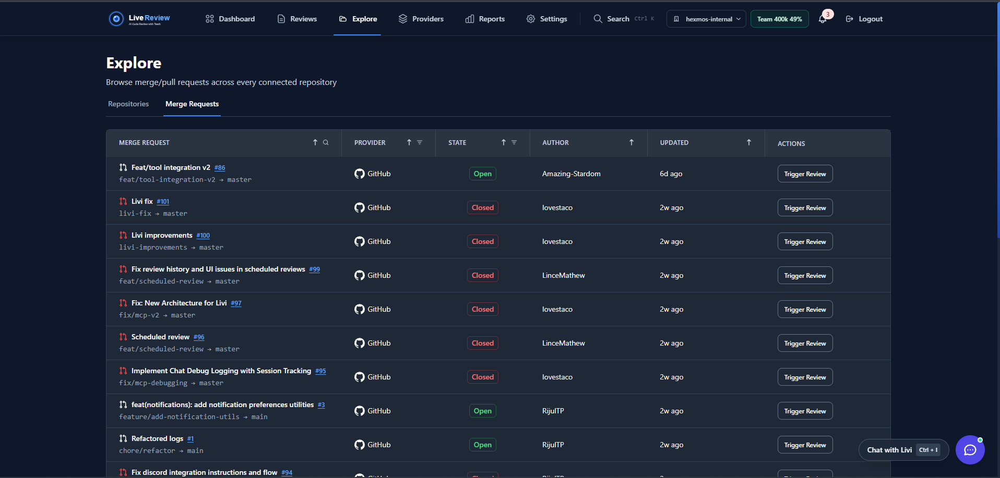 |

<details>
<summary>Show 6 more features (review list, progress tracking, custom prompts, team learnings, PR summaries, AI clarification)</summary>

### View All AI Reviews in One Place
Manage all your code reviews from a single, intuitive interface. Track review status, prioritize PRs, and monitor team activity with real-time updates.

<p align="center">
   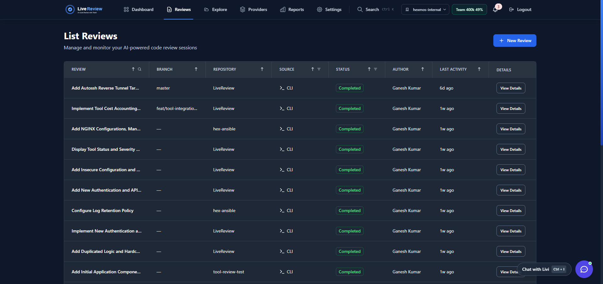
</p>

### Look Under the Hood with Detailed Progress Tracking
Monitor review progress in real-time. Track which files have been reviewed, identify bottlenecks, and ensure nothing falls through the cracks.

<p align="center">
   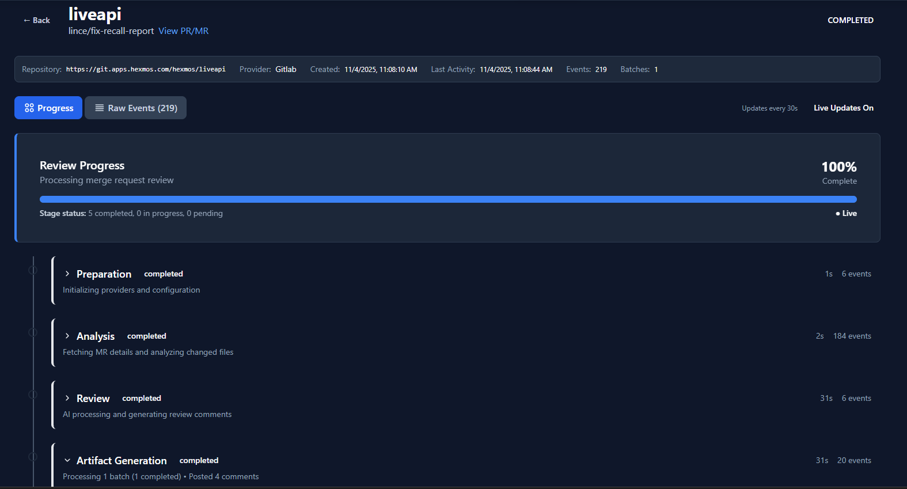
</p>

### Customize Review Prompts to Fit Your Team
Tailor AI review behavior to match your team's coding standards and priorities. Create custom prompts that focus on what matters most to your organization. *(Premium & Enterprise)*

<p align="center">
   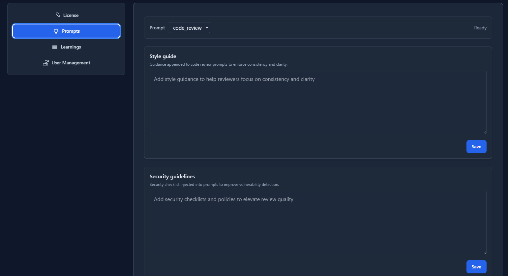
</p>

### Discuss with AI in MR and See it Learn Everyday
Build an institutional knowledge base from code reviews. Capture best practices, common issues, and team learnings to continuously improve code quality.

<p align="center">
   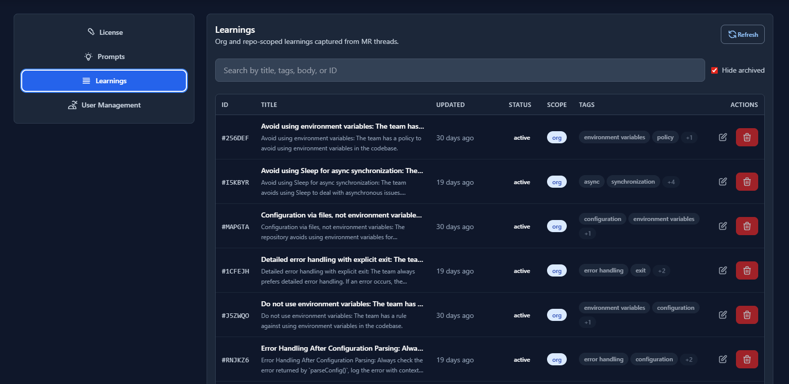
</p>

### Sharp AI-Generated Pull Request Summaries
Get a detailed, actionable summary of every pull request. See changes at a glance: key modifications, potential issues, and suggested improvements.

<p align="center">
   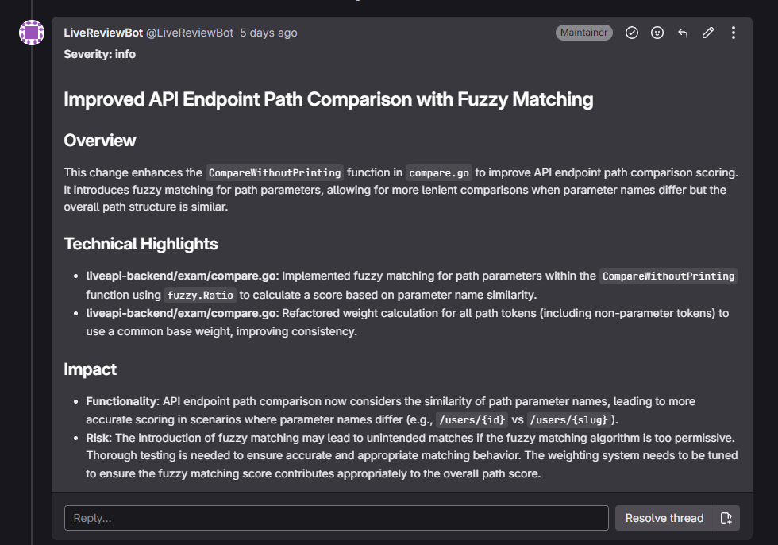
</p>

### Ask AI for Clarification or Debate Code Changes
Ask questions and get instant clarifications about code changes. The AI reviewer understands context and provides helpful explanations to speed up the review process.

<p align="center">
   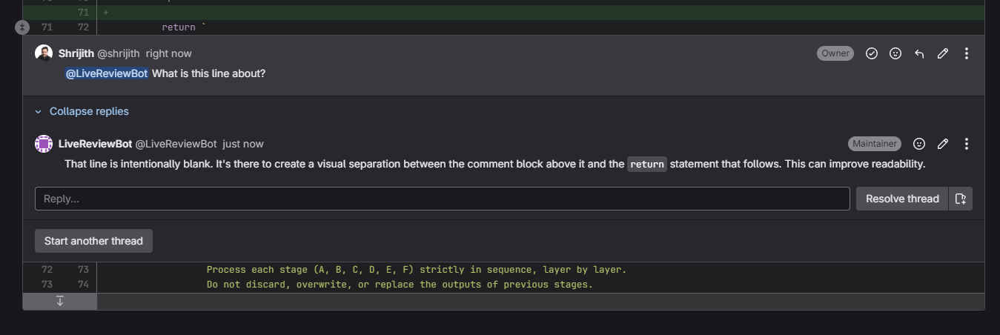
</p>

</details>

<a id="cli"></a>
## Two CLI Tools. One LiveReview Backend.

Install `git-lrc` for commit-time reviews in any terminal. Use `claude-lrc` when you build inside Claude Code. Both tools share the same AI review engine and the same monthly LOC quota.

```bash
# Typical Git Guardrails Flow
git add .
git lrc review

# Or skip explicitly (auditable in git log):
git lrc review --skip
git commit -m "message"
```

<p align="center">
   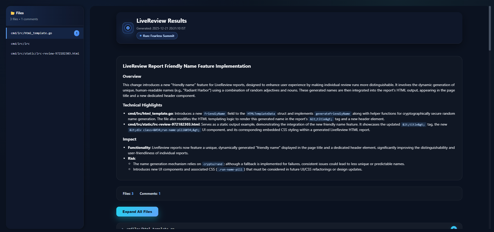
</p>

**`git-lrc` (git commit hook):**
- Git-native, works in any repo without a cloud platform connection
- Skips tracked in git log, auditable, not silent
- One-line install, 30k LOC free every month

**`claude-lrc` (Claude Code integration):**
- Review, vouch, and skip inside Claude Code without leaving the chat surface
- Natural language or slash commands (`/lrc:review`, `/lrc:skip`, `/lrc:vouch`)
- Bundled with `git-lrc`, no separate install needed

### Quick Install

**Linux/macOS:**
```bash
curl -fsSL https://hexmos.com/lrc-install.sh | bash
```

**Windows (PowerShell):**
```powershell
iwr -useb https://hexmos.com/lrc-install.ps1 | iex
```

### Prefer the Web UI? Paste a URL Instead

No local setup needed. Paste a merge or pull request URL into LiveReview and it runs the same review, with the same Blast Radius scoring.

<p align="center">
   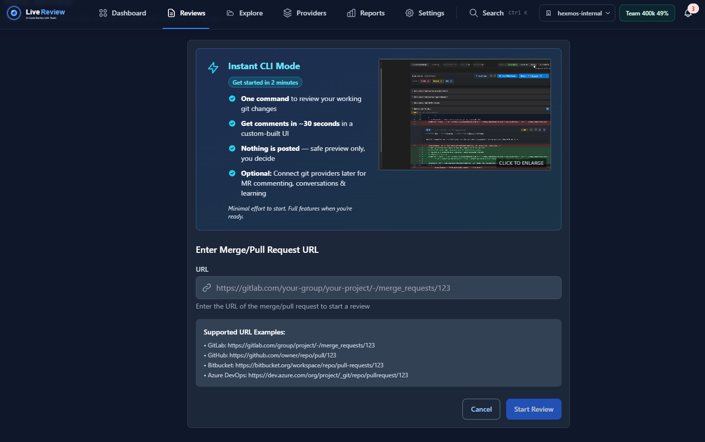
</p>

### git-lrc and claude-lrc in Action

`git-lrc` and `claude-lrc` are the two CLI tools above, in motion. Both plug into the same LiveReview backend.

**git-lrc catching real issues on commit:** leaked credentials, expensive cloud calls, and sensitive data in log statements, all flagged before the commit lands.

https://github.com/user-attachments/assets/cc4aa598-a7e3-4a1d-998c-9f2ba4b4c66e

**claude-lrc reviewing a diff inside Claude Code:** no separate terminal, no context switch, just a slash command or a plain-English request.

https://github.com/user-attachments/assets/bff8595b-fcf0-47a2-b0af-859e6af656e3

**Issue Navigator:** every finding, filterable by severity, category, and subcategory, with a one-click send to your AI agent.

<p align="center">
   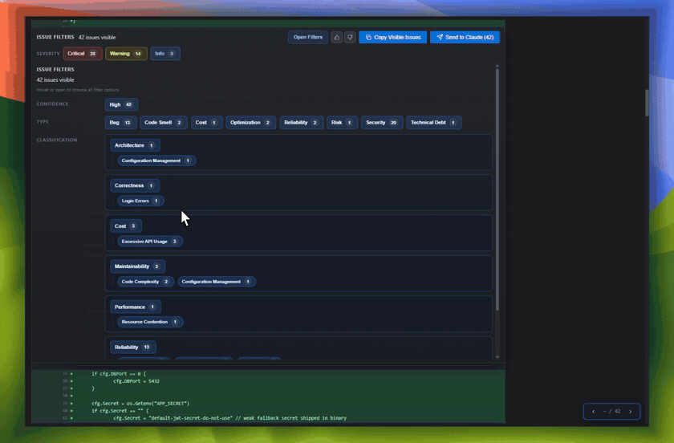
</p>

**Summary Deck:** a 60-second slide summary of what changed, why, and what risks were flagged, generated automatically for every review.

<p align="center">
   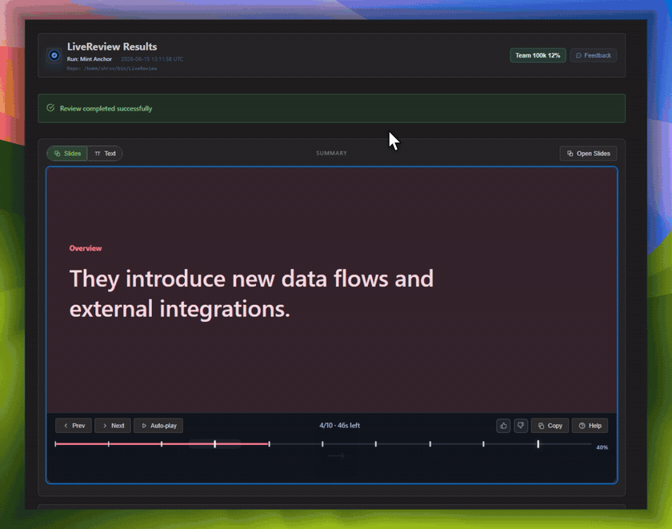
</p>

**Risk-Scored View:** every hunk ranked by blast radius and customer-impact potential, with the full signal breakdown behind each score.

| Score badge, with breakdown | Whole diff, ranked by risk |
|:---:|:---:|
| 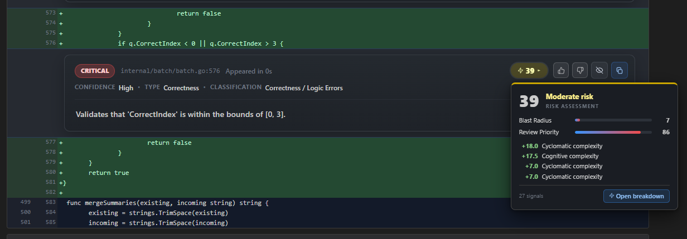 | 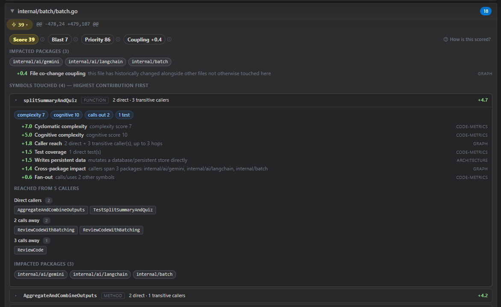 |

**Connector management:** switch AI providers, or reorder them to set review priority, from one screen.

<p align="center">
   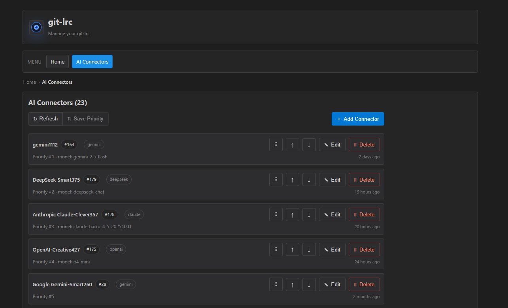
</p>

<details>
<summary>Show 2 more git-lrc videos (setup walkthrough, review UI walkthrough)</summary>

**Setup, start to finish:** one command, two browser sign-ins (LiveReview API key, free Gemini API key), about a minute total.

https://github.com/user-attachments/assets/392a4605-6e45-42ad-b2d9-6435312444b5

**The review UI, end to end:** GitHub-style diff, inline AI comments with severity badges, staged file list, and the review summary, all in the browser window that opens after `git commit`.

https://github.com/user-attachments/assets/b579d7c6-bdf6-458b-b446-006ca41fe47d

</details>

<a id="ide-extensions"></a>
## IDE Extensions

Get AI code reviews without leaving your editor. Available for VSCode, Cursor, and Antigravity.

| IDE | Install Link |
|-----|--------------|
| **VSCode** | [Visual Studio Marketplace](https://marketplace.visualstudio.com/items?itemName=Hexmos.livereview) |
| **Cursor** | [Open VSX Registry](https://open-vsx.org/extension/hexmos/livereview) |
| **Antigravity** | [Open VSX Registry](https://open-vsx.org/extension/hexmos/livereview) |

<a id="mcp-server"></a>
## Get Actionable Engineering Intelligence with MCP and APIs

Every code review LiveReview performs adds to a growing source of **engineering intelligence**. Use the MCP server or REST API instead of piecing pull requests, comments, and reviews together by hand:

- Generate custom reports
- Identify your strongest contributors
- Uncover quality and security trends
- Drill into engineering activity in minutes, not hours

### Getting your API Key

1. Go to LiveReview
2. Click on Settings
3. Navigate to API Keys
4. Generate and copy a new API key

<p align="center">
   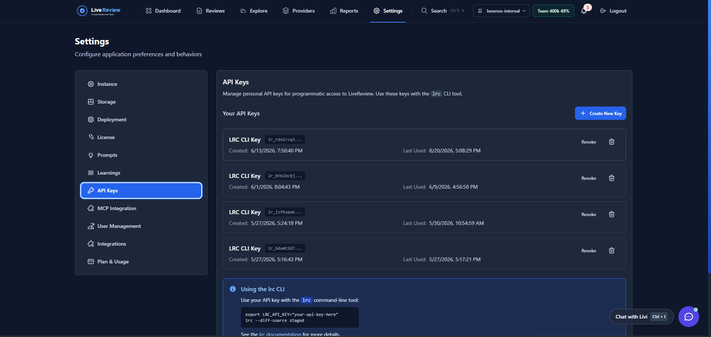 API Keys: generate and manage keys for the lrc CLI and MCP server" width="80%"/>
</p>

### Configuration

Add the following block to your MCP client's configuration file:

- For eg: Claude Desktop: claude_desktop_config.json
- Other clients: Check the client's documentation for the equivalent file.

```json
{
  "mcpServers": {
    "livereview": {
      "command": "npx",
      "args": [
        "-y",
        "mcp-remote",
        "https://livereview.hexmos.com/api/mcp",
        "--header",
        "X-API-KEY: ${LIVEREVIEW_API_KEY}"
      ],
      "env": {  
        "LIVEREVIEW_API_KEY": "<YOUR_LIVEREVIEW_API_KEY>"  
      }                       
    }
  }
}
```

Replace `<YOUR_LIVEREVIEW_API_KEY>` with your actual LiveReview API key.

### What you can do

Once connected to the MCP server, you can ask your assistant to interact with LiveReview.

#### Code Reviews
| Tool | Description | Example Prompt |
|------|-------------|----------------|
| `post_api_v1_connectors_trigger-review` | Trigger a new code review for a repo URL | *"Trigger a review for https://github.com/user/repo/pull/123"* |
| `get_api_v1_reviews` | List recent reviews | *"List our recent completed reviews"* |
| `get_api_v1_reviews_id_summary` | Get the AI summary and insights for a specific review | *"Summarize the review ID xyz"* |
| `get_api_v1_reviews_id_accounting` | Get the token and LOC accounting for a review | *"Show the token usage for review ID xyz"* |

<details>
<summary>Show all MCP tools (Learnings & Prompts, Billing & Quotas, Integrations)</summary>

#### Learnings & Prompts
| Tool | Description | Example Prompt |
|------|-------------|----------------|
| `get_api_v1_learnings` | List existing team learnings | *"List our team's active learnings"* |
| `get_api_v1_learnings_id` | Get details of a specific learning | *"Show details for learning ID abc"* |
| `put_api_v1_learnings_id` | Update an existing learning | *"Update learning ID abc to enforce snake_case"* |
| `get_api_v1_prompts_catalog` | List available prompt catalogs | *"Show the catalog of prompt rules"* |
| `get_api_v1_prompts_key_variables` | Get required variables for a prompt template | *"What variables does the base prompt need?"* |
| `get_api_v1_prompts_key_render` | Render a prompt preview with provided variables | *"Render the prompt key 'system' with..."* |

#### Billing & Quotas
| Tool | Description | Example Prompt |
|------|-------------|----------------|
| `get_api_v1_billing_status` | Check current billing status of the organization | *"What is our current billing status?"* |
| `get_api_v1_quota_status` | Check current LOC status and quota | *"How much LOC quota do we have left?"* |
| `get_api_v1_billing_usage_summary` | Get billing usage summary | *"Show a summary of our billing usage"* |
| `get_api_v1_billing_usage_operations` | Get recent billable review operations | *"List the most recent billable operations"* |
| `get_api_v1_billing_usage_members` | Get member-wise LOC usage information | *"Show the usage broken down by team member"* |
| `post_api_v1_billing_upgrade_preview` | Generate an upgrade preview for a target plan | *"Preview the cost of upgrading to team_32usd"* |

#### Integrations
| Tool | Description | Example Prompt |
|------|-------------|----------------|
| `get_api_v1_connectors` | List configured Git connectors | *"List our configured Git connectors"* |
| `get_api_v1_aiconnectors` | List configured AI provider connections | *"Which AI providers are currently active?"* |

</details>

<a id="repository-rules"></a>
## Enforce Your Team's Engineering Standards with Repository Rules

A good reviewer knows your language and framework. A great reviewer also knows *your* repository: which patterns your team prefers, which dependencies are off-limits, and which files don't need a second look. Drop a `.lrc/` directory in your repo, and LiveReview reads it on every review.

```
.lrc/
├── ignore               # files the reviewer never sees
├── rules/
│   ├── INSTRUCTIONS.md  # read first, every review
│   ├── security.md
│   └── style.md
└── policy/
    └── tools.toml       # which checks are allowed to run
```

| | |
|---|---|
| **Repository Rules** | Write down the decisions that come up in every review, such as "prefer direct SQL over ORM abstractions" or "avoid new infrastructure dependencies". LiveReview reads `INSTRUCTIONS.md` first, then every other `rules/*.md` file, in order. |
| **Ignore File** | Point the reviewer away from generated code, vendored dependencies, and anything else that doesn't need a second look. Uses gitignore syntax, matched from your repo root. Ignored files don't count toward billable lines. |
| **Policies** *(coming soon)* | Decide which tools and checks can run on this repo. Machine-readable settings that LiveReview reads directly. Never sent to the AI model. |
| **Static Checks** *(coming soon)* | Pair AI review with static analyzers like semgrep and eslint. Authorized through policy, run as part of the same commit-time flow. |

<a id="adaptive-reviews"></a>
## Cut AI Review Costs by 50% Without Compromising Quality

**Adaptive Reviews** uses two AI models instead of one: a powerful Leader Model finds complex issues, and a cost-efficient Helper Model explains them. Same review quality, at half the price.

| | |
|---|---|
| **Reduce Costs by 40-50%** | A cost-efficient Helper Model writes the explanations, instead of one expensive model doing everything. |
| **Double Review Volume** | Review up to 2x more code on the same budget. No need to monitor limits constantly. |
| **Leader + Helper Architecture** | The Leader Model finds complex issues. The Helper Model expands those findings into detailed explanations. |
| **Maintain Review Quality** | The high-end Leader Model still drives issue detection, so accuracy does not drop. |

<a id="self-hosted-tiers"></a>
## Pricing & Enterprise

LiveReview's pricing tracks **reviewed workload, not headcount**:

| Plan | Price | Includes |
|---|---|---|
| **Individual** (Free) | Free (30k LOC/month) | Bring your own AI keys, unlimited projects, git-native CLI (`git-lrc`), dedicated VS Code extension |
| **Premium** | From $32/month for 100k LOC, scaling to $1024/month for 3.2M LOC | Unlimited team members, AI-generated review summaries, custom review prompts, engineering insights dashboard, full API access |
| **Enterprise** | [Contact us](https://hexmos.com/livereview?modal=start-free) | Multiple organizations, self-hosted deployment, SSO/SAML & directory sync, custom domain, full data privacy |

LOC (Lines of Code) means the code shown in the reviewed diff, not your total repository size. Paid plans keep users unlimited, so cost tracks reviewed workload, not seats.

### LiveReview Enterprise

Custom deployments, SSO integration, dedicated AI keys, and priority SLA support, for scaling engineering organizations:

- **Security & Ops**: Self-hosted deployment (optional), support for multiple organizations, custom domain hosting, SSO & User Directory integration (SAML/OIDC), and full data privacy
- **Flexible AI & Models**: Connect to private cloud LLMs or opt for fully self-hosted AI models using Ollama or your private infrastructure to guarantee no code leaves your network
- **Custom Integrations**: Custom API access, bespoke workflow integrations, and engineering insights dashboards tailored to your development tooling
- **Dedicated SLA Support**: Prioritized support channel with dedicated SLAs, custom development, and professional onboarding

[Get a Self-Hosted License](https://hexmos.com/livereview/selfhosted-access/) · [Explore Self-Hosted Enterprise](https://hexmos.com/livereview/enterprise-selfhosted)

<a id="comparisons"></a>
## How LiveReview Compares

### vs CodeRabbit

| | LiveReview | CodeRabbit |
|---|---|---|
| **Pricing model** | Free up to 30k LOC/month, then fixed LOC bands ($32 for 100k, up to $1024 for 3.2M) | Per-seat pricing |
| **Cost as team grows** | Stays flat; tracks reviewed workload, not headcount | Rises with headcount, even if workload does not |
| **Rate limits** | None per developer | Hourly rate limits per developer per repository |
| **Source code** | Source-available, browse the full codebase and scan reports on GitHub | Closed source |
| **Enforcement point** | Git level, same for every editor and OS | Varies by integration |

### vs GitHub Copilot Code Review

| | LiveReview | GitHub Copilot |
|---|---|---|
| **Pricing model** | Tracks reviewed LOC, not seats | Caps premium requests at 300 on the Pro plan |
| **Users and projects** | Unlimited, inside your monthly LOC quota | Limited by plan tier |
| **Git provider support** | GitHub, GitLab, Bitbucket, Gitea, Azure DevOps | GitHub only |
| **Setup for other providers** | None needed, works out of the box | Requires a separate product |

<details>
<summary>Show more comparisons (SonarQube, Claude Code, Cursor / Antigravity)</summary>

### vs SonarQube

| | LiveReview | SonarQube |
|---|---|---|
| **Source availability** | Entire codebase is source-available | Only Community Edition is source-available; Developer and Enterprise editions are closed |
| **Self-host setup** | One command, under 5 minutes | Resource-intensive server, heavier dependency management |

### vs Claude Code

| | LiveReview | Claude Code |
|---|---|---|
| **Pricing model** | LOC-based, predictable, tied to reviewed code | Token-metered; a few complex reviews can create hard-to-forecast costs |
| **Source and data** | Source-available, self-hostable on Enterprise, data stays on your network | Closed product; sends your source code to Anthropic's cloud |
| **Intended use** | Enforces standards org-wide, at the git level, across GitHub, GitLab, Gitea, Bitbucket, and Azure DevOps | CLI tool built for individual developers on specific tasks |

### vs Cursor / Antigravity in-editor review

| | LiveReview | Cursor / Antigravity |
|---|---|---|
| **Visibility** | Organization-wide, everyone sees the same findings | Visible only to the individual using the tool |
| **Enforcement point** | Git level, same for every IDE, triggers automatically on commit | In-editor only; hard to enforce consistently across different IDEs |

</details>

## Full Documentation

Visit the [LiveReview Docs](https://hexmos.com/livereview/docs/) for complete documentation, including self-hosted setup guides, git provider integration, MCP/API reference, and more.

<a id="security"></a>
## Security

### Built for security review

LiveReview documents the questions enterprise teams ask first: deployment model differences, code and data handling, AI safeguards, supply-chain visibility, and security response timelines.

- Separate guidance for self-hosted/Ollama and cloud LLM deployments
- Explicit data handling: what leaves your network, when it happens, and retention/deletion expectations
- Prompt-injection and unsafe-output mitigations, automated scanners, SBOM visibility, and transparent GitHub source with responsive disclosure policy

[Open Security Page](https://hexmos.com/livereview/security) · [Read SECURITY.md](https://github.com/HexmosTech/LiveReview/blob/master/SECURITY.md) · [Report a Vulnerability](https://github.com/HexmosTech/LiveReview/security/advisories/new)

### Security FAQ

**What data is collected, stored, and used in LiveReview?**
When you run a review, LiveReview sends only the diff to the AI model. Nothing else. We do not store your code. We never train any AI model on your code. We regularly scan our own codebase with Gitleaks, OSV Scanner, Govulncheck, and Semgrep, through GitHub Actions. We generate and publish a Bill of Materials with every release.

**How does self-hosted deployment differ from cloud in terms of security?**
In self-hosted mode, your team runs the entire application stack and database. Your infrastructure team controls all data storage, backups, retention, and network access. In cloud or provider-integrated mode, LiveReview sends data to configured external provider endpoints for AI inference and git provider operations.

**Does LiveReview provide a Software Bill of Materials (SBOM)?**
Yes. An SBOM is automatically generated on every release using Syft and published to the GitHub release assets.

**Is LiveReview SOC 2 Type II certified?**
Not at this time. The full security documentation, scan history, SBOM, and source code are all public. Enterprise buyers can review them directly and see the product's security posture for themselves.

For complete details, see [SECURITY.md](SECURITY.md).

### Security Scans

LiveReview includes local security scan targets in the Makefile:

```bash
make security-govulncheck
make security-govulncheck-json
make security-osv
make security-gitleaks
make security-triage
```

Scan artifacts are written under `security_issues/`.

#### Ported Workflows Are Disabled By Default

The following workflows are present but gated off by default:

- `.github/workflows/gitleaks.yml`
- `.github/workflows/osv-scanner.yml`
- `.github/workflows/govulncheck.yml`

They only run when GitHub repository variable `ENABLE_SECURITY_WORKFLOWS` is set to `true`.

Enable later:

1. Open repository settings in GitHub.
2. Go to Secrets and variables > Actions > Variables.
3. Add `ENABLE_SECURITY_WORKFLOWS` with value `true`.

Disable again:

- Set `ENABLE_SECURITY_WORKFLOWS=false` or remove the variable.

## FAQ

**What is Blast-Radius scoring, exactly?**
It is a per-hunk score. It combines call-graph reach, cross-package impact, persistent-state mutation, cyclomatic and cognitive complexity, and test coverage gaps. The score shows which parts of a diff can do the most damage if something is wrong, so reviewers spend their limited attention where it matters most.

**What is LOC in LiveReview?**
LOC stands for Lines of Code. In LiveReview pricing, it refers to the code shown in the reviewed diff, not the total size of your repository.

**How much LOC is available on the premium plan?**
Premium starts at 100,000 LOC per month for $32. Higher paid bands are 200,000 LOC for $64, 400,000 LOC for $128, 800,000 LOC for $256, 1.6M LOC for $512, and 3.2M LOC for $1024. All paid bands keep users unlimited and refresh every month.

**What does the enterprise plan offer?**
Multiple organization support, SSO & directory sync (SAML/OIDC), self-hosted deployment within your own infrastructure, a custom domain, and full data privacy over where your code and review data are stored.

**Is my code secure with LiveReview?**
When you run a review, LiveReview sends only the diff to the AI model. Nothing else. We do not store your code, and we never train any AI model on it. See the [Security](#security) section above for full details.

**What's the difference between self-hosting this repo and the cloud version?**
This repository is the self-hosted product itself. It is Docker-based and runs entirely on your infrastructure. The [cloud version](https://hexmos.com/livereview/) runs the same review engine as a managed service, so you do not have to run the stack yourself.

## License

LiveReview is distributed under a modified variant of **Sustainable Use License (SUL)**.

> [!NOTE]
>
> **What this means:**
> - ✅ **Source Available**: Full source code is available for self-hosting
> - ✅ **Business Use Allowed**: Use LiveReview for your internal business operations
> - ✅ **Modifications Allowed**: Customize for your own use
> - ❌ **No Resale**: Cannot be resold or offered as a competing service
> - ❌ **No Redistribution**: Cannot redistribute modified versions commercially
>
> This license ensures LiveReview remains sustainable while giving you full access to self-host and customize for your needs.

For detailed terms, examples of permitted and prohibited uses, and definitions, see the full
[LICENSE.md](LICENSE.md).

<a id="transformation-program"></a>
## Want Hands-On Help Rolling This Out?

Self-hosting gets you the tool. The **14-Day Transformation Program** gets your whole team, from execs to individual contributors, actually using it well. It covers onboarding, workflow integration, and measurable before/after engineering metrics.

<p align="center">
   <a href="https://hexmos.com/livereview/transform/">
      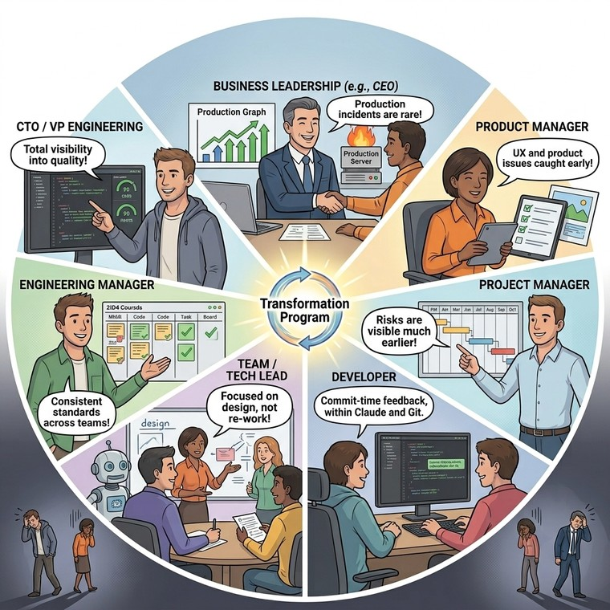
   </a>
</p>

<p align="center">
   <a href="https://hexmos.com/livereview/transform/"><b>Join the 14-Day Transformation Program →</b></a>
</p>

<p align="center">
   <b>Self-Host:</b> <a href="#quick-start">Get Started Free</a> | 
   <b>Cloud:</b> <a href="https://hexmos.com/livereview/">Try hexmos.com/livereview</a> | 
   <a href="https://hexmos.com/livereview/docs/">Documentation</a>
</p>
