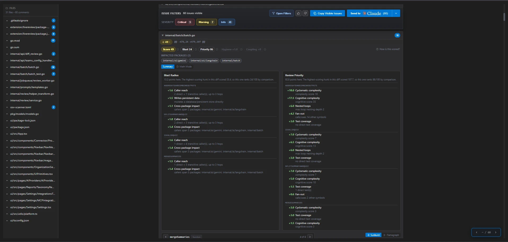
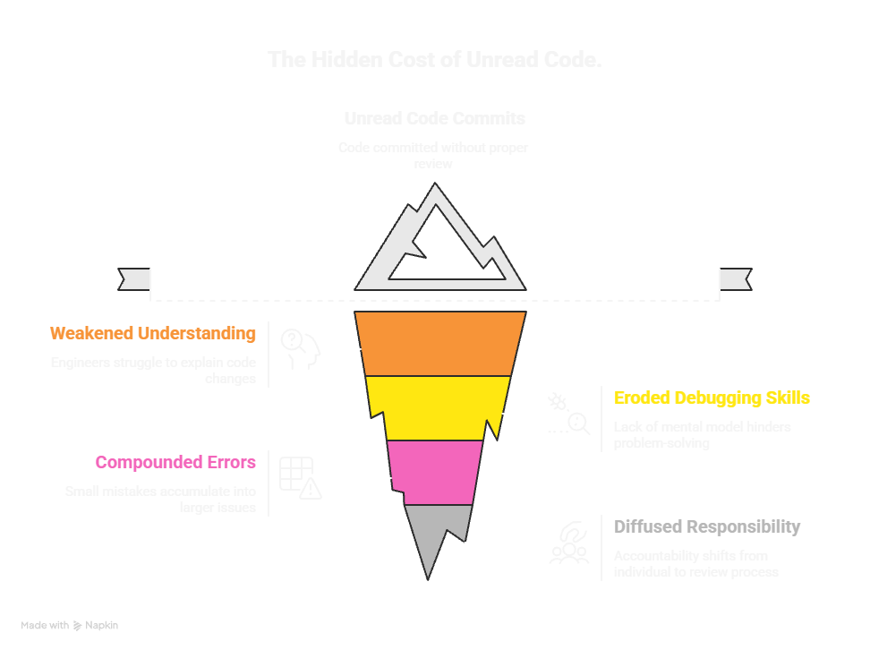
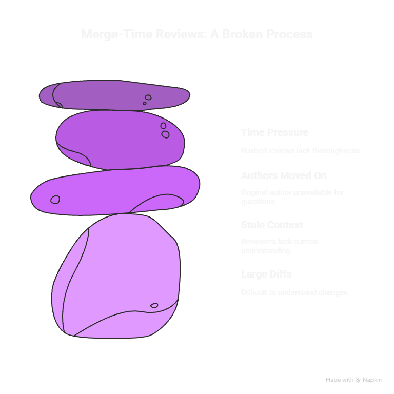

<a href="https://github.com/HexmosTech/LiveReview/actions/workflows/gitleaks.yml" target="_blank" rel="noopener noreferrer"></a>&nbsp;<a href="https://github.com/HexmosTech/LiveReview/actions/workflows/osv-scanner.yml" target="_blank" rel="noopener noreferrer"></a>&nbsp;<a href="https://github.com/HexmosTech/LiveReview/actions/workflows/govulncheck.yml" target="_blank" rel="noopener noreferrer"></a>&nbsp;<a href="https://github.com/HexmosTech/LiveReview/actions/workflows/semgrep.yml" target="_blank" rel="noopener noreferrer"></a>&nbsp;&nbsp;<a href="https://github.com/HexmosTech/LiveReview/actions/workflows/mcp-testcases.yml" target="_blank" rel="noopener noreferrer"></a>


# Blast-Radius Aware AI Code Review for Business-Critical Systems

**Not every diff is equal risk.** LiveReview scores every change by how far it can actually break your system — call graph reach, cross-package impact, cyclomatic and cognitive complexity, test coverage gaps — and turns that into a **Blast Radius** and **Review Priority** score your team can triage against. It's AI code review that tells you *what to look at first*, not just what changed.

<p align="center">
   
</p>

<p align="center">
   <b>Self-Host for Free:</b> <a href="#quick-start">Get Started in 5 Minutes</a><br/>
   <i>Want a guided rollout?</i> <a href="https://hexmos.com/livereview/transform/">Join the 14-Day Transformation Program</a>
</p>

---

## What Do You Need?

| I want to... | Go to |
|---|---|
| Try LiveReview free in under 5 minutes | [Quick Start](#quick-start) |
| Understand Blast-Radius scoring | [Blast-Radius Aware Review](#blast-radius) |
| See what LiveReview's analytics can tell my team | [Data-Backed Decisions](#data-backed-decisions) |
| See the full feature set | [Features](#features) |
| Wire reviews into every commit | [Git-Native CLI](#cli) |
| Review code without leaving my editor | [IDE Extensions](#ide-extensions) |
| Connect LiveReview to Claude, Cursor, or Windsurf | [MCP Server](#mcp-server) |
| Compare self-hosted pricing tiers | [Self-Hosted Tiers](#self-hosted-tiers) |
| See how LiveReview stacks up vs Copilot / CodeRabbit / Graphite | [Comparisons](#comparisons) |
| Get hands-on help rolling this out to my team | [14-Day Transformation Program](#transformation-program) |

---

<a id="quick-start"></a>
## Quick Start — Self-Hosted Community Edition (Free)

Get LiveReview running in under 5 minutes. The **Community Edition is completely free** and includes everything you need to start AI-powered code reviews.

### One-Command Install

```bash
# Quick demo setup (localhost only, no webhooks)
curl -fsSL https://raw.githubusercontent.com/HexmosTech/LiveReview/main/lrops.sh | sudo bash -s -- setup-demo
```

**Requirements:**
- `bash` shell (zsh/fish not officially supported)
- Ubuntu/MacOS
- Docker (with `docker-compose` or `docker compose`)
- `jq`

You'll need a **Free Licence** to get started — follow the guide [here](https://github.com/HexmosTech/LiveReview/wiki/Get-a-LiveReview-Licence).

**Access your installation:**
- Web UI: http://localhost:8081/
- API: http://localhost:8888/api

### What You Get for Free (Community Edition)

- ✅ **Full AI Code Reviews** — Same powerful AI review engine as paid tiers, including Blast-Radius scoring
- ✅ **All Git Providers** — GitHub, GitLab, Bitbucket, Gitea integration
- ✅ **Any AI Provider** — Gemini, OpenAI, or self-hosted Ollama
- ✅ **Dashboard & Analytics** — Track review quality and team velocity
- ✅ **Up to 3 Users** — Perfect for small teams or individual developers
- ✅ **Unlimited Reviews** — No daily limits, review as much as you need

### Production Deployment

For teams needing external access and webhooks, follow the [Productionization Guide](https://github.com/HexmosTech/LiveReview/wiki/Productionize-LiveReview).

| Feature | Demo Mode | Production Mode |
|---------|-----------|-----------------|
| **Access** | localhost only | External via reverse proxy |
| **Webhooks** | Disabled (manual triggers) | Enabled (automatic triggers) |
| **Configuration** | Zero config required | Reverse proxy setup needed |
| **Perfect for** | Development, testing, demos | Teams, production deployments |

---

<a id="blast-radius"></a>
## Blast-Radius Aware AI Code Review

Line count and diff size are terrible proxies for risk. A five-line change to a shared auth helper can be far more dangerous than a five-hundred-line change to an isolated script. LiveReview scores every reviewable hunk on two axes:

- **Blast Radius** — how far the change can propagate: caller reach (direct + transitive callers), cross-package impact, whether it mutates persistent state, and how many packages/services are touched.
- **Review Priority** — how much attention the change deserves right now: cyclomatic and cognitive complexity, nested-loop depth, fan-out, and test coverage gaps.

Both scores are broken down term-by-term in the UI — nothing is a black box — so reviewers can see exactly *why* a hunk ranked where it did.

<p align="center">
   
</p>

### Enforce It at Every Stage — Org-Wide

Mix and match enforcement per repository, at whichever point in the workflow matters to your team:

| Commit | Before Push | MR / PR | CI / CD | Scheduled Checks |
|:---:|:---:|:---:|:---:|:---:|
| `git lrc review` on staged changes | Guardrail before code leaves your machine | Full AI review + Blast-Radius score on the diff | Gate merges on review completion | Periodic sweeps for drift and hotspots |

---

<a id="why-livereview"></a>
## Why LiveReview

| | |
|---|---|
| **Blast-Radius Aware** | Reviews are ranked by how much of the system a change can actually break — not by diff size. |
| **Git-Level Guardrails** | Unread code never sneaks in. Reviews track every commit, and deliberate skips stay in the audit trail. |
| **Works With Your Git Setup** | GitHub, GitLab, Bitbucket, Gitea, or something else—LiveReview adapts to your workflow, not the other way around. |
| **Choose Your AI** | Pick the LLMs that match quality, latency, and budget today—and swap them whenever your requirements change. |
| **Works Wherever You Do** | Web, CLI, IDE. Cloud, self-hosted, or air gapped. Same guardrails and visibility everywhere. |
| **Priced to Stay Out of the Way** | The cost of review shouldn't decide whether review happens. LiveReview stays lean so teams can use it daily. |

### Why Engineering Teams Love LiveReview

- **Accelerate Delivery Cycles** — Reduce PR review time from hours to minutes, enabling your team to ship features faster and with greater confidence
- **Save Senior Engineering Time** — Liberate senior developers from routine reviews, allowing them to focus on mentorship and high-impact architectural work
- **Drive Quality Excellence** — Build a culture of quality with metrics that highlight improvements in code standards, reduced defects, and development efficiency
- **Prioritize by Risk, Not Volume** — Blast-Radius scoring means the riskiest hunks surface first, even on a huge PR

---

<a id="data-backed-decisions"></a>
## See It In Action: Data-Backed Decisions

LiveReview ships with **Livi**, a chat-native analytics layer that answers plain-English questions about your review activity with live charts — no dashboard-building required. Below is a sample of the kind of questions different roles ask Livi, rendered from the same chart specs used in the interactive product demo at [hexmos.com/livereview](https://hexmos.com/livereview/#data-backed-decisions).

### Adoption & Growth

| Persona | Question to Livi | Chart |
|---|---|---|
| Exec | "Is LiveReview adoption increasing across the org?" |  |
| Exec | "Which repositories have adopted LiveReview the most?" |  |

### Repository Analysis

| Persona | Question to Livi | Chart |
|---|---|---|
| Product | "Which repos are gaining or losing engineering velocity?" |  |
| Product | "How much code are we reviewing in each repository?" |  |

### Engineer Analysis

| Persona | Question to Livi | Chart |
|---|---|---|
| Eng Manager | "Who are our top contributors by review volume?" |  |
| Eng Manager | "How does each engineer trigger their reviews?" |  |

### Review Quality

| Persona | Question to Livi | Chart |
|---|---|---|
| Eng Manager | "What are the most concerning issue types this quarter?" |  |
| Eng Manager | "Are engineers actually incorporating reviews into their daily workflow?" |  |

### Cost & Efficiency

| Persona | Question to Livi | Chart |
|---|---|---|
| Exec | "How much does LiveReview cost us per day?" |  |
| Product | "Which AI provider gives us the best value?" |  |

### Engagement & Trust

| Persona | Question to Livi | Chart |
|---|---|---|
| Eng Manager | "Are people trusting the reviews LiveReview produces?" |  |
| Product | "Which engineers get the most value from LiveReview?" |  |

### Summary & Comparison

| Persona | Question to Livi | Chart |
|---|---|---|
| Exec | "How does this week compare to last week?" |  |
| Eng Manager | "What's the overall severity mix across all our findings?" |  |

### Trace & Investigate

| Persona | Question to Livi | Chart |
|---|---|---|
| Engineer | "Show me reviews connected to last week's production incident." |  |
| Engineer | "Which files keep showing up with issues?" |  |

*Charts above use illustrative sample data. Try the fully interactive version, with live chart drill-down, at [hexmos.com/livereview](https://hexmos.com/livereview/#data-backed-decisions).*

---

<a id="features"></a>
## Powerful Features for Modern Engineering Teams

<p align="center">
   
</p>

### Track Engineering Excellence
Quantify your team's improvement with comprehensive metrics. Track review times, code quality trends, and team velocity to demonstrate engineering value to stakeholders.

<p align="center">
   
</p>

### Pick Your AI: Gemini, OpenAI, or Self-Hosted Ollama
Bring Your Own Key (BYOK) - Use Gemini, OpenAI, or any LLM provider of your choice. Maintain complete control over your AI usage and costs while leveraging the best models for your needs.

<p align="center">
   
</p>

### Use Any Git Provider: GitHub, GitLab, Bitbucket, Gitea
Works effortlessly with GitHub, GitLab, Bitbucket, Gitea. Connect your repositories in minutes and start receiving AI-powered code reviews across all your projects.

<p align="center">
   
</p>

### View All AI Reviews in One Place
Manage all your code reviews from a single, intuitive interface. Track review status, prioritize PRs, and monitor team activity with real-time updates.

<p align="center">
   
</p>

### Sharp AI-Generated Pull Request Summaries
Get detailed, actionable summaries of every pull request. Understand changes at a glance with AI-generated insights that highlight key modifications, potential issues, and improvement suggestions.

<p align="center">
   
</p>

### Ask AI for Clarification or Debate Code Changes
Ask questions and get instant clarifications about code changes. The AI reviewer understands context and provides helpful explanations to speed up the review process.

<p align="center">
   
</p>

### Customize Review Prompts to Fit Your Team
Tailor AI review behavior to match your team's coding standards and priorities. Create custom prompts that focus on what matters most to your organization. *(Team & Enterprise)*

<p align="center">
   
</p>

### Discuss with AI in MR and See it Learn Everyday
Build an institutional knowledge base from code reviews. Capture best practices, common issues, and team learnings to continuously improve code quality. *(Team & Enterprise)*

<p align="center">
   
</p>

---

<a id="cli"></a>
## Git-Native Code Review Protocol

LiveReview adds a new git subcommand: `git lrc review`. Review before every commit, explicitly skip when needed, and maintain an auditable trail in your git history.

```bash
# Typical Git Guardrails Flow
git add .
git lrc review

# Or skip explicitly (auditable in git log):
git lrc review --skip
git commit -m "message"
```

<p align="center">
   
</p>

<p align="center">
   
</p>

**CLI Benefits:**
- Review becomes part of git workflow, not an afterthought
- Runs directly in your repo on uncommitted code — before merge time, not after
- Skips are explicit and tracked in commit history
- Human oversight for AI-generated code

<p align="center">
   
</p>

### Quick Install

**Linux/macOS:**
```bash
curl -fsSL https://hexmos.com/lrc-install.sh | bash
```

**Windows (PowerShell):**
```powershell
iwr -useb https://hexmos.com/lrc-install.ps1 | iex
```

---

<a id="ide-extensions"></a>
## IDE Extensions

Get instant AI code reviews without leaving your editor. Available for VSCode, Cursor, and Antigravity.

| IDE | Install Link |
|-----|--------------|
| **VSCode** | [Visual Studio Marketplace](https://marketplace.visualstudio.com/items?itemName=Hexmos.livereview) |
| **Cursor** | [Open VSX Registry](https://open-vsx.org/extension/hexmos/livereview) |
| **Antigravity** | [Open VSX Registry](https://open-vsx.org/extension/hexmos/livereview) |

---

<a id="mcp-server"></a>

## Model Context Protocol (MCP) Server

Integrate LiveReview natively into your favorite AI-powered IDEs and clients, including Cursor, Claude Desktop, Windsurf, and VS Code.

### Getting your API Key

1. Go to LiveReview
2. Click on Settings
3. Navigate to API Keys
4. Generate and copy a new API key

### Configuration

Add the following block to your MCP client's configuration file:

- For eg: Claude Desktop: claude_desktop_config.json
- Other clients: Check the client's documentation for the equivalent file.

```json
{
  "mcpServers": {
    "livereview": {
      "command": "npx",
      "args": [
        "-y",
        "mcp-remote",
        "https://livereview.hexmos.com/api/mcp",
        "--header",
        "X-API-KEY: ${LIVEREVIEW_API_KEY}"
      ],
      "env": {  
        "LIVEREVIEW_API_KEY": "<YOUR_LIVEREVIEW_API_KEY>"  
      }                       
    }
  }
}
```

Replace `<YOUR_LIVEREVIEW_API_KEY>` with your actual LiveReview API key.

### What you can do

Once connected to the MCP server, You can ask your assistant to interact with LiveReview.

#### Code Reviews
| Tool | Description | Example Prompt |
|------|-------------|----------------|
| `post_api_v1_connectors_trigger-review` | Trigger a new code review for a repo URL | *"Trigger a review for https://github.com/user/repo/pull/123"* |
| `get_api_v1_reviews` | List recent reviews | *"List our recent completed reviews"* |
| `get_api_v1_reviews_id_summary` | Get the AI summary and insights for a specific review | *"Summarize the review ID xyz"* |
| `get_api_v1_reviews_id_accounting` | Get the token and LOC accounting for a review | *"Show the token usage for review ID xyz"* |

#### Learnings & Prompts
| Tool | Description | Example Prompt |
|------|-------------|----------------|
| `get_api_v1_learnings` | List existing team learnings | *"List our team's active learnings"* |
| `get_api_v1_learnings_id` | Get details of a specific learning | *"Show details for learning ID abc"* |
| `put_api_v1_learnings_id` | Update an existing learning | *"Update learning ID abc to enforce snake_case"* |
| `get_api_v1_prompts_catalog` | List available prompt catalogs | *"Show the catalog of prompt rules"* |
| `get_api_v1_prompts_key_variables` | Get required variables for a prompt template | *"What variables does the base prompt need?"* |
| `get_api_v1_prompts_key_render` | Render a prompt preview with provided variables | *"Render the prompt key 'system' with..."* |

#### Billing & Quotas
| Tool | Description | Example Prompt |
|------|-------------|----------------|
| `get_api_v1_billing_status` | Check current billing status of the organization | *"What is our current billing status?"* |
| `get_api_v1_quota_status` | Check current LOC status and quota | *"How much LOC quota do we have left?"* |
| `get_api_v1_billing_usage_summary` | Get billing usage summary | *"Show a summary of our billing usage"* |
| `get_api_v1_billing_usage_operations` | Get recent billable review operations | *"List the most recent billable operations"* |
| `get_api_v1_billing_usage_members` | Get member-wise LOC usage information | *"Show the usage broken down by team member"* |
| `post_api_v1_billing_upgrade_preview` | Generate an upgrade preview for a target plan | *"Preview the cost of upgrading to team_32usd"* |

#### Integrations
| Tool | Description | Example Prompt |
|------|-------------|----------------|
| `get_api_v1_connectors` | List configured Git connectors | *"List our configured Git connectors"* |
| `get_api_v1_aiconnectors` | List configured AI provider connections | *"Which AI providers are currently active?"* |

---

<a id="self-hosted-tiers"></a>
## Self-Hosted Tiers

LiveReview offers three tiers for self-hosted deployments. **Community Edition is free forever and provides genuine value for small teams and individual developers.**

| Feature | Community (Free) | Team | Enterprise |
|---------|:----------------:|:----:|:----------:|
| AI Code Reviews (with Blast-Radius scoring) | ✅ | ✅ | ✅ |
| Git Provider Integration | ✅ | ✅ | ✅ |
| AI Provider Configuration | ✅ | ✅ | ✅ |
| Dashboard & Analytics | ✅ | ✅ | ✅ |
| **Unlimited Reviews** | ✅ | ✅ | ✅ |
| Users | Up to 3 | Unlimited | Unlimited |
| Prompt Customization | ❌ | ✅ | ✅ |
| Learnings Management | ❌ | ✅ | ✅ |
| Multiple API Keys | ❌ | ✅ | ✅ |
| Priority Support | ❌ | ✅ | ✅ |
| SSO / SAML | ❌ | ❌ | ✅ |
| Audit Logs | ❌ | ❌ | ✅ |
| Compliance Reports | ❌ | ❌ | ✅ |
| Custom Integrations | ❌ | ❌ | ✅ |

**Growing team?** Upgrade to Team or Enterprise for advanced features, priority support, and unlimited users.

[Get a License](https://hexmos.com/livereview/selfhosted-access/)

---

<a id="comparisons"></a>
## How LiveReview Compares

### vs GitHub Copilot Code Review
- **Multi-Platform Support**: Works with GitHub, GitLab, Bitbucket, AND Gitea (not just GitHub)
- **Self-Hosted Option**: Your code stays private vs cloud-only risk
- **AI Choice Freedom**: Pick your AI backend vs locked into one model
- **Cost Control**: You control both costs and quality

### vs CodeRabbit
- **More Affordable**: Significantly lower pricing
- **Zero Cloud Risk**: Self-hosted option vs cloud-only deployment
- **Complete Control**: Your code never leaves your infrastructure (with self-hosted)
- **Attack Prevention**: Eliminates entire class of cloud-based vulnerabilities

### vs Graphite / Qodo Merge / CodeAnt AI
- **Deployment Flexibility**: Cloud or self-hosted — your choice
- **AI Provider Freedom**: Bring your own keys, use any LLM
- **Git-Native Protocol**: `git lrc review` integrates directly into your workflow
- **Works Everywhere**: Web, CLI, IDE — same experience across all

### vs Building Your Own
- **Ready Out-of-Box**: Skip months of development time
- **Complex Integration Covered**: Code host APIs, webhooks, dashboards all handled
- **AI Expertise Included**: Advanced prompt engineering and review logic, including Blast-Radius scoring, included
- **Ongoing Maintenance**: No need for ongoing MR/PR handling, user management
- **Focus on Product**: Your team builds features, not infrastructure

---

## Full Documentation

Visit the [Wiki](https://github.com/HexmosTech/LiveReview/wiki) for complete documentation:

<a href="https://github.com/HexmosTech/LiveReview/wiki"></a>

---

## Security You Can Count On

- Security is treated as a first-class concern across LiveReview deployment models.
- We maintain documented reporting channels, response commitments, and verification references.
- Automated security checks and SBOM generation support ongoing transparency.
- For complete details, see [SECURITY.md](SECURITY.md).

---

## Security Scans

LiveReview includes local security scan targets in the Makefile:

```bash
make security-govulncheck
make security-govulncheck-json
make security-osv
make security-gitleaks
make security-triage
```

Scan artifacts are written under `security_issues/`.

### Ported Workflows Are Disabled By Default

The following workflows are present but gated off by default:

- `.github/workflows/gitleaks.yml`
- `.github/workflows/osv-scanner.yml`
- `.github/workflows/govulncheck.yml`

They only run when GitHub repository variable `ENABLE_SECURITY_WORKFLOWS` is set to `true`.

Enable later:

1. Open repository settings in GitHub.
2. Go to Secrets and variables > Actions > Variables.
3. Add `ENABLE_SECURITY_WORKFLOWS` with value `true`.

Disable again:

- Set `ENABLE_SECURITY_WORKFLOWS=false` or remove the variable.

---

## FAQ

**How will LiveReview benefit our engineering organization?**
LiveReview provides tangible improvements in code quality and delivery speed while generating meaningful metrics that demonstrate the value of your engineering investments. Teams typically see a 70% reduction in review time and up to 40% increase in velocity.

**What is Blast-Radius scoring, exactly?**
It's a per-hunk score built from call-graph reach, cross-package impact, persistent-state mutation, cyclomatic/cognitive complexity, and test coverage gaps. It tells you which parts of a diff can do the most damage if something's wrong, so reviewers spend their limited attention where it matters most. See [Blast-Radius Aware Review](#blast-radius) above.

**Is my code secure with LiveReview?**
Absolutely. With self-hosted deployment, all code stays within your infrastructure with no data sent to external servers. For teams preferring managed hosting, our [cloud version](https://hexmos.com/livereview/) uses industry-standard security practices and encryption.

**What's the difference between Community and paid tiers?**
Community Edition is fully functional with unlimited reviews, all AI providers, and all git integrations — limited to 3 users. Team and Enterprise tiers add prompt customization, learnings management, priority support, and unlimited users.

---

## License

LiveReview is distributed under a modified variant of **Sustainable Use License (SUL)**.

> [!NOTE]
>
> **What this means:**
> - ✅ **Source Available** — Full source code is available for self-hosting
> - ✅ **Business Use Allowed** — Use LiveReview for your internal business operations
> - ✅ **Modifications Allowed** — Customize for your own use
> - ❌ **No Resale** — Cannot be resold or offered as a competing service
> - ❌ **No Redistribution** — Cannot redistribute modified versions commercially
>
> This license ensures LiveReview remains sustainable while giving you full access to self-host and customize for your needs.

For detailed terms, examples of permitted and prohibited uses, and definitions, see the full
[LICENSE.md](LICENSE.md).

---

<a id="transformation-program"></a>
## Want Hands-On Help Rolling This Out?

Self-hosting gets you the tool. The **14-Day Transformation Program** gets your whole team — from execs to individual contributors — actually using it well: onboarding, workflow integration, and measurable before/after engineering metrics.

<p align="center">
   <a href="https://hexmos.com/livereview/transform/">
      
   </a>
</p>

<p align="center">
   <a href="https://hexmos.com/livereview/transform/"><b>Join the 14-Day Transformation Program →</b></a>
</p>

---

<p align="center">
   <b>Self-Host:</b> <a href="#quick-start">Get Started Free</a> | 
   <b>Cloud:</b> <a href="https://hexmos.com/livereview/">Try hexmos.com/livereview</a> | 
   <a href="https://github.com/HexmosTech/LiveReview/wiki">Documentation</a>
</p>
