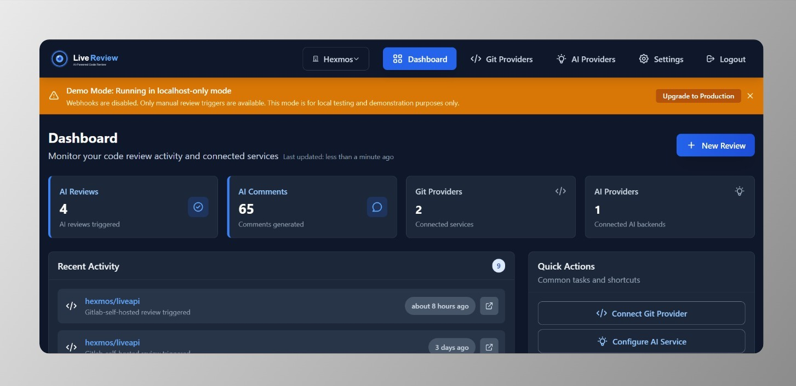

# Secure, Flexible & Affordable AI Code Reviewer

*LiveReview* is a self-hosted AI code reviewer that keeps your code private, adapts to your setup, and won’t blow your budget.

<br />
<p align="center">
   
  
</p>
<br />

<p align="center">
   <a href="#our-approach">Philosophy</a> |
   <a href="#comparisons">Comparisons</a> |
   <a href="#features">Features</a> |
   <a href="#quick-start">Quick Start</a> |
   <a href="#full-documentation">Full Documentation</a>
  
</p>


## Our Approach

1. **Security-First Design 🔒**
   - **Zero Cloud Dependency**: Runs entirely on your infrastructure (on-prem or private cloud) - except for checking for software updates and licence validation
   - **Complete Code Privacy**: Your source code and credentials never leave your environment
   - **Risk Elimination**: Recent breaches of cloud-hosted reviewers show how misconfigurations expose repositories--LiveReview eliminates this by design
   - **Full Control**: Your code stays on your servers, period
2. **Maximum Flexibility** 
   - **Multi-Platform**: Integrates with GitHub, GitLab, and Bitbucket
   - **AI Choice Freedom**: Choose Gemini, OpenAI, or self-hosted Ollama for maximum privacy
   - **Workflow Adaptation**: Adapts to your process instead of forcing change
   - **Custom Support**: Unusual setup? We'll work with you--:w
   [open an issue](https://github.com/HexmosTech/LiveReview/issues)
3. **Transparent Affordability**
   - **Straightforward Pricing**: Significantly lower than comparable hosted tools
   - **Sustainable Model**: Paid software built for long-term reliability
   - **R&D Focus**: Investment goes to product improvements, not marketing hype
   - **Maximum Value**: Every dollar funds engineering excellence

<a id="comparisons"></a>
## How is this better than... 🆚

### **vs GitHub Copilot**
- **Multi-Platform Support**: Works with GitHub, GitLab, AND Bitbucket (not just GitHub)
- **Self-Hosted Security**: Your code stays private vs cloud-hosted risk
- **AI Choice Freedom**: Pick your AI backend vs locked into one model
- **Cost Control**: You control both costs and quality

### **vs CodeRabbit**  
- **More Affordable**: Significantly lower pricing than CodeRabbit
- **Zero Cloud Risk**: Self-hosted vs recent security breaches in cloud platforms
- **Complete Control**: Your code never leaves your infrastructure
- **Attack Prevention**: Eliminates entire class of cloud-based vulnerabilities

### **vs Building Your Own**
- **Ready Out-of-Box**: Skip months of development time
- **Complex Integration Covered**: Code host APIs, webhooks, dashboards all handled
- **AI Expertise Included**: Advanced prompt engineering and review logic included  
- **Ongoing Maintenance**: No need for ongoing MR/PR handling, user management
- **Focus on Product**: Your team builds features, not infrastructure

## Features

- Integrated Dashboard - See usage statistics, impact analysis, user activity
- Git Provider - Connect as many git providers as you want - GitHub, GitLab, Bitbucket supported already.
- AI Connector - Connect your Gemini, OpenAI or Self-Hosted Ollama Keys
- Demo and Production modes - Try it out in 5 minutes, and make it production grade quickly with built-in help
- High-quality MR Summary - goes through all the changes in its full context and produces short and medium-size summaries of reviews
- Find a large number of technical issues in areas such as: unused variables, security vulnerabilities, performance issues, missing error handling, duplicated code detection, null pointer detection, data structure fit to problem, etc. Find a full list of both technical and business benefits in the [landing page](https://hexmos.com/livereview)

## Quick Start

Get LiveReview running in under 5 minutes with our simplified two-mode deployment system:

### Demo Mode (Recommended for First Time) 🚀

This is the recommended installation method. With this - you can get your first AI code review posted within 5-10 minutes:

```bash
# Quick demo setup (localhost only, no webhooks)
curl -fsSL https://raw.githubusercontent.com/HexmosTech/LiveReview/main/lrops.sh | sudo bash -s -- setup-demo
```

You'll require a Free Licence to get started - follow the guide [here](https://github.com/HexmosTech/LiveReview/wiki/Get-a-LiveReview-Licence) to obtain a Licence.

**Demo Mode Features:**

- **Zero configuration** - just run and go
- **Localhost only** - secure local development
- **Manual triggers** - webhooks disabled for simplicity
- **Perfect for testing** - try LiveReview without any setup
- **Easy upgrade path** - switch to production mode anytime

**Access your demo installation:**

- Web UI: http://localhost:8081/
- API: http://localhost:8888/api

### Production Mode (External Access Ready) 🌐

For teams and production deployments with reverse proxy and webhooks follow the [Productionization Guide](https://github.com/HexmosTech/LiveReview/wiki/Productionize-LiveReview)


**Production Mode Features:**

- **External access** - ready for reverse proxy setup
- **Webhooks enabled** - automatic code review triggers
- **SSL/TLS ready** - secure for production use
- **Auto-configuration** - webhook URLs derived automatically

### Two-Mode Deployment System

LiveReview uses an intelligent two-mode system that automatically adapts based on your deployment:


| Feature           | Demo Mode                       | Production Mode               |
| ------------------- | --------------------------------- | ------------------------------- |
| **Access**        | localhost only                  | External via reverse proxy    |
| **Webhooks**      | Disabled (manual triggers)      | Enabled (automatic triggers)  |
| **Configuration** | Zero config required            | Reverse proxy setup needed    |
| **Perfect for**   | Development, testing, demos     | Teams, production deployments |
| **Upgrade**       | `LIVEREVIEW_REVERSE_PROXY=true` | Ready out of the box          |


## Full Documentation

Visit the [Wiki](https://github.com/HexmosTech/LiveReview/wiki):


<a href="https://github.com/HexmosTech/LiveReview/wiki"></a>

## License

> [!NOTE]
>
> LiveReview is a proprietary developer tool by Hexmos, built to streamline code review and help teams ship faster.
>
> Guides, documentation, roadmaps, and community discussions are fully open, making it easy to get started, provide feedback, and stay informed about product evolution.
