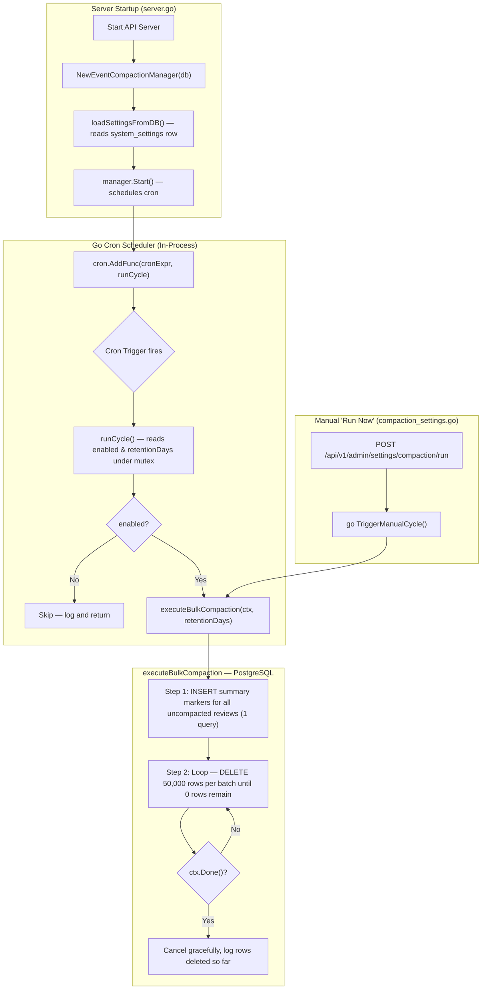

# Event Log Compaction Architecture

This document describes the design, implementation, database impact, and SuperAdmin management controls for automated event log compaction (`review_events`) in LiveReview.

---

## 1. Overview & Problem Statement

Production PostgreSQL analysis revealed that `review_events` accounted for **1.57 GB (4.89M rows)** out of the overall database size. **95.8% (4.07M rows)** consisted of `event_type = 'log'`, primarily caused by verbose LLM streaming chunk lines (`Streaming chunk 1...35`), divider formatting (`========`), and hunk line-number debug prints.

Core AI review findings, inline comments, file diffs, and cost accounting reside in separate, untouched tables (`reviews`, `ai_comments`, `loc_usage_ledger`, `tool_credit_ledger`) and blob artifacts.

**Solution:** Implement an automated, in-process Go compaction manager (`EventCompactionManager`) using Go Cron (`github.com/robfig/cron/v3`) that runs on a configurable schedule (default: **daily at 02:00 Server Time** (`0 2 * * *`)). Before deleting raw debug logs older than the retention threshold (default: **30 days**), the manager writes a **Compaction Summary Marker** containing original total event count.

---

## 2. Code Locations

| Purpose | File |
|---|---|
| Compaction Manager (scheduler, executor) | [`internal/api/event_compaction.go`](file:///home/gk/hex/LiveReview/internal/api/event_compaction.go) |
| SuperAdmin API Endpoints (GET/PUT/POST) | [`internal/api/compaction_settings.go`](file:///home/gk/hex/LiveReview/internal/api/compaction_settings.go) |
| Server Lifecycle (Start/Stop hooks) | [`internal/api/server.go`](file:///home/gk/hex/LiveReview/internal/api/server.go) |
| Settings UI Tab (SuperAdmin only) | [`ui/src/pages/Settings/CompactionSettingsTab.tsx`](file:///home/gk/hex/LiveReview/ui/src/pages/Settings/CompactionSettingsTab.tsx) |
| Settings Tab Registration & Access Gate | [`ui/src/pages/Settings/Settings.tsx`](file:///home/gk/hex/LiveReview/ui/src/pages/Settings/Settings.tsx) |
| Mega Menu Entry (SuperAdmin only) | [`ui/src/components/Navbar/megaMenuData.ts`](file:///home/gk/hex/LiveReview/ui/src/components/Navbar/megaMenuData.ts) |
| Unit Tests | [`internal/api/event_compaction_test.go`](file:///home/gk/hex/LiveReview/internal/api/event_compaction_test.go) |

---

## 3. Go Cron Scheduler Architecture

The event compaction manager uses Go Cron (`github.com/robfig/cron/v3`) and is initialized in [`server.go`](file:///home/gk/hex/LiveReview/internal/api/server.go) at startup.



### Key Architectural Points

1. **No Distributed Lock**: Compaction runs in the **backend process** (single instance). A distributed advisory lock is not needed — concurrent execution from multiple backend processes is not a deployment scenario. The `lockStore` field and `compactionLeaderLocker` interface have been removed entirely from `EventCompactionManager`.

2. **Dynamic Config Reload**: `UpdateConfig(enabled, cronExpr, retentionDays)` updates `m.enabled`, `m.retentionDays`, and `m.cronExpr` in memory. If `cronExpr` changed and `m.cronRunner` is running, it removes the old entry and adds a new one — **no server restart required**.

3. **Graceful Shutdown**: `Stop()` calls `m.cronRunner.Stop()` (which waits up to 5 seconds for running jobs to finish) then cancels `m.ctx`, which causes any in-progress batch delete loop to exit cleanly via `ctx.Done()`.

---

## 4. executeBulkCompaction — Exact SQL

### Step 1: INSERT Summary Markers (1 query, runs once per cycle)

Inserts one summary marker row per review that has not been compacted yet and has events older than `retentionDays`:

```sql
INSERT INTO public.review_events (review_id, org_id, ts, event_type, level, data)
SELECT 
    re.review_id, 
    re.org_id, 
    NOW(), 
    'log', 
    'info', 
    jsonb_build_object(
        'message', 'Review log events compacted',
        'compacted', true,
        'original_total_event_count', COUNT(*)
    )
FROM public.review_events re
WHERE re.ts < NOW() - ($1 * INTERVAL '1 day')
  AND NOT EXISTS (
      SELECT 1 FROM public.review_events cx 
      WHERE cx.review_id = re.review_id AND cx.org_id = re.org_id 
        AND cx.event_type = 'log' AND (cx.data->>'compacted')::boolean = true
  )
GROUP BY re.review_id, re.org_id;
```

> **`NOT EXISTS` guard**: Ensures idempotency — if a summary marker already exists for a review, that review is skipped. Running compaction twice is always safe.

### Step 2: Batched DELETE (50,000 rows/batch, loop until 0 rows remain)

Instead of a single unbounded DELETE (which causes PostgreSQL statement timeouts on millions of rows), deletion runs in safe chunks using `ctid`:

```sql
DELETE FROM public.review_events
WHERE ctid IN (
    SELECT ctid FROM public.review_events
    WHERE ts < NOW() - ($1 * INTERVAL '1 day')
      AND event_type = 'log'
      AND COALESCE(level, 'info') NOT IN ('error', 'warn')
      AND (data->>'compacted')::boolean IS NOT TRUE
      AND data->>'message' NOT ILIKE '%started%'
      AND data->>'message' NOT ILIKE '%completed%'
      AND data->>'message' NOT ILIKE '%posted%'
      AND data->>'message' NOT ILIKE '%generated%'
      AND data->>'message' NOT ILIKE '%CLI DIFF REVIEW STARTED%'
    LIMIT 50000
);
```

The Go loop runs this until `RowsAffected() == 0`.

---

## 5. What Is Kept vs. Deleted

| Event Category | Rule |
|---|---|
| **Compaction Summary Marker** (`compacted: true`) | **NEVER deleted** — `NOT TRUE` guard in DELETE |
| **All non-log event types** (`status`, `completion`, `artifact`, `batch`, etc.) | **NEVER deleted** — `event_type = 'log'` filter in DELETE |
| **Error & Warning logs** (`level = 'error'` or `'warn'`) | **NEVER deleted** — `NOT IN ('error', 'warn')` guard |
| **Stage milestone messages** (contain `started`, `completed`, `posted`, `generated`, `CLI DIFF REVIEW STARTED`) | **NEVER deleted** — `NOT ILIKE` guards |
| **Verbose streaming debug logs** (info/debug/success level, no milestone keyword) | **DELETED** |

---

## 6. GET /api/v1/admin/settings/compaction — 1 Query Only

`GetCompactionSettings` in [`compaction_settings.go`](file:///home/gk/hex/LiveReview/internal/api/compaction_settings.go) executes **exactly 1 query**:

```sql
SELECT data FROM system_settings WHERE name = 'event_compaction_settings';
```

Response time: **< 1ms**. No stats, no counts, no scans of `review_events`.

The response includes the stored config plus a `schedule_human` field generated by `describeCronSchedule()` (pure Go, no DB call):

```json
{
  "enabled": true,
  "cron_expression": "0 2 * * *",
  "retention_days": 30,
  "schedule_human": "Daily at 02:00 UTC"
}
```

---

## 7. SuperAdmin Access Control (AGENTS.md compliance)

Per `AGENTS.md` — all system-level settings are **Super Admin only**:

- **`Settings.tsx`**: Storage tab gated with `isSuperAdmin` only.
- **`megaMenuData.ts`**: Log Compaction mega menu link gated with `(ctx) => ctx.isSuperAdmin`.
- **Backend**: All three endpoints (`GET`, `PUT`, `POST`) are registered under `authMiddleware.RequireSuperAdmin()` in `server.go`.

> No org-level `org_id` scoping applies here because `system_settings` is a globally public system config (not an org-scoped resource), consistent with the AGENTS.md rule: *"No Global Fallbacks: Never write global queries that omit `org_id` filters, unless the resource is globally public (e.g. system configs)."*

---

## 8. Verified Database Test Results

### Live Test on hexmos-internal (Org ID 151)

| Review ID | Events Before | Events After | Rows Deleted | Reduction |
|---|---|---|---|---|
| **#8288** (1,225 log events) | **1,252** | **186** | **1,039** | **83%** |
| **#8529** (138 log events) | **145** | **40** | **105** | **73%** |

### Full Database Pass (all orgs, retention_days=30)

- **Total Reviews Compacted**: **10,211 reviews**
- **Verbose Log Rows Deleted**: **3,419,193 rows** (69 batches of 50,000)
- **Total Execution Time**: **29.3 seconds** — zero statement timeouts
- **Summary Markers Inserted**: **10,211** (one per eligible review)

---

## 9. Unit Tests

Tests live at [`internal/api/event_compaction_test.go`](file:///home/gk/hex/LiveReview/internal/api/event_compaction_test.go):

| Test | What It Verifies |
|---|---|
| `TestDefaultCompactionSettingsConfig` | Default fallback values: `enabled=true`, `retention_days=30`, `cron_expression="0 2 * * *"` |
| `TestDescribeCronSchedule` | `describeCronSchedule()` correctly formats daily, every-N-hours, and multi-time-daily expressions |
| `TestEventCompactionManager_ConfigUpdate` | `UpdateConfig()` correctly updates `enabled`, `retentionDays`, and `cronExpr` in memory |

Run with:
```bash
go test -v ./internal/api -run TestEventCompaction
```
