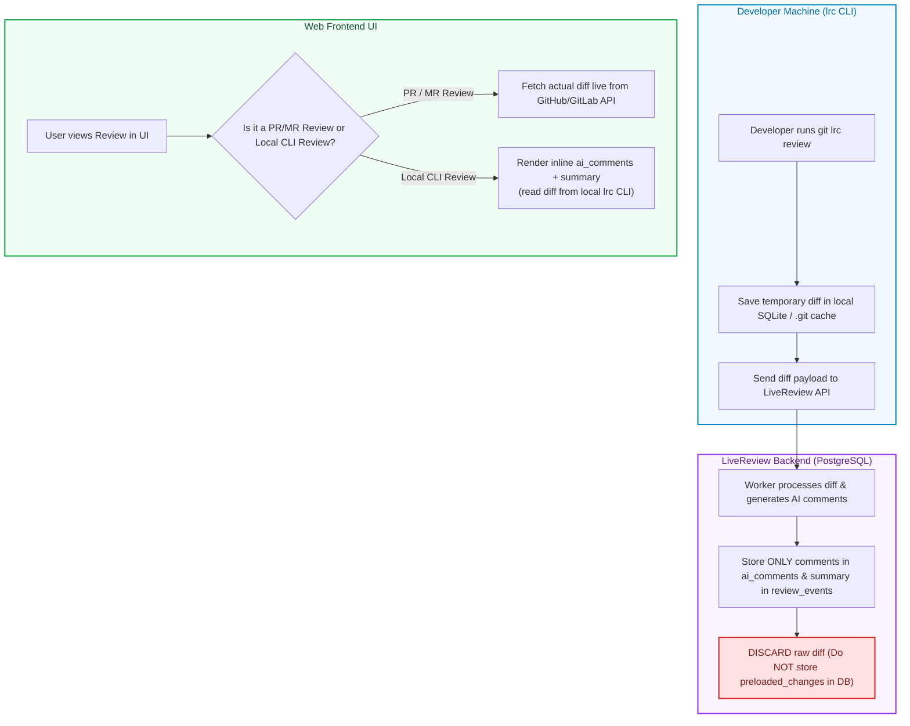

# LiveReview Database Storage Analysis, Backup Dump Breakdown, and Code Diff Elimination Plan

This document presents the complete empirical storage analysis of the LiveReview PostgreSQL database across production backups (`ServiceBackups_pg_sunday.tar.gz` and `ServiceBackups_pg_thursday.tar.gz`), identifies the root causes of database and backup bloat, and details the architectural plan to eliminate raw source code diff storage from PostgreSQL.

---

## 1. Executive Summary & Key Discoveries

1. **Raw Code Diffs account for 99.89% of `reviews` table storage**:
   - The `reviews.metadata` JSONB column holds **`879.89 MB`** out of `881.66 MB` in the `reviews` table.
   - The `metadata->'preloaded_changes'` key (raw Git diffs) alone takes up **`791.30 MB` (90.4% of metadata)** in PostgreSQL and **`149.85 MB` (90.4% of `reviews` dump size)** inside the compressed backup file.
2. **Top 3 Tables account for 96.7% of all backup storage**:
   - `reviews` (**165.72 MB** dump) + `river_job` (**79.09 MB** dump) + `review_events` (**59.30 MB** dump) = **304.11 MB** out of the **314.59 MB** total `.dump` file.
3. **`cli_diff` is the ONLY trigger type storing raw diffs**:
   - **100%** of the 791 MB of stored raw diffs in PostgreSQL belongs exclusively to CLI reviews (`trigger_type = 'cli_diff'`).
   - `scheduled`, `manual`, `mcp`, and `api` reviews store **0 MB** of raw diffs.
4. **Massive Scheduler Tick Log Bloat in `upgrade_request_events`**:
   - Out of 603,455 rows in `upgrade_request_events`, **603,418 rows (99.99%)** are duplicate `reconciliation_retrying` background scheduler tick logs (`{"source": "scheduler_tick"}`), bloating the table to **`198 MB` in PostgreSQL**.
5. **Privacy Promise Alignment**:
   - The `README.md` guarantees: *"Your code is never stored."*
   - Eliminating `preloaded_changes` from PostgreSQL aligns the backend 100% with our privacy commitment, reclaims **~800 MB of Postgres storage**, and shrinks backup dumps by **~150 MB**.

---

## 2. Backup Archive Structure (`ServiceBackups_pg_thursday.tar.gz`)

The 467 MB tarball archive (`ServiceBackups_pg_thursday.tar.gz`) contains **17 distinct microservice database dumps** totaling **`496.61 MB`** uncompressed:

| # | Database Dump File Name | Service / Purpose | Dump File Size | % of Total Backup Archive |
| :--- | :--- | :--- | :--- | :--- |
| 1 | 🔴 **`livereview.dump`** | Main LiveReview Backend DB | **`327.48 MB`** | **`66.0%`** |
| 2 | 🟠 **`liveapi.dump`** | LiveAPI Microservice DB | **`104.31 MB`** | **`21.0%`** |
| 3 | 🟡 **`feedzap.dump`** | Feedzap Microservice DB | **`37.56 MB`** | **`7.6%`** |
| 4 | ⚪ **`livereview_staging.dump`** | LiveReview Staging DB | **`14.45 MB`** | **`2.9%`** |
| 5 | ⚪ **`screenshot_monitoring_development.dump`** | Screenshot Service DB | **`5.29 MB`** | **`1.1%`** |
| 6 | ⚪ **`dprompts.dump`** | Prompts Service DB | **`3.80 MB`** | **`0.8%`** |
| 7 | ⚪ **`listmonk.dump`** | Listmonk Email Service DB | **`3.25 MB`** | **`0.7%`** |
| 8 | ⚪ **10 Other Microservice Dumps Combined** | Small Services | **`0.47 MB`** | **`0.1%`** |
| **—** | **TOTAL UNCOMPRESSED DUMP SUM** | **17 Services** | **`496.61 MB`** | **`100.0%`** |

---

## 3. Top 10 Tables Storage Analysis (`livereview.dump`)

### Overall Database Totals:
- **Database `before` (Sunday Dump, Uncompacted)**: **`2,398 MB` (2.40 GB)**
- **Database `after` (Thursday Dump, Compacted)**: **`1,549 MB` (1.55 GB)**
- **Net Live Database Savings**: **`-849 MB` (-35.4% Live Disk Drop)**

### Detailed Table Breakdown:

| # | Table Name | Row Count | Dump File Size | Raw Postgres Data Size *(Table + TOAST)* | Postgres Index Size | Primary Reason for Storage |
| :--- | :--- | :--- | :--- | :--- | :--- | :--- |
| 1 | 🔴 **`reviews`** | 11,996 | **`165.72 MB`** *(52.7%)* | **`289.5 MB`** *(5.5MB main + 284MB TOAST)* | **`1.8 MB`** | `metadata->preloaded_changes` (Raw Diffs) & `review_result` |
| 2 | 🟠 **`river_job`** | 523,252 | **`79.09 MB`** *(25.1%)* | **`263.5 MB`** *(183.5MB main + 80MB TOAST)* | **`143.0 MB`** | 523,000 completed background jobs holding `DiffZipBase64` |
| 3 | 🟡 **`review_events`** | 1,540,478 | **`59.30 MB`** *(18.9%)* | **`428.1 MB`** *(403MB main + 25MB TOAST)* | **`212.0 MB`** | Event logs *(3.5M deleted; 1.0M old rows pending batching)* |
| 4 | ⚪ **`upgrade_request_events`** | 603,455 | **`7.33 MB`** *(2.3%)* | **`127.6 MB`** | **`70.0 MB`** | 603,418 `reconciliation_retrying` scheduler tick logs |
| 5 | ⚪ **`chat_messages`** | 44 | **`0.49 MB`** *(0.2%)* | **`0.03 MB`** | **`0.85 MB`** | Chatbot history & response payloads |
| 6 | ⚪ **`pull_requests`** | 1,145 | **`0.46 MB`** *(0.1%)* | **`1.25 MB`** | **`0.82 MB`** | GitHub / GitLab PR metadata cache |
| 7 | ⚪ **`loc_usage_ledger`** | 5,894 | **`0.34 MB`** *(0.1%)* | **`3.58 MB`** | **`1.52 MB`** | Lines of Code usage accounting ledger |
| 8 | ⚪ **`quota_batch_settlements`** | 6,321 | **`0.33 MB`** *(0.1%)* | **`1.84 MB`** | **`1.06 MB`** | Quota batch settlements |
| 9 | ⚪ **`quota_operation_aggregates`** | 6,058 | **`0.31 MB`** *(0.1%)* | **`1.80 MB`** | **`0.70 MB`** | Daily/Monthly LOC usage aggregates |
| 10 | ⚪ **`dashboard_cache`** | 707 | **`0.16 MB`** *(0.0%)* | **`1.50 MB`** | **`0.33 MB`** | Pre-cached dashboard analytics JSON payloads |

---

## 4. Deep-Dive: `reviews.metadata` & Privacy Compliance

### Column Storage Breakdown inside `reviews`:
- **`metadata` JSONB Column**: **`879.89 MB` (99.89% of table data)**
- **All Other 12 Columns Combined** (`repository`, `branch`, `commit_hash`, `user_email`, `status`, etc.): **`1.77 MB` (0.11% of table data)**

### Breakdown of JSON Keys inside `metadata`:

```
reviews.metadata (Total: 879.89 MB)
├── preloaded_changes (Raw Git Diffs) ────────► 791.30 MB (90.4% of metadata) [149.85 MB in .dump]
├── review_result (AI Comments & Summary) ───►  81.80 MB (9.3% of metadata)  [ 15.42 MB in .dump]
└── All Other 40+ Metadata Keys Combined ─────►   6.79 MB (0.3% of metadata)  [  0.40 MB in .dump]
```

### Empirical Trigger Type Audit:
Query run: `SELECT trigger_type, COUNT(*), COUNT(*) FILTER (WHERE metadata ? 'preloaded_changes') FROM reviews GROUP BY trigger_type;`

| Trigger Type | Total Reviews | Reviews Storing `preloaded_changes` | Stored Diff Size |
| :--- | :--- | :--- | :--- |
| 🟢 **`scheduled`** | 14 | **`0`** | **`0 MB`** |
| 🟢 **`manual`** | 140 | **`0`** | **`0 MB`** |
| 🟢 **`mcp`** | 8 | **`0`** | **`0 MB`** |
| 🟢 **`api`** | 2 | **`0`** | **`0 MB`** |
| 🚨 **`cli_diff`** | 11,832 | **`11,826`** | **`791.3 MB` (100% of stored diffs)** |

---

## 5. Target Architecture: Eliminating Raw Code Diffs

To align 100% with our `README.md` privacy guarantee (*"Your code is never stored"*), we adopt the following 3-part architecture:

### Architecture Flow Diagram



### Architectural Guarantees:
1. **Local `lrc` SQLite Storage**:
   Diffs are stored strictly on the developer's local machine (`~/.lrc/lrc.db` or `.git/livereview_state`).
2. **Central PostgreSQL DB**:
   Stores **ONLY** `ai_comments`, `summary`, file paths, line numbers, and risk metrics. **Zero raw code diff stored.**
3. **Web UI Rendering**:
   - *Unpushed CLI Reviews*: Renders AI summary, risk scores, file list, and inline AI comments with a local privacy banner.
   - *Committed & Pushed Reviews*: Fetches the diff live on-demand from GitHub/GitLab API via `AttachDiffReviewCommit(commit_sha)`.

---

## 6. Actionable SQL Cleanup Commands

Run these targeted SQL commands on production PostgreSQL to reclaim **~1.0 GB of live disk space** and shrink backup dumps by **> 250 MB**:

```sql
-- 1. Prune Raw Diffs from Completed CLI Reviews (Saves ~791 MB in DB, ~150 MB in .dump)
UPDATE public.reviews 
SET metadata = metadata - 'preloaded_changes'
WHERE status IN ('completed', 'failed')
  AND metadata ? 'preloaded_changes';

-- 2. Prune Old Completed/Discarded Queue Jobs older than 7 days (Saves ~260 MB in DB, ~79 MB in .dump)
DELETE FROM public.river_job 
WHERE state IN ('completed', 'discarded', 'cancelled') 
  AND COALESCE(finalized_at, created_at) < NOW() - INTERVAL '7 days';

-- 3. Prune Duplicate Reconciler Scheduler Tick Logs older than 7 days (Saves ~198 MB in DB, ~7 MB in .dump)
DELETE FROM public.upgrade_request_events 
WHERE event_type = 'reconciliation_retrying' 
  AND created_at < NOW() - INTERVAL '7 days';

-- 4. Reclaim Disk Space & Reindex Tables
VACUUM FULL public.reviews;
VACUUM FULL public.river_job;
VACUUM FULL public.upgrade_request_events;
REINDEX TABLE public.reviews;
```

---

### Expected Post-Cleanup Outcome:
- **`reviews` Table Size**: Drops from **`880 MB` $\rightarrow$ `~1.8 MB`** (**99.8% reduction**)
- **`river_job` Table Size**: Drops from **`263 MB` $\rightarrow$ `< 1.0 MB`**
- **`upgrade_request_events` Size**: Drops from **`198 MB` $\rightarrow$ `< 1.0 MB`**
- **Total Backup `.dump` File**: Drops from **`314.59 MB` $\rightarrow$ `< 20.0 MB`** (**93.6% backup size drop**)
