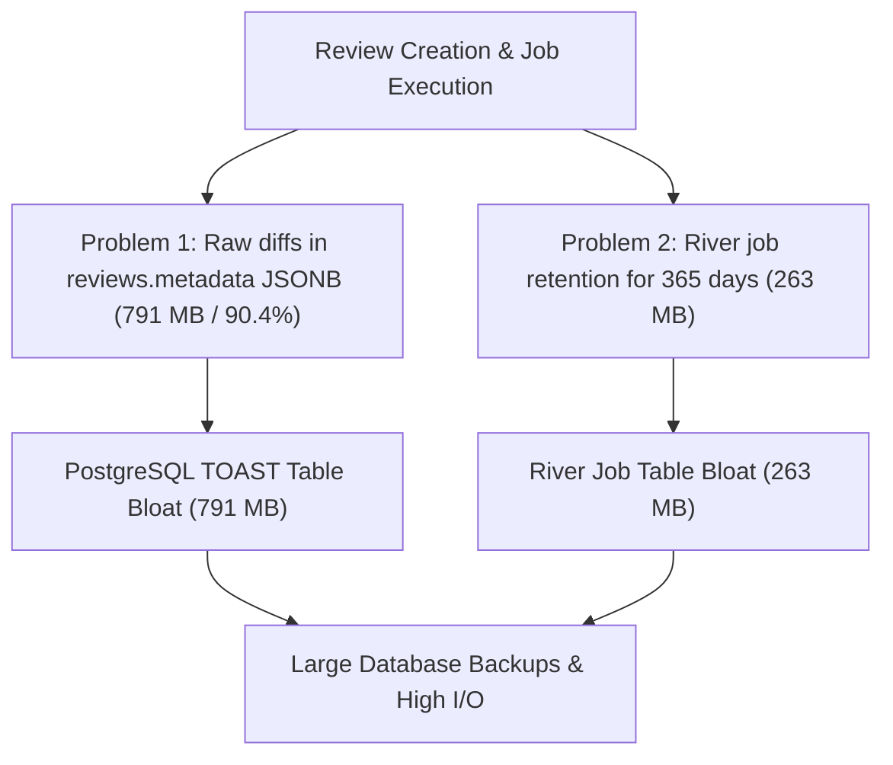
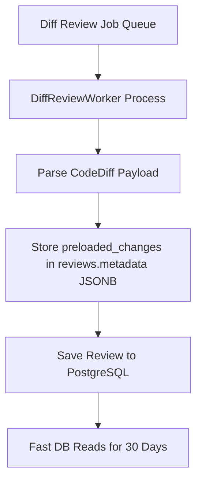
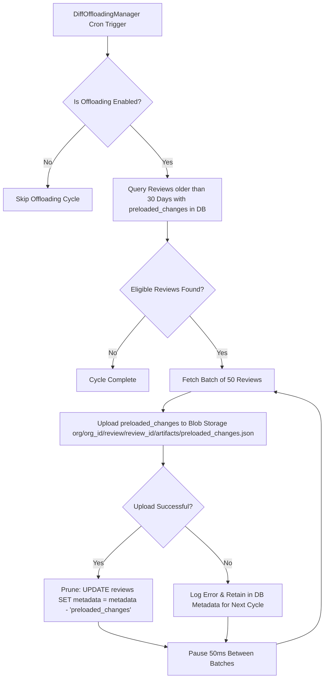
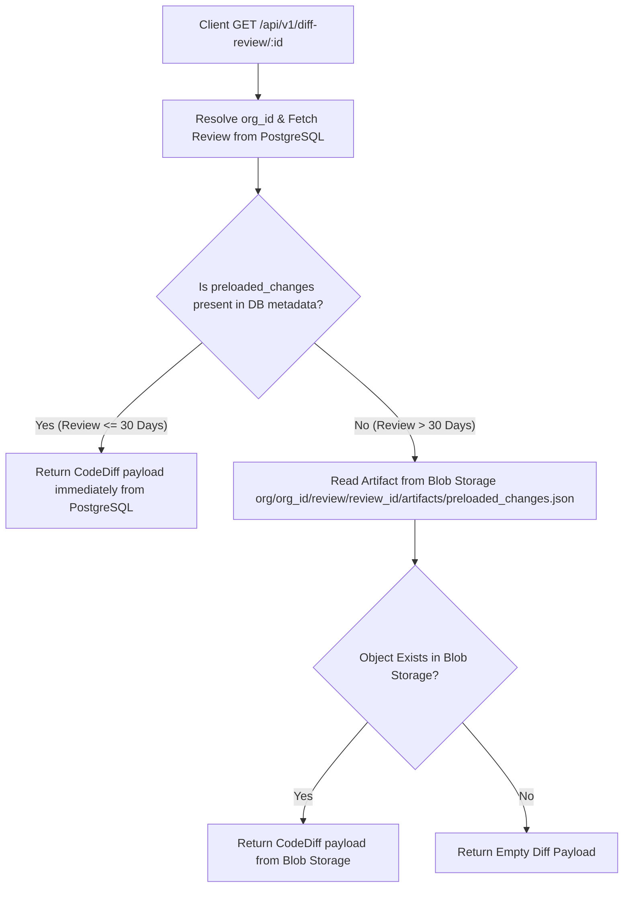

# Database Storage Optimization and Diff Storage Offloading Architecture

## Problem

### Problem 1: Code Diff Storage Bloat in reviews.metadata

PostgreSQL stores review records in the reviews table. The metadata column of the reviews table contains a JSON field named preloaded_changes. The preloaded_changes field stores raw Git code diff strings. The preloaded_changes field used 791.30 megabytes in PostgreSQL. This field used 90.4 percent of the metadata column storage. Unchecked accumulation of raw source code diffs in preloaded_changes creates PostgreSQL TOAST table bloat. It increases database backup dump sizes by 150 megabytes. It degrades database query performance.

### Problem 2: Background Job Record Accumulation in river_job

Completed background job records in the river_job table accumulated over time. They consumed 263.5 megabytes in PostgreSQL. They added 79.09 megabytes to database backup files because the job queue had a 365 day retention configuration.



## Solution

The system combines database reads for recent reviews with low PostgreSQL disk usage. The system uses a 30 day database retention window and an automated background offloading cron job.

### Key Principles

1. Newly generated code diffs remain stored in PostgreSQL for the first 30 days. This ensures that recent code reviews get high read speed and low query latency.
2. A background scheduled cron manager named DiffOffloadingManager periodically scans PostgreSQL. It finds reviews older than 30 days that still hold preloaded_changes in database metadata.
3. For reviews older than 30 days, the cron job uploads the raw code diffs to Blob Storage under the key path org/org_id/review/review_id/artifacts/preloaded_changes.json. When the upload succeeds, the job removes preloaded_changes from reviews.metadata in PostgreSQL.
4. The background manager operates with controlled batch sizes of 50 reviews per batch. It pauses for 50 milliseconds between batches. It uses streaming JSON serialization. This prevents CPU spikes, memory bloat, and database connection pool exhaustion.
5. The API server inspects PostgreSQL metadata first for active diffs. If preloaded_changes is absent from metadata, the server reads the diff payload from Blob Storage.

## Component Architecture

The architecture contains five primary components.

1. Review Worker Creation
2. Automated Background Offloading Cron
3. Blob Storage Transfer and PostgreSQL Pruning
4. API Handler Fallback Strategy
5. River Job Queue Retention Strategy

### Review Worker Creation

When DiffReviewWorker executes a review job, it writes raw code diffs to the metadata column of the reviews table in PostgreSQL. During the first 30 days, the system does not make external storage calls when users display reviews in the Web UI or CLI.



### Automated Background Offloading Cron

The DiffOffloadingManager background scheduler runs at scheduled cron intervals. The default schedule runs daily at 2:30 AM IST.

The system loads configuration from system_settings. You can update configuration without restarting the server.

The enabled configuration option enables or disables the offloading background manager.
The cron_expression configuration option sets the schedule for running offloading cycles.
The retention_days configuration option sets the number of days to retain diffs in PostgreSQL metadata before offloading.
The batch_size configuration option sets the number of reviews processed in each database query batch.
The inter_batch_delay_ms configuration option sets the pause duration between batches to maintain a low resource footprint.

### Blob Storage Transfer and PostgreSQL Pruning Workflow

The offloading cycle runs four steps.

First, query PostgreSQL for reviews created more than 30 days ago that still have preloaded_changes in metadata.

```sql
SELECT id, org_id, metadata->'preloaded_changes'
FROM reviews
WHERE created_at < NOW() - ($1 * INTERVAL '1 day')
  AND metadata ? 'preloaded_changes'
ORDER BY created_at ASC
LIMIT $2;
```

Second, for each review in the batch, write the preloaded_changes payload to Blob Storage under the key path org/org_id/review/review_id/artifacts/preloaded_changes.json.

Third, when the upload succeeds, remove the preloaded_changes key from PostgreSQL metadata.

```sql
UPDATE reviews
SET metadata = metadata - 'preloaded_changes'
WHERE id = $1 AND org_id = $2;
```

Fourth, if the Blob Storage upload fails for any review, the system keeps metadata unchanged in PostgreSQL. The system logs the error and retries the upload during the next scheduled cycle.



### API Handler Fallback Strategy

When a client requests review details, the server processes three steps.

First, make sure that the request has a valid organization context.

Second, inspect preloaded_changes inside PostgreSQL reviews.metadata. If preloaded_changes is present in metadata, return the diff payload immediately from PostgreSQL.

Third, if preloaded_changes is absent from metadata, read the diff payload from Blob Storage at key path org/org_id/review/review_id/artifacts/preloaded_changes.json. If the object exists in Blob Storage, return the diff payload to the client. If the object does not exist, return an empty diff payload.



### River Job Queue Retention Strategy

The background job queue system configures River job auto-cleaning to purge historical job records from PostgreSQL after 30 days. The queue initialization configures CompletedJobRetentionPeriod, CancelledJobRetentionPeriod, and DiscardedJobRetentionPeriod to 30 days in internal/jobqueue/jobqueue.go. This policy purges completed, cancelled, and discarded job records automatically. It keeps river_job table storage below one megabyte.

## Resource Footprint and Optimization Strategy

You must keep system resource usage low during offloading.

1. Query and process reviews in chunks of 50 to prevent large memory allocations.
2. Pause for 50 milliseconds between batches to allow PostgreSQL to process application queries.
3. Convert diffs to JSON bytes and stream them to storage backends.
4. Use atomic execution guards to prevent overlapping cron runs.
5. Run periodic PostgreSQL vacuum jobs to compact TOAST space freed by the removal of preloaded_changes.

## Security and Organization Isolation

All Blob Storage artifact keys include the organization identifier org_id. The API handler verifies permissions before reading from Blob Storage or PostgreSQL metadata. If a user requests diff artifacts from another organization, the API server returns an HTTP 404 response.

---

## Proposed Enhancement: River-based Parallel Upload Architecture

### Problem with Current Sequential Implementation

The current `DiffArchivalManager` processes reviews sequentially — one upload per network roundtrip to Blob Storage. With an average network latency of 150ms per upload to Backblaze B2 US-East, uploading 30,000 review diffs takes approximately 75 minutes. This is unacceptable for large deployments.

The root cause is that `gocloud.dev/blob` writes one file key per `WriteAll()` call. There is no multi-file bulk upload API in S3-compatible object storage. The only way to achieve throughput is to issue multiple `WriteAll()` calls in parallel over multiple HTTP connections simultaneously.

### Solution: River Job Queue with Parallel Workers

The proposed architecture uses the existing River v0.32.0 job queue infrastructure in `internal/jobqueue/` to distribute upload work across parallel workers, with support for horizontal scaling across multiple LiveReview server instances.

#### Three-Phase Design

**Phase 1 — Cron Enqueues Jobs (lightweight, API server)**

The existing `DiffArchivalManager` cron fires on schedule. Instead of running archival inline, it queries eligible review IDs and calls `river.InsertMany()` with one lightweight job per review. The cron returns immediately — no heavy upload work on the API server.

```
DB calls: 2 (1 SELECT eligible IDs + 1 batch INSERT into river_job)
```

**Phase 2 — Workers Upload in Parallel (worker server)**

Each River worker independently:
1. Fetches `preloaded_changes` from `reviews WHERE id = ?`
2. Uploads diff JSON to Blob Storage at `org/{org_id}/review/{review_id}/artifacts/preloaded_changes.json`
3. On confirmed upload success, strips `preloaded_changes` from Postgres:
   ```sql
   UPDATE reviews
   SET metadata = metadata - 'preloaded_changes'
   WHERE id = $1 AND metadata ? 'preloaded_changes';
   ```
4. Returns nil — River marks the job complete via `BatchCompleter` (batches up to 5,000 completions per 50ms tick)

**Phase 3 — Automatic Cleanup (River built-in)**

River's `JobCleaner` maintenance service automatically deletes finalized `river_job` rows in periodic batched `DELETE` queries. Default retention periods:
- Completed jobs: **24 hours**
- Cancelled jobs: **24 hours**
- Discarded jobs (exhausted all retries): **7 days**

The cleaner loops in sub-batches if there is a large backlog, so Phase 3 may issue more than one `DELETE` query during initial archival of a large backlog.

#### DB Call Analysis for 1,000 Reviews

| Operation | Queries |
| :--- | :--- |
| Phase 1: SELECT eligible review IDs | 1 |
| Phase 1: InsertMany into `river_job` | 1 |
| Phase 2: Batched job fetch (`FOR UPDATE SKIP LOCKED LIMIT MaxWorkers`) | ~10–50 |
| Phase 2: SELECT `preloaded_changes` per review (app code, unavoidable) | 1,000 |
| Phase 2: UPDATE reviews per review (app code, unavoidable) | 1,000 |
| Phase 2: BatchCompleter marks jobs done (batched, ~1–20 total) | ~1–20 |
| Phase 3: JobCleaner deletes completed jobs (may loop in sub-batches) | ~1–5 |
| **Total** | **~2,053** |

The 2,000 SELECT + UPDATE queries are inherent to the work itself and exist in any approach. River's own overhead is only ~53 extra batched queries.

#### Horizontal Worker Scaling

```
LiveReview API Server               Shared Postgres DB
┌─────────────────────┐            ┌──────────────────┐
│ DiffArchivalManager │──INSERT──► │  river_job table  │
│ Cron (enqueue only) │            └──────────────────┘
└─────────────────────┘                    ▲
                                           │ FOR UPDATE SKIP LOCKED
                          ┌────────────────┴──────────────────┐
              LR Worker 1 │                        LR Worker 2 │
              ┌───────────────────┐        ┌───────────────────┐
              │ Worker 1 ──► B2   │        │ Worker 1 ──► B2   │
              │ Worker 2 ──► B2   │        │ Worker 2 ──► B2   │
              │ Worker 3 ──► B2   │        │ Worker 3 ──► B2   │
              │ Worker 4 ──► B2   │        │ Worker 4 ──► B2   │
              │ Worker 5 ──► B2   │        │ Worker 5 ──► B2   │
              └───────────────────┘        └───────────────────┘
              5 concurrent uploads          5 concurrent uploads
                          = 10 total concurrent uploads across cluster
```

`FOR UPDATE SKIP LOCKED` in River's `JobGetAvailable` guarantees no two workers ever process the same review. Adding a third server automatically scales to 15 concurrent uploads with zero configuration changes.

#### Performance Estimate for 30,000 Reviews

| Config | Concurrent Uploads | Estimated Time |
| :--- | :--- | :--- |
| 1 LR server, 5 workers | 5 | ~17 minutes |
| 2 LR servers, 5 workers each | 10 | ~8.5 minutes |
| 3 LR servers, 5 workers each | 15 | ~6 minutes |

#### River Retry Behavior

River's default `MaxAttempts` is **25**, not 5. The retry schedule uses `attempt^4` seconds (with jitter), not linear backoff:

| Attempt | Retry After |
| :--- | :--- |
| 1 | 1 second |
| 2 | 16 seconds |
| 3 | 1 minute 21 seconds |
| 4 | 4 minutes 16 seconds |
| 5 | 10 minutes 25 seconds |
| 6 | 21 minutes 36 seconds |
| 10 | 2 hours 46 minutes |
| 25 | ~3+ days |

For diff archival, overriding to a lower `MaxAttempts` (e.g. 10) via `InsertOpts.MaxAttempts` or the job args `InsertOpts()` method is reasonable to avoid jobs retrying over days for what should be a fast file upload. This is a deliberate override of River's default.

#### Uniqueness and Discard Behavior

`UniqueOpts{ByArgs: true}` hashes all encoded args fields by default. Since `DiffArchivalJobArgs` contains both `ReviewID` and `OrgID`, both fields contribute to the uniqueness hash. This is correct because `OrgID` is fixed per `ReviewID`.

`ByState` defaults to `{available, completed, pending, running, retryable, scheduled}`. Notably, **discarded and cancelled states are excluded from the default uniqueness check**. This means:
- If a job for a review is discarded (exhausted all retries), the unique constraint no longer blocks re-insertion.
- This is the desired behavior: a future admin "retry failed archival" action can re-enqueue discarded jobs without having to manually clear them first.

#### Safety Guarantees

| Risk | How It Is Handled |
| :--- | :--- |
| Server crash mid-upload | Job stays in `river_job` as `running`. River `JobRescuer` runs every 30 seconds and moves jobs stuck for **≥ 1 hour** (default `RescueStuckJobsAfter`) back to `retryable`. Total crash recovery time: up to ~1 hour. Tune `Config.RescueStuckJobsAfter` or worker `Timeout()` if faster recovery is needed. |
| Duplicate processing | `UniqueOpts{ByArgs: true}` prevents enqueueing the same `review_id` twice while the job is in active states. |
| Data loss if B2 upload fails | `UPDATE reviews` only runs after confirmed upload success. Diff remains in Postgres until confirmed. |
| Two workers racing on same review | `WHERE metadata ? 'preloaded_changes'` in UPDATE is idempotent — second update matches 0 rows safely. |
| B2 key collision on retry | Keys are deterministic: `org/{org_id}/review/{review_id}/...` — idempotent re-upload overwrites with identical data. |
| Job discarded after max retries | Diff payload remains in Postgres metadata (never lost). Discarded state clears the unique constraint, so a future admin action can re-enqueue. If `MaxAttempts` is overridden to 10 (see Retry Behavior), discard happens at attempt 10 (≈2h46m into the retry schedule), not the default ~3 days (25 attempts). Decide based on acceptable SLA before admin intervention. |

#### Files to Change

| File | Change |
| :--- | :--- |
| `internal/api/diff_archival.go` | Replace inline upload loop with `riverClient.InsertMany()` call |
| `internal/jobqueue/diff_archival_worker.go` | **New file** — `DiffArchivalJobArgs` + `DiffArchivalWorker` implementing River `Worker` interface |
| `internal/jobqueue/queue_config.go` | Add `diff_archival` queue entry with `MaxWorkers: 5` (configurable via env) |
| `internal/jobqueue/jobqueue.go` | Register `DiffArchivalWorker` with the River client |

#### Completed Job Row Cleanup Strategy

River intentionally keeps completed `river_job` rows for `JobList`/audit/observability and lets `JobCleaner` sweep them asynchronously. There is no built-in "delete on completion" path. Two options exist for faster cleanup:

**Option 1 — Standard `CompletedJobRetentionPeriod` (chosen approach):** Set `CompletedJobRetentionPeriod` on the River `Client` config to `30 * 24 * time.Hour` (30 days). `JobCleaner` runs on its own tick `Interval` (default `JobCleanerIntervalDefault = 30s`) and deletes completed rows older than 30 days. Completed job history is preserved for 30 days for audit, debugging, and River UI visibility.

**Option 2 — Manual deletion inside `Work()` (not used):** Calling `Client.JobDelete`/`JobDeleteTx` from inside `Work()` before returning `nil` would delete the row synchronously. However, deleting a `running` row while River's executor then calls `JobSetStateCompleted` on the now-gone row is undefined/untested behavior — even if it produces a benign no-op, it is not worth the risk.

**Decision: Option 1.** Setting `CompletedJobRetentionPeriod: 30 * 24 * time.Hour` maintains full 30-day audit/debug history for all job types.

