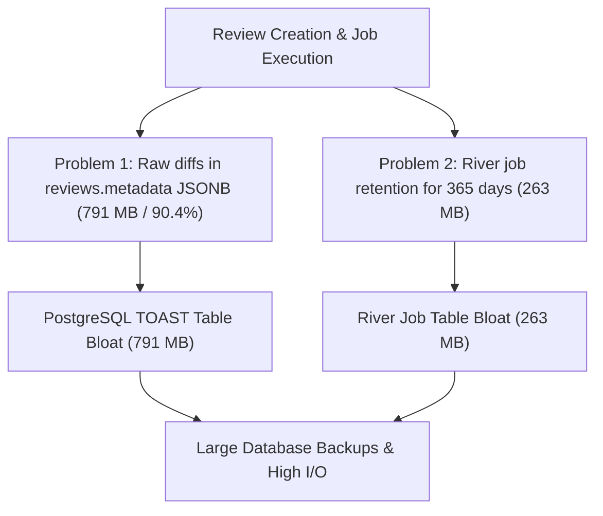
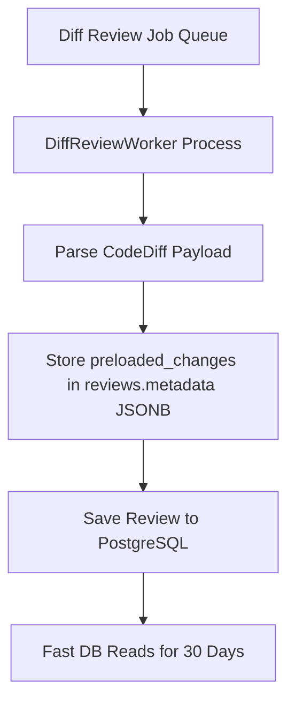
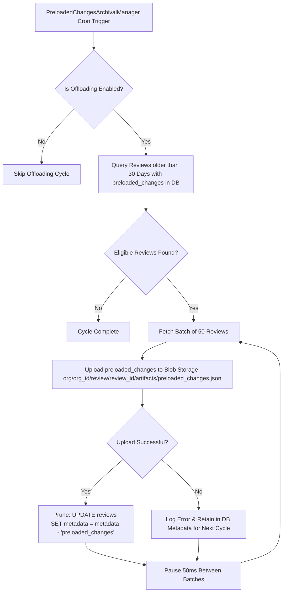
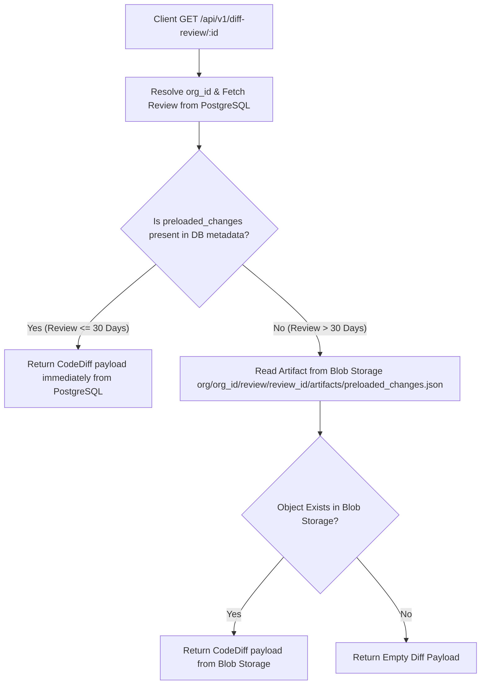
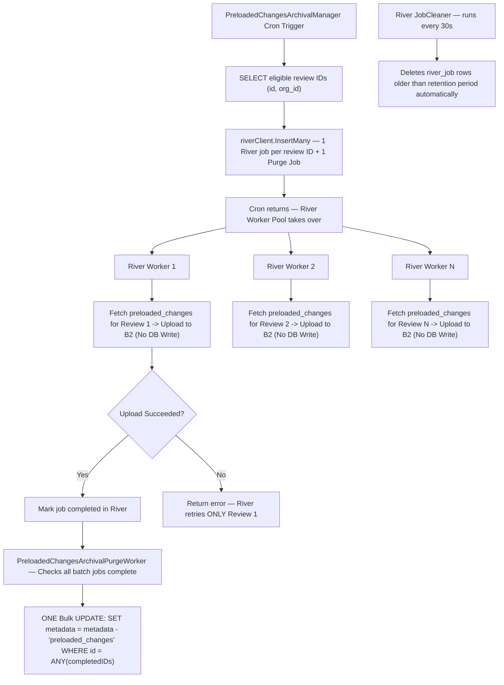

# Database Storage Optimization and Diff Storage Offloading Architecture

## Problem

### Problem 1: Code Diff Storage Bloat in reviews.metadata

PostgreSQL stores review records in the reviews table. The metadata column of the reviews table contains a JSON field named preloaded_changes. The preloaded_changes field stores raw Git code diff strings. The preloaded_changes field used 791.30 megabytes in PostgreSQL. This field used 90.4 percent of the metadata column storage. Unchecked accumulation of raw source code diffs in preloaded_changes creates PostgreSQL TOAST table bloat. It increases database backup dump sizes by 150 megabytes. It degrades database query performance.

### Problem 2: Background Job Record Accumulation in river_job

Completed background job records in the river_job table accumulated over time. They consumed 263.5 megabytes in PostgreSQL. They added 79.09 megabytes to database backup files because the job queue had a 365 day retention configuration.



## Solution

The system combines database reads for recent reviews with low PostgreSQL disk usage. The system uses a 30 day database retention window and an automated background offloading cron job.

### Key Principles

1. Newly generated code diffs remain stored in PostgreSQL for the first 30 days. This ensures that recent code reviews get high read speed and low query latency.
2. A background scheduled cron manager named PreloadedChangesArchivalManager periodically scans PostgreSQL. It finds reviews older than 30 days that still hold preloaded_changes in database metadata.
3. For reviews older than 30 days, the cron job uploads the raw code diffs to Blob Storage under the key path org/org_id/review/review_id/artifacts/preloaded_changes.json. When the upload succeeds, the job removes preloaded_changes from reviews.metadata in PostgreSQL.
4. The background manager operates with controlled batch sizes of 50 reviews per batch. It pauses for 50 milliseconds between batches. It uses streaming JSON serialization. This prevents CPU spikes, memory bloat, and database connection pool exhaustion.
5. The API server inspects PostgreSQL metadata first for active diffs. If preloaded_changes is absent from metadata, the server reads the diff payload from Blob Storage.

## Component Architecture

The architecture contains five primary components.

1. Review Worker Creation
2. Automated Background Offloading Cron
3. Blob Storage Transfer and PostgreSQL Pruning
4. API Handler Fallback Strategy
5. River Job Queue Retention Strategy

### Review Worker Creation

When DiffReviewWorker executes a review job, it writes raw code diffs to the metadata column of the reviews table in PostgreSQL. During the first 30 days, the system does not make external storage calls when users display reviews in the Web UI or CLI.



### Automated Background Offloading Cron

The PreloadedChangesArchivalManager background scheduler runs at scheduled cron intervals. The default schedule runs daily at 2:30 AM IST.

The system loads configuration from system_settings (`preloaded_changes_archival_settings`). You can update configuration without restarting the server.

The enabled configuration option enables or disables the offloading background manager.
The cron_expression configuration option sets the schedule for running offloading cycles.
The retention_days configuration option sets the number of days to retain diffs in PostgreSQL metadata before offloading.
The batch_size configuration option sets the number of reviews processed in each database query batch.
The inter_batch_delay_ms configuration option sets the pause duration between batches to maintain a low resource footprint.

### Blob Storage Transfer and PostgreSQL Pruning Workflow

The offloading cycle runs four steps.

First, query PostgreSQL for reviews created more than 30 days ago that still have preloaded_changes in metadata.

```sql
SELECT id, org_id, metadata->'preloaded_changes'
FROM reviews
WHERE created_at < NOW() - ($1 * INTERVAL '1 day')
  AND metadata ? 'preloaded_changes'
ORDER BY created_at ASC
LIMIT $2;
```

Second, for each review in the batch, write the preloaded_changes payload to Blob Storage under the key path org/org_id/review/review_id/artifacts/preloaded_changes.json.

Third, when the upload succeeds, remove the preloaded_changes key from PostgreSQL metadata.

```sql
UPDATE reviews
SET metadata = metadata - 'preloaded_changes'
WHERE id = $1 AND org_id = $2;
```

Fourth, if the Blob Storage upload fails for any review, the system keeps metadata unchanged in PostgreSQL. The system logs the error and retries the upload during the next scheduled cycle.



### API Handler Fallback Strategy

When a client requests review details, the server processes three steps.

First, make sure that the request has a valid organization context.

Second, inspect preloaded_changes inside PostgreSQL reviews.metadata. If preloaded_changes is present in metadata, return the diff payload immediately from PostgreSQL.

Third, if preloaded_changes is absent from metadata, read the diff payload from Blob Storage at key path org/org_id/review/review_id/artifacts/preloaded_changes.json. If the object exists in Blob Storage, return the diff payload to the client. If the object does not exist, return an empty diff payload.



### River Job Queue Retention Strategy

The background job queue system configures River job auto-cleaning to purge historical job records from PostgreSQL after 30 days. The queue initialization configures CompletedJobRetentionPeriod, CancelledJobRetentionPeriod, and DiscardedJobRetentionPeriod to 30 days in internal/jobqueue/jobqueue.go. This policy purges completed, cancelled, and discarded job records automatically. It keeps river_job table storage below one megabyte.

## Resource Footprint and Optimization Strategy

You must keep system resource usage low during offloading.

1. Query and process reviews in chunks of 50 to prevent large memory allocations.
2. Pause for 50 milliseconds between batches to allow PostgreSQL to process application queries.
3. Convert diffs to JSON bytes and stream them to storage backends.
4. Use atomic execution guards to prevent overlapping cron runs.
5. Run periodic PostgreSQL vacuum jobs to compact TOAST space freed by the removal of preloaded_changes.

## Security and Organization Isolation

All Blob Storage artifact keys include the organization identifier org_id. The API handler verifies permissions before reading from Blob Storage or PostgreSQL metadata. If a user requests diff artifacts from another organization, the API server returns an HTTP 404 response.

---

## Proposed Enhancement: River-based Parallel Upload Architecture

### Problem with Current Sequential Implementation

The current `PreloadedChangesArchivalManager` processes reviews sequentially — one upload per network roundtrip to Blob Storage. With an average network latency of 150ms per upload to Backblaze B2 US-East, uploading 30,000 review diffs sequentially takes approximately 75 minutes.

The root cause is single-threaded network execution. The standard way to achieve high throughput with object storage is to issue multiple upload operations in parallel over multiple HTTP connections simultaneously.

### Solution: Single-Review River Jobs with Consumer-Side Parallelism

Rather than creating batch jobs containing multiple review IDs or running manual goroutine pools inside a worker, the system uses **1 River job per 1 review ID** (`PreloadedChangesArchivalJobArgs{ReviewID int64, OrgID int64}`). 

Parallelism is achieved on the **consumer side** via River's native worker pool concurrency (`MaxWorkers`). River automatically executes multiple single-review workers concurrently in separate background goroutines.

#### Architecture & Execution Flow

**Phase 1 — Enqueueing (Producer Cron)**

1. The `PreloadedChangesArchivalManager` cron fires on schedule.
2. It queries un-archived review IDs eligible for archival (`created_at < NOW() - retentionDays`):
   ```sql
   SELECT id, COALESCE(org_id, 0)
   FROM reviews
   WHERE created_at < NOW() - ($1 * INTERVAL '1 day')
     AND trigger_type = 'cli_diff'
     AND metadata ? 'preloaded_changes'
   ORDER BY created_at ASC;
   ```
3. It calls `jq.QueuePreloadedChangesArchivalJobs()` to enqueue 1 River job per review ID via `InsertMany()`.
4. It enqueues a single `PreloadedChangesArchivalPurgeWorker` job (`PreloadedChangesArchivalPurgeJobArgs`) to monitor completion and execute the final bulk purge.

**Phase 2 — Parallel Execution (Consumer Workers)**

1. River's worker engine executes `PreloadedChangesArchivalWorker.Work()` concurrently across workers (`MaxWorkers`):
   - Reads `metadata->'preloaded_changes'` from PostgreSQL for its single `ReviewID`.
   - Uploads diff to Blob Storage (`org/:org_id/review/:review_id/artifacts/preloaded_changes.json`).
   - **No DB write** during upload — individual workers return `nil` on success.

**Phase 3 — Bulk Purge (Purge Worker)**

1. `PreloadedChangesArchivalPurgeWorker` monitors job states via `river_job`:
   - Waits while any archival jobs in the batch remain active.
   - Collects review IDs of all successfully completed jobs (`JobStateCompleted`).
2. Executes **ONE bulk UPDATE** query in PostgreSQL:
   ```sql
   UPDATE reviews
   SET metadata = metadata - 'preloaded_changes'
   WHERE id = ANY($1::bigint[])
     AND org_id = $2
     AND metadata ? 'preloaded_changes';
   ```



#### Database Call Count Breakdown for 1,000 Reviews

| Operation | Query Type | Count |
| :--- | :--- | :--- |
| **Cron Query** | `SELECT id, org_id` for eligible reviews | **1** |
| **Enqueue Archival Jobs** | `INSERT INTO river_job` (InsertMany for 1,000 jobs) | **1** |
| **Enqueue Purge Job** | `INSERT INTO river_job` (1 purge job) | **1** |
| **River Worker Job Fetch** | `SELECT ... FOR UPDATE SKIP LOCKED` on `river_job` (batch size ~20–50) | **~20–50** |
| **Diff Data Fetch** | `SELECT metadata->'preloaded_changes'` per review | **1,000** |
| **Purge Status Check** | `JobList()` queries on `river_job` checking batch completion | **~2–5** |
| **Bulk Metadata Purge** | `UPDATE reviews SET metadata = metadata - 'preloaded_changes' WHERE id = ANY($1)` | **1** |
| **TOTAL PostgreSQL Calls** | | **~1,026 – 1,059** |

#### Safety & Performance Guarantees

* **Clean Retries:** If 1 out of 5,000 reviews fails to upload to Blob Storage, only that 1 review job is retried by River.
* **1 Bulk Write:** PostgreSQL `metadata` is purged in **1 single SQL UPDATE** after all archival jobs finish, saving 999 DB writes.
* **Low Memory Footprint:** Workers fetch `preloaded_changes` one review at a time right before upload.
* **Controlled Concurrency:** Bound by River's `MaxWorkers` queue configuration.
* **Automatic Job Cleanup:** Built-in River `JobCleaner` purges completed `river_job` rows automatically.

