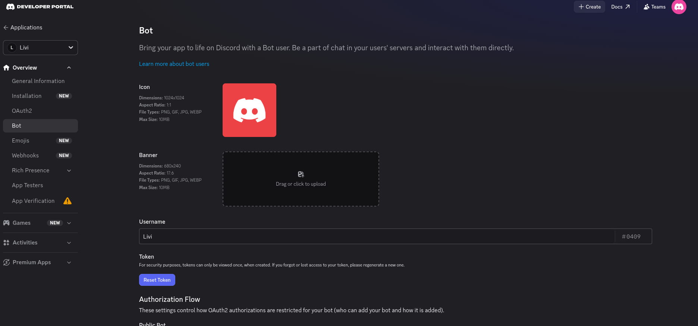

# Discord Integration — Local Testing

## 1. Create the bot in Discord

1. Go to [discord.com/developers/applications](https://discord.com/developers/applications) → **New Application**.
2. Open the **Bot** tab → copy the **Bot Token** (click **Reset Token** if you haven't generated one yet — it's only shown once).

   

3. On the same tab, scroll down and turn on **Message Content Intent** (under Privileged Gateway Intents). Without this the bot can't read message text.
4. Go to **OAuth2 → URL Generator** → check scope `bot` → check permissions `Send Messages`, `Read Message History`, `Attach Files` → open the generated URL and invite the bot to a test server you control.

## 2. Configure it in LiveReview

1. Go to **Settings → Integrations → Discord** in the LiveReview web UI.
2. Paste the **Bot Token** and **Application ID**, then Save.
3. **Restart the LiveReview server.** Saving the config only writes it to the database — the bot only connects to Discord at server startup, so it won't come alive until you restart.

## 3. Test it

1. Watch the server logs on startup for:
   ```
   [DiscordBot] Org <id>: authenticated as <botname> (<id>)
   [DiscordBot] All orgs connected
   ```
2. In your test Discord server, either DM the bot directly, or `@mention` it in a channel it's in.
3. Ask something like "how many reviews do we have?" and confirm you get a reply.

## Troubleshooting

- **Config saved but bot never replies** → you forgot step 2.3 (restart the server).
- **`bot is not in any guild`** in logs → you haven't invited it yet, redo step 1.4.
- **Connects fine but never replies** → Message Content Intent isn't enabled (step 1.3).
- **Chart images fail with `vl-convert: executable file not found`** → run `make install-vl-convert` to download the chart-rendering binary.
