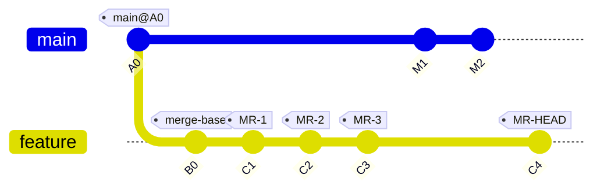
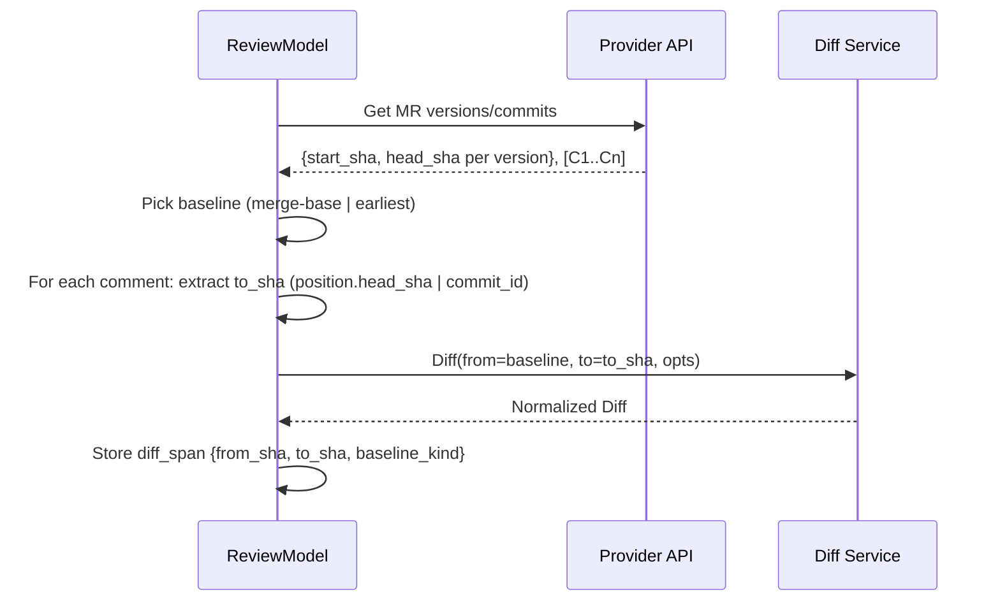
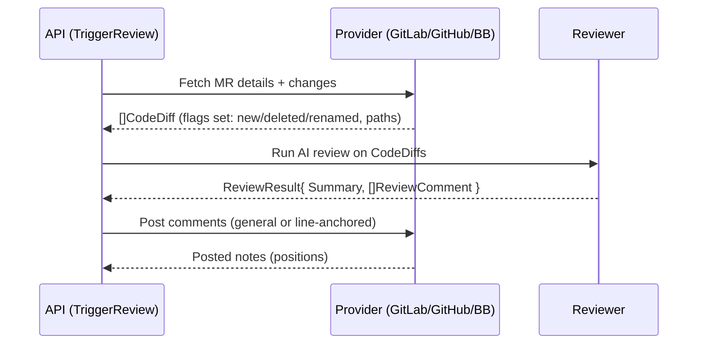

# MR Diff Representation and Baseline Choice

This document analyzes how we should compute and represent diffs for Merge Request (MR/PR) comments across GitLab, GitHub, and Bitbucket. We’re not implementing code yet; this is a design/analysis doc with concrete examples and diagrams.

## Why this matters

To understand a comment’s relevance, we must know “what changed” between a chosen baseline and the commit the comment refers to. That requires the ability to diff between arbitrary commits consistently across hosts. We then annotate each comment with the exact diff span it’s speaking about.

## Contract (what we’ll standardize on)

- Inputs
	- repo: { provider, project path }
	- from_sha: baseline for comparison
	- to_sha: the commit tied to a comment (or MR head at the time)
	- optional: paths filter, options (rename detection, ignore whitespace, limits)
- Output (normalized Diff)
	- files[]: { old_path, new_path, binary, is_rename }
	- hunks[]: unified-style hunks with line ranges
	- lines[]: added/removed/context with old/new line numbers
	- metadata: stats, truncation flags
- Recorded on each relevant item (timeline/comment)
	- diff_span: { from_sha, to_sha, baseline_kind }

## The big question: picking a baseline

There are two practical baselines in an MR:

1) Merge-base (Git-meaning). The divergence point of source branch from target branch.
	 - GitLab exposes this via MR versions (first version’s `start_sha`).
	 - GitHub shows this implicitly as PR base.
	 - “Compare base” semantics across providers map naturally to this.

2) Earliest MR commit (“first commit in the MR”). The chronological first commit included in the MR.
	 - Users sometimes mean this when they say “from the first commit to the one I’m commenting on”.

These are NOT always the same.

### Visualizing baseline alternatives



- Merge-base = B0
- Earliest MR commit = C1
- The current MR head = C4

Suppose a comment is attached when the MR head was C3. What diff is “relevant” for that comment?

- Using merge-base baseline: diff(B0 → C3)
- Using earliest-MR-commit baseline: diff(C1 → C3)

These diffs can produce different file scopes and line numbers in the presence of changes on main and/or rebases.

### Example of how results differ

```mermaid
flowchart LR
	B0((B0)) -- adds file F --> C1((C1))
	C1 -- edits F lines 10-20 --> C2((C2))
	M1((M1 on main)) -- edits F lines 1-9 --> M2((M2))
	C2 -- merges/rebases main changes --> C3((C3))

	subgraph Baseline=merge-base
	A[B0] -->|diff to| X[C3]
	end

	subgraph Baseline=earliest MR commit
	A2[C1] -->|diff to| X2[C3]
	end
```

- diff(B0→C3) includes both the MR’s changes AND anything accumulated on main between B0 and merge-time that got incorporated into the branch.
- diff(C1→C3) only shows what changed within the MR after its “first commit,” which can better match a reviewer’s intuition when they authored a stacked series of commits.

### So which baseline should we use?

There isn’t a one-size-fits-all answer, but we can adopt a clear default and make it explicit per record.

- Default for MR-wide comparison: merge-base (maps to provider compare semantics; stable across hosts).
- Default when the user intention is “progress since I started this MR”: earliest MR commit.

We will record `baseline_kind` with values like `merge-base` or `earliest-mr-commit` on each diff_span so downstream logic can interpret correctly, and we can switch policies without losing provenance.

## Mapping a comment to a (from_sha, to_sha)

- to_sha: The commit the comment refers to.
	- GitLab: diff notes include `position.head_sha`; commit notes include `commit_id`.
	- GitHub/Bitbucket: PR review comments similarly anchor to a specific commit/tree.
- from_sha (baseline):
	- merge-base: the first MR version’s `start_sha` (GitLab) or PR base (GitHub/Bitbucket).
	- earliest MR commit: the oldest commit in the MR’s commits list.

Sequence sketch for deciding the pair:



## Cross-host ways to compute the diff

Option A: Provider compare APIs

- GitLab: `GET /projects/:id/repository/compare?from=…&to=…`
- GitHub: `GET /repos/{owner}/{repo}/compare/{base}...{head}`
- Bitbucket: `GET /repositories/{workspace}/{repo}/diff/{spec}`

Pros
- No local clone; fast to ship per provider.
- Rename handling is often reasonable by default.

Cons
- APIs differ; truncation limits exist on large diffs; options vary.
- Rate limits and latency; consistency across hosts may drift.

Option B: Local git mirror

- Maintain a bare clone; compute diffs locally (`git diff` or go-git/libgit2).

Pros
- One canonical diff engine and options across all hosts.
- Full control (rename threshold, whitespace, word-diff, binary policy), cacheable.

Cons
- Complexity: auth, storage, syncing, GC, concurrency.
- Initial clone time and disk footprint; need eviction.

Option C: Hybrid (recommended)

- Default to provider compare APIs (fast path); fallback to local mirror when:
	- API truncates large diffs or lacks required options
	- Rate limits or outages occur
	- We need strict cross-host consistency

We cache diffs keyed by `(provider, project, from_sha, to_sha, optsHash)`.

## What exists in LiveReview today (reuse this)

This repo already has a normalized shape and some provider wiring we can (and should) reuse.

- Canonical diff and comment types
	- `pkg/models/models.go`
		- `CodeDiff` { FilePath, OldContent, NewContent, Hunks, CommitID, FileType, IsDeleted, IsNew, IsRenamed, OldFilePath }
		- `DiffHunk` { OldStartLine, OldLineCount, NewStartLine, NewLineCount, Content }
		- `ReviewComment` { FilePath, Line, Content, Severity, Suggestions, IsDeletedLine, IsInternal }
		- Severity enum: `SeverityInfo|SeverityWarning|SeverityCritical`

- GitLab provider creates CodeDiffs
	- `internal/providers/gitlab/http_client.go`
		- `GetMergeRequestChanges(project, mrIID)` fetches MR changes.
		- `ConvertToCodeDiffs(...)` maps GitLab changes to `[]*models.CodeDiff`:
			- Sets `FilePath = new_path`, `OldFilePath = old_path`
			- Flags `IsNew`, `IsDeleted`, `IsRenamed` from API booleans
			- Packs patch text into a single `DiffHunk{Content: diff}` (line numbers are not fully parsed yet)

- GitLab line-anchored comment posting (positions)
	- `internal/providers/gitlab/gitlab_comment.go`
		- Uses MR versions (`base_sha`, `start_sha`, `head_sha`) to create proper diff positions
		- Resolves and normalizes file paths against MR changes (`resolvePathAgainstChanges`)
		- Classifies target line as added/removed/context to choose `new_line` vs `old_line`
		- Falls back to a general MR note if precise anchoring fails
	- Tests and tooling under `tests/` and `scripts/` validate API behavior for line comments

- Minimal CLI verifies current data path
	- `cmd/mrmodel/main.go` fetches MR details and changes, prints a summary using `CodeDiff` fields and hunk count

Takeaway: We already have a shared, provider-agnostic `CodeDiff` and `DiffHunk`, plus GitLab-specific plumbing that understands added/deleted/renamed files and line anchoring semantics. We should extend—not replace—this.

### Why GitLab needs special handling (format + anchoring)

GitLab’s REST shape and anchoring logic differ from GitHub/Bitbucket in a few important ways, which is why our provider includes specialized code:

- Diff payloads
	- GitLab MR Changes returns per-file `diff` strings with inline markers; the response does not directly decompose into unified hunk headers and numeric ranges the same way as Git’s patch format. We currently pack these into `DiffHunk.Content` and (where needed) parse enough to classify lines.
	- GitHub compare APIs more closely resemble git’s unified patch, and Bitbucket’s diff endpoints are closer to raw patch streams. Mapping into `DiffHunk` fields tends to be more straightforward there.

- Positioning for line comments
	- GitLab requires a “position” object with `base_sha`, `start_sha`, `head_sha`, and explicit `old_line`/`new_line` depending on whether the target line is from the old or new side. Single-line anchors must avoid `line_code` unless doing range comments.
	- GitHub/Bitbucket APIs use commit/tree SHAs but generally accept a path and a side-specific line (new vs old) with fewer moving parts; the server resolves anchors against the PR diff version.

- Versioned diffs and force-pushes
	- GitLab exposes MR versions; anchors must reference the correct version SHAs to survive rebases/force-pushes.
	- Our GitLab code resolves the latest version, normalizes file paths against MR changes, and classifies the target line (added/removed/context) to choose `new_line` vs `old_line` accurately.

Net effect: GitLab needs bespoke logic for building the “position” object, for mapping AI‑suggested paths to MR paths, and for classifying the target line. That logic already exists in our provider and should be reused by any future diff/anchor features.

## How this relates to TriggerReview vs MR Modeling

There are two complementary tracks in this repo:

- Production path (battle‑tested): TriggerReview
	- Entry: HTTP `POST /api/v1/connectors/trigger-review` (see `internal/api/server.go`).
	- Behavior: Uses provider implementations (GitLab/GitHub/Bitbucket) to fetch diffs and normalize them into `[]CodeDiff`.
	- Review: Feeds `CodeDiff` to the reviewer pipeline, produces `ReviewResult`, and posts comments via provider line‑anchoring.
	- Status: Proven across GitLab, GitHub, and Bitbucket in real use. This remains the source of truth for diff normalization today.

- Modeling path (new, additive): MR Model + Timeline/Threads
	- Purpose: Developer‑facing tooling and representation to build an integrated MR timeline (commits + comments) and a proper comment hierarchy for AI reply workflows.
	- Scope: Reads MR metadata (commits, discussions) and emits artifacts for inspection; does not replace TriggerReview.
	- Reuse: Keeps using our provider layer and the `CodeDiff/DiffHunk` shape when diffs are needed; any future diff lookups (e.g., baseline→commit pairs for a specific comment) will be expressed through a small DiffService that ultimately maps back to `[]CodeDiff`.

Key point: MR Modeling is orthogonal and additive. It does not change how TriggerReview computes diffs. We will reuse the same normalized types and provider strengths, and we will gate any new diff lookups behind a clean abstraction to avoid regressions.

### Current behavior for added/deleted/moved files

- Added file: `IsNew = true`, `OldFilePath = ""`, `FilePath = new_path`
- Deleted file: `IsDeleted = true`, `FilePath` may equal old path; review comments on deleted lines use `IsDeletedLine = true` and `position[old_line]`
- Renamed file: `IsRenamed = true`, `OldFilePath != FilePath`; path normalization logic maps AI-proposed paths to actual MR change paths when posting

### Known gaps (and why they matter)

- `DiffHunk` currently stores full hunk `Content` but often without parsed `OldStartLine/NewStartLine/Counts` from provider patches; precise line windows for AI/context benefit from structured parsing.
- Provider parity status:
	- All three providers already return `[]CodeDiff` in the TriggerReview path.
		- GitHub: parses `/pulls/{number}/files` patches into structured `DiffHunk` (see `internal/providers/github/github.go::parsePatchIntoHunks`).
		- Bitbucket: parses unified diff stream into `DiffHunk` (see `internal/providers/bitbucket/bitbucket.go::parseDiffContent/parsePatchIntoHunks`).
		- GitLab: maps MR changes into `CodeDiff` and currently packs the raw patch string into a single `DiffHunk.Content` (see `internal/providers/gitlab/http_client.go::ConvertToCodeDiffs`).
	- The practical gap is enriching GitLab’s conversion to populate `DiffHunk` line/range fields like GitHub/Bitbucket do, so all providers surface similarly structured hunks.
- Arbitrary commit-pair diffs (baseline→commit) are not yet exposed via a unified interface; current GitLab code focuses on MR changes view.

### Bridge plan to the new DiffService

- Keep `CodeDiff/DiffHunk` as the public shape used by the reviewer and UI; it’s already wired through the pipeline.
- Introduce `DiffService` (analysis above) to compute arbitrary commit-pair diffs (via provider APIs and, optionally, a local mirror). The service returns a normalized Diff that we can map into `[]CodeDiff` without losing flags:
	- Set `IsNew/IsDeleted/IsRenamed/OldFilePath` per file entry
	- Fill `DiffHunk` using parsed unified hunks (populate start/lines counts; retain raw patch text when helpful)
- Leverage existing GitLab position logic when anchoring replies; the SHAs from `diff_span` flow directly into that code path.

## Current review flow (high-level)



When we add DiffService, the “Fetch MR details + changes” step gains an optional “compute baseline→commit diffs” branch, but the downstream still sees `[]CodeDiff`.

## Normalized diff model (sketch)

This is a conceptual contract, not implementation:

```text
Diff {
	files: [
		{
			old_path, new_path, binary?: bool, renamed?: bool,
			hunks: [
				{ header, old_start, old_lines, new_start, new_lines,
					lines: [ { type: '+|-| ', old_no?, new_no?, text } ] }
			]
		}
	],
	stats?: { files_changed, insertions, deletions },
	truncated?: bool,
}
```

Each comment node in our Comment Hierarchy can optionally carry a lightweight `diff_span`:

```text
diff_span {
	from_sha, to_sha, baseline_kind,
	file?: { old_path, new_path },
	line_hint?: { old_no?, new_no? }, // small anchor window, not the full diff
}
```

This keeps the comment JSON small while allowing the UI to lazily fetch or expand the full diff when needed.

## Important edge cases to plan for

- Renames/moves: ensure rename detection is enabled and normalized.
- Binary files: skip diff lines; show metadata-only entries.
- Whitespace-insensitive reviews: option to ignore whitespace.
- Large diffs: providers may truncate; local mirror fallback.
- Force-pushes: MR baseline may shift; resolve baseline via MR versions timeline.
- Orphaned anchors: file removed or renamed after the comment; fall back to old_path and best-effort mapping.

## Baseline choice cheat‑sheet

- Use `merge-base` when:
	- You want parity with provider’s “compare” view and stable semantics.
	- You’re answering: “What changed relative to target branch at divergence?”

- Use `earliest-mr-commit` when:
	- You’re answering: “What changed since the first commit I introduced in this MR?”
	- You want to track incremental progress of a stacked-commit MR.

Always record which one you used. That makes diffs auditable and re-computable later.

## Performance & caching

- Cache per repo+pair+options; LRU in-memory + optional disk.
- Batch requests: many comments share the same `to_sha`.
- Precompute common pairs: (baseline → each MR commit) once.

## Proposed next steps (analysis only)

1) Add a DiffService contract (no implementation yet) in design notes:
	 - Diff(repo, from, to, opts) → Diff
2) GitLab-first mapping plan (when we implement):
	 - Resolve `baseline = first MR version start_sha` and `earliest = oldest MR commit`.
	 - For each comment, extract `to_sha` from position/commit_id.
	 - Start with provider compare API; record `diff_span` (without embedding huge diffs).
3) Evaluate a small local-mirror POC for large/truncated cases.

4) Parse unified diff hunks into structured `DiffHunk` fields during conversion, so reviewers and context windows can target stable line ranges (keep `Content` as raw patch for reference).

---

If you want, I can augment this doc with a couple of real MR #426 snapshots (baseline → commit pairs) showing the actual file sets and a side-by-side of merge-base vs earliest-MR-commit behavior. That would make the trade-off very concrete without writing any code.

