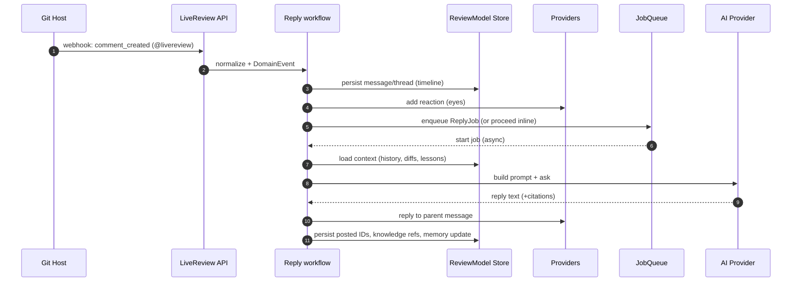
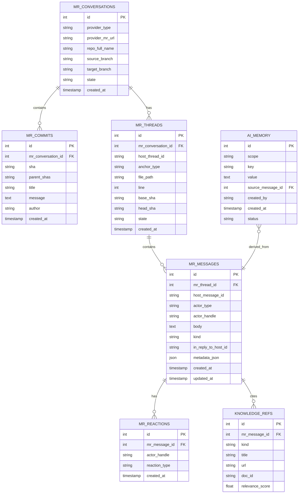

# LiveReview MR Reply Capability — Requirements and Design

Last updated: 2025-09-21

## Why this feature

LiveReview today runs a one-shot review: fetch MR/PR, send to AI, post comments. That’s useful but misses the real value of code review: two-way discussion. We need LiveReview to actively participate in nested threads, answer questions, defend or adapt its opinions, and be @-mentionable. This must work consistently across GitLab, GitHub, and Bitbucket.

## High-level goals

- Enable humans to reply to AI comments and get contextual answers from LiveReview.
- Support @livereview (or configurable handle) anywhere in an MR to ask follow-ups or request help.
- Maintain a consistent internal representation of the MR timeline: commits, iterations, comments, threads, and actors.
- Allow the AI to “ack” a human comment quickly (reaction/emoji) and reply when ready, handling latency gracefully.
- Capture durable “lessons learned” when humans disagree and provide valid counter-arguments, and let the AI refine future behavior.
- Keep the representation model provider-agnostic; implement host-specific APIs (threads/replies/reactions) inside each Provider.

## Concepts and responsibilities (minimal and clear)

We’ll align on the smallest set of concepts, each with What/Why/Responsibilities and Status (exists/partial/new) with code references.

- Git Host (external platform, represented in code via providers)
	- What: GitLab/GitHub/Bitbucket. Owns MRs/PRs, threads/messages, reactions, and emits webhooks.
	- Why: Human-facing source of truth for collaboration.
	- Responsibilities: Host MR/PR data; expose APIs; emit webhooks.
	- Status: External system, but modeled in code through the Provider abstraction and concrete implementations:
		- Provider interface and core MR types: `internal/providers/shared.go`
		- GitLab provider: `internal/providers/gitlab/gitlab.go`, HTTP helpers in `internal/providers/gitlab/gitlab_comment.go`
		- GitHub provider: `internal/providers/github/github.go`
		- Bitbucket provider: `internal/providers/bitbucket/bitbucket.go`
		- Webhook ingestion points: `internal/api/webhook_handler.go`

- ReviewModel (pure, normalized)
	- What: Provider-agnostic representation of MR timeline, threads, messages, reactions, knowledge refs, and lessons.
	- Why: Stable internal view that ensures consistent answers across providers and over time.
	- Responsibilities: Define schema; store/retrieve conversation graph; expose read APIs for context.
	- Status: Partial. Related code exists: `pkg/models` (CodeDiff, ReviewComment); MR metadata via `internal/providers.MergeRequestDetails`. Conversation graph/knowledge/memory are new.

\- Provider abstraction (existing)
	- What: The current `Provider` interface and concrete host implementations.
	- Why: Practical I/O with each Git host (details, changes, post comments). This remains the primary integration surface.
	- Responsibilities: Fetch MR details/changes; post comments. We will extend with minimal, optional methods for replies and reactions directly on providers (or via small shims), avoiding a separate mandatory adapter layer.
	- Status: Exists. Files: `internal/providers/shared.go`, `internal/providers/gitlab/*.go`, `internal/providers/github/*.go`, `internal/providers/bitbucket/*.go`.

\- Reply workflow (can live near ReviewModel)
	- What: The orchestration that turns normalized events into replies.
	- Why: Needed, but does not require a separate service boundary; it can be a package or methods colocated with ReviewModel store and helpers.
	- Responsibilities: Normalize events; quick ack; build context from ReviewModel; call AI; post reply via Provider; persist references/memory.
	- Status: New package or module-level functions; implementation detail, not a heavyweight service.

- AI Service (existing + thin reply layer)
	- What: Uses current AI providers; adds reply-specific prompt building.
	- Why: Reuse what exists; keep new logic small.
	- Responsibilities: Build prompt from ReviewModel; call AI; return reply text and citations.
	- Status: Exists (`internal/ai/**`); thin reply builder is new.

- Background worker (River job queue)
	- What: Async execution for replies (optional for MVP).
	- Why: Fast webhook handling; retries for rate limits/transients; idempotency.
	- Responsibilities: Execute ReplyJob; retry on failures; record results.
	- Status: Exists. Files: `internal/jobqueue/jobqueue.go`, `internal/jobqueue/queue_config.go` using `github.com/riverqueue/river`.

- AI Identity (bot self-identity)
	- What: The username/handle of LiveReview on each host (e.g., GitLab username, GitHub login, Bitbucket username) plus stable IDs if available.
	- Why: To decide when an AI response is expected (e.g., human replied to an AI comment) and to avoid responding to our own posts. Also used to filter thread history and compute attribution/metrics.
	- Responsibilities: Discover or configure bot identity per provider; persist it (scoped to provider/org/repo if needed); expose an isAI(actor) helper for routing logic.
	- Status: New (clarified as core). Where it fits:
		- Config: `livereview.toml` per-provider identity override (e.g., reply.identity.gitlab_username)
		- Discovery: via provider API (e.g., GitLab /user when using PAT; GitHub /user; Bitbucket /user)
		- Storage: persist in DB (e.g., table `provider_identities`) keyed by provider + org/repo; cache in-memory.
	- Usage: webhook handler and the Reply workflow determine if parent actor != AI and if thread contains AI messages.

## Scope and phases

- Phase 1 (MVP)
	- Reply to human messages in AI-started threads and in direct @livereview mentions.
	- Add a “read marker” reaction quickly; post an answer shortly after.
	- Support GitLab, GitHub, Bitbucket core cases (general thread and file/line discussions).
	- Minimal persistence: map host comment IDs to internal messages; store conversation history and references; basic lessons.

	GitLab-first implementation focus (self-hosted GitLab):
	- MR timeline builder (GitLab)
		- Use `internal/providers/gitlab/gitlab_comment.go` HTTP client to list commits and discussions per MR (add list methods if missing).
		- Normalize to internal Iteration + Thread + Message graph with host IDs and anchors (base/head/start SHAs).
	- Hierarchical thread view
		- Build parent/child chains from GitLab discussions/notes (root → replies) with `discussion_id` and `in_reply_to` mapping.
	- Event-to-respond model
		- Define domain events: comment_created (human), mention_detected (@livereview), reaction_added, commit_pushed.
		- For a human comment event, the AI must consider:
			1) MR evolution (historical context from commits and timeline)
			2) Latest state (current head/base, active threads, unresolved discussions)
			3) Comment-local context (exact file/line anchor; nearby hunks)
		- Implement tests that create a synthetic MR fixture or hit a sandbox MR URL, evolve it (new commits/comments), then assert the normalized graph and the chosen response target.

- Phase 2
	- Better knowledge retrieval: repo docs, org practices, linkable authoritative references.
	- Stronger iteration awareness (force-pushes, rebases, discussion resolution state).
	- Configurable policies (when to defend vs. concede, tone, depth).
	- Off-thread Q&A and proactive summaries.

## Cross-host requirements

We must normalize differences across hosts within Provider implementations:

- Threads/discussions
	- GitLab: Discussions and notes; “in_reply_to_id” or discussion_id.
	- GitHub: Issue comments, review comments; replies via “in_reply_to” for review comment threads.
	- Bitbucket: Pull request comments and replies; nested comments.

- Reactions/emoji for read markers
	- GitLab: Award emojis API.
	- GitHub: Reactions API (eyes, hourglass, rocket, etc.).
	- Bitbucket: If reactions unavailable or limited, fall back to a short “acknowledged” comment.

- Mentions
	- Detect @livereview (configurable aliases) in any MR comment; route to AI.

## Representation model (provider-agnostic)

Core concepts we keep in an internal store independent of Git host:

- MergeRequest
	- id (internal), provider_type, provider_url, provider_mr_url, repo_full_name, source_branch, target_branch, author, created_at, state, web_url

- Commit
	- sha, parent_shas, title, message, author, created_at

- Iteration (Change Event)
	- type: commit_push | force_push | comment_added | comment_edited | comment_deleted | reaction_added | reaction_removed | review_requested | resolved | reopened
	- at: timestamp; actor; payload (host-raw + normalized)

- Thread
	- thread_id (internal), root_message_id, location anchor: general | file+line (with base_sha/head_sha), state: open/resolved

- Message
	- message_id (internal), thread_id, actor (human|ai + identity), body, created_at, updated_at, in_reply_to (optional), host_message_id, host_thread_id, kind: general | line_comment | system
	- metadata: severity, category, confidence, tags

- Reaction
	- message_id, actor, reaction_type, created_at

- KnowledgeRef
	- message_id, url | doc_id | snippet, title, kind (doc|spec|rfc|link), relevance_score

- Memory (lessons)
	- key (principle), value (short, actionable rule), source (message_id/link), created_by, created_at, status (active|archived)

 

### Concept hierarchy (tl;dr)

1) ReviewModel (pure, core, normalized)
	- MR conversation graph: Threads, Messages, Reactions
	- KnowledgeRefs (links/docs used), Memory (lessons)
	- Timeline/Events (normalized)

2) Provider abstraction (side effects and IO)
	- GitLab/GitHub/Bitbucket providers
	- Operations: existing post comments; extend with reply-to-message, add reaction; optional list threads/messages

## Provider extensions for reply capability (host-specific)

Minimal capabilities each provider (or a thin shim) should expose (some may no-op on a host):

- Fetch
	- getMRDetails(mrURL) → MergeRequestDetails (already exists)
	- listCommits(mrID)
	- listThreads(mrID) with mapping to file/line anchors and host IDs
	- listMessages(thread)

- Post
	- postGeneralComment(mrID, body) → PostedMessage (already supported)
	- postLineComment(mrID, file, line, body, isOldLine) → PostedMessage (already supported)
	- ReplyToMessage(mrID, inReplyToHostMessageID, body) → PostedMessage (new)
	- AddReaction(hostMessageID, reaction) (new)
	- MarkResolved(threadHostID) (optional if host supports)

Note: Current providers support PostComment/PostComments. We’ll extend them with small optional capabilities for replies/reactions/listing. No separate adapter layer is required.

Concrete extension points in this repo for Phase 1:
- Provider additions (preferred path)
	- Add optional methods directly to providers (behind capability checks):
		- ListCommits(mrID) ([]Commit, error)
		- ListThreads(mrID) ([]ThreadSummary, error)
		- ListMessages(threadHostID) ([]HostMessage, error)
		- ReplyToMessage(mrID, inReplyToHostMessageID, body) (PostedMessage, error)
		- AddReaction(hostMessageID, reaction) error
	- Implement GitLab-first using existing `GitLabHTTPClient` helpers in `gitlab_comment.go` (discussions and award emoji APIs).
	- For GitHub/Bitbucket, implement incrementally using existing post paths and each host’s reactions API or ack-comment fallback.

Testing and fixtures (GitLab-first):
- Add integration tests under `internal/providers/gitlab/tests/` to cover:
	- Listing discussions → normalized threads/messages mapping
	- ReplyToMessage and AddReaction against a test MR (env-driven URL/token)
	- Edge cases: deleted lines (old_line) vs added lines (new_line), resolved threads
	- Deterministic idempotency: ensure duplicate events don’t double-post

## Event ingestion and decisioning

- Webhooks: receive comment created/edited, reaction added, PR updated, review requested, discussion resolved/reopened.
- The Reply workflow normalizes to a DomainEvent and appends it to the ReviewModel timeline.
- Trigger responder when:
	- @livereview is mentioned.
	- A human replies to an AI message.
	- A new commit arrives after AI asked for changes (optional policy).

GitLab-first webhook scope:
- Extend `internal/api/webhook_handler.go` to handle GitLab “note” events for MR discussions (comment_created) and award emojis.
- Mention detection: parse `@livereview` (configurable) in note body; normalize to DomainEvent.
- Store host IDs (discussion_id, note_id) and MR URL; enqueue a ReplyJob or run inline for MVP.

## Reply workflow (near ReviewModel)

1) Acknowledge fast
	- Provider adds a “read” reaction (eyes) or short ack comment.

2) Build context
	 - Thread history (messages ± N), MR summary, changed files around anchor, current iteration commits, relevant previous AI statements, linked KnowledgeRefs, and Memory items (lessons).

3) Decide mode
	 - Clarification vs. disagreement vs. general help.
	 - If disagreement and user provides evidence, either concede and store lesson, or defend with references.

4) Respond
	 - Generate answer; include citations/links when used.
	 - Post reply in-thread; optionally mark resolved if action is completed and the user requested it.

5) Learn
	 - Extract new Memory candidates (principles), gate with heuristics; store with scope.

## Latency and reliability (and why a job queue)

- Ack within seconds via reaction/comment.
- Recommended: actual answer via the River job queue worker with retries and idempotency (dedupe by content hash + anchor + parent host ID). This keeps webhook handlers fast and robust.
- MVP fallback: inline processing without a queue is possible in small deployments.
- Timeouts: soft (per step) and hard (end-to-end), with graceful fallbacks.

## Data persistence additions (DB)

- mr_conversations
	- id, provider_type, provider_mr_url, repo_full_name, source_branch, target_branch, state, created_at

- mr_commits
	- id, mr_conversation_id, sha, parent_shas, title, message, author, created_at

- mr_threads
	- id, mr_conversation_id, host_thread_id, anchor_type, file_path, line, base_sha, head_sha, state, created_at

- mr_messages
	- id, mr_thread_id, host_message_id, actor_type, actor_handle, body, kind, in_reply_to_host_id, created_at, updated_at, metadata_json

- mr_reactions
	- id, mr_message_id, actor_handle, reaction_type, created_at

- knowledge_refs
	- id, mr_message_id, kind, title, url, doc_id, relevance_score

- ai_memory
	- id, scope, key, value, source_message_id, created_by, created_at, status

- provider_identities
	- id, provider_type, provider_url, org_id (nullable), repo_full_name (nullable), username, user_id (nullable), created_at, updated_at

Indexes: provider_mr_url, host IDs, (file_path, line, head_sha), created_at.

Migration approach: additive tables + backfill lazily as threads are touched.

## AI prompting strategy

- Inputs
	- Thread history (windowed), MR summary, relevant diff hunks around anchor, commit messages since last AI action, Memory items, KnowledgeRefs.
- Policies
	- Clarification: explain intent, give examples/snippets.
	- Disagreement: if valid, concede and record as lesson; if not, defend with references (docs/specs/links) and show concrete examples.
	- Style vs. correctness: treat style as “suggestion” severity; correctness as “critical.”
- Outputs
	- Reply body (Markdown), optional code suggestions, citations, optional “mark resolved” hint.

## Errors and edge cases

- Force-push/rebase: anchor by base/head SHA; if line moved, try to remap via diff; if not possible, fall back to general reply with quoted context.
- Deleted threads/messages: detect 404s and post a new general comment referencing prior context.
- Rate limits: exponential backoff + jitter; surface telemetry.
- Permissions: if the bot can’t react, skip reaction but still reply.

## Observability

- Metrics: time-to-ack, time-to-reply, success/error rates per provider, rate-limit counts.
- Logs: correlation-id per event; store mapping to host IDs and internal IDs.

## API/Webhook additions

- Webhooks: extend existing handlers to capture comment/reaction events across providers and to detect @mentions.
- Internal endpoints (optional):
	- POST /api/mr/reply/test — test harness
	- GET /api/mr/:id/conversation — inspect normalized graph (for debug)

## Backwards compatibility

- Keep existing review flow untouched for initial posting.
- Introduce reply capability via Provider extensions (reply/reactions/list APIs) implemented gradually per host (backward-compatible with existing review flow).

## Code changes — outline (kept minimal)

Packages to add

- internal/reviewmodel
	- store.go (DB access for threads/messages/reactions + knowledge/memory)
	- timeline.go (DomainEvent normalization, append/read)
	- reply.go (Reply workflow: ack, build context, call AI, post reply, learning)

- internal/ai/reply (thin layer over existing AI providers)
	- builder.go (prompt construction from conversation graph)
	- responder.go (call existing AI provider; unify outputs)
	- learning.go (memory extraction, dedupe)

Provider extensions

- internal/providers/shared.go
	- Add optional threading capability methods behind capability checks (non-breaking additions).

- internal/providers/gitlab, github, bitbucket
	- Implement ReplyToMessage and AddReaction using host APIs:
		- GitLab: discussions/notes APIs + award emojis.
		- GitHub: issue comments, review comments endpoints + reactions.
		- Bitbucket: PR comments + replies; reactions if available; fallback ack comment if not.

Server/webhooks

- internal/api/webhook_handler.go
	- Extend to ingest comment_created/comment_edited/reaction_added across providers.
	- Detect @livereview mentions and reply triggers.
	- Persist to ReviewModel Store and enqueue a ReplyJob (or invoke Reply workflow inline for MVP).

- internal/jobqueue
	- Add ReplyJob with retries and idempotency keys (host_message_id + normalized prompt hash).

Persistence

- internal/api/database.go (or new migration files)
	- Create tables listed above; provide simple DAO in internal/reviewmodel/store.go

Orchestration

- internal/reviewmodel/reply.go
	- On event: add reaction (ack), build context, ask AI, post reply, store mapping.
	- Policy hooks for “defend vs. learn,” attach KnowledgeRefs.

Models

- pkg/models/models.go (minimal changes)
	- Optionally add IDs to ReviewComment for mapping (HostMessageID, HostThreadID, Anchor struct with SHAs).
	- Keep review flow stable; rely on Conversation Store for replies.
	- Add lightweight AI identity helper (e.g., IsAIActor(handle string) bool) in a shared util or conversation package.

CLI/tests

- tests: add integration tests for each provider using recorded fixtures or test tokens.
- cmd/test/*: add small drivers for reply flows.

## Minimal viable API surface (contract)

Inputs
- Event: { providerType, mrURL, hostMessageID, hostThreadID?, actor, body, anchor?, createdAt }

Outputs
- Reply posted: { hostMessageID, hostThreadID, status }
- Side-effects: ack reaction; timeline updated; optional Memory item.

Failure modes
- Rate limit → retry with backoff.
- Missing permissions → skip reaction, still reply if possible.
- Deleted/edited parent → post general comment linking context.

Success criteria
- Median time-to-ack < 5s (reaction or ack comment).
- Replies posted in correct threads with correct anchors across all three hosts.
- Lessons persist and are retrievable by repo/org scope.

## Testing strategy

- Unit
	- Mention detection parser, idempotency keys, Memory extraction heuristics.

- Provider integration per host
	- Post/Reply/Reactions happy path + common errors (404, 403, 429).
	- Identity discovery: verify the adapter or provider can fetch current user; assert username persists and is used to classify AI vs human messages.

- E2E
	- Create MR → AI posts comments → human asks @livereview → bot reacts and replies.
	- Disagreement path where bot concedes and stores a lesson.
	- Identity-aware routing: ensure we do not reply to ourselves and only trigger when the last human comment addressed our AI or mentions @livereview.

## Rollout plan

1) Ship provider extensions with ack-only reaction and reply in existing AI threads.
2) Enable @livereview mention triggers.
3) Add Memory persistence and simple admin listing.
4) Expand to cross-thread Q&A and better iteration tracking.

## Open questions

- Exact LiveReview handle(s) to listen for per host?
- Memory governance: who can delete/approve lessons? Scope defaults?
- Which emoji to standardize for “read marker” if reactions differ per host?

---

## Mermaid diagrams

### Conceptual architecture (minimal)

```mermaid
flowchart LR
	subgraph GitHost[Git Host (GitLab/GitHub/Bitbucket)]
		MR[MR/PR + Threads + Reactions]
		Webhooks[(Webhooks)]
	end

	subgraph LiveReview
		API[/internal/api (webhook endpoints)/]
		ReplyWF[/reply workflow (near ReviewModel)/]
		RMStore[(ReviewModel Store: threads, messages, reactions, knowledge, memory)]
		AI[internal/ai providers + reply]
		JobQ[[Background Worker (optional)]]
		Providers[internal/providers (GitLab/GitHub/Bitbucket)]
		ReviewSvc[internal/review/service (existing review)]
	end

	MR <-->|post comments, replies, reactions| Providers
	Webhooks --> API --> ReplyWF
	ReplyWF <--> RMStore
	ReplyWF --> AI
	ReplyWF --> Providers
	ReplyWF --> JobQ
	MR <-->|initial review comments| ReviewSvc
```

### Sequence: @livereview mention reply (minimal)



### Persistence (ER) overview



### Provider extensions (minimal)

```mermaid
classDiagram
	classDiagram
		class Provider {
			+GetMergeRequestDetails(url) MergeRequestDetails
			+PostComment(...)
			+PostComments(...)
			+PostLineComment(...)
			+ReplyToMessage(mrID, parentHostMessageID, body) PostedMessage
			+AddReaction(hostMessageID, reaction) error
			+ListThreads(mrID) []ThreadSummary
			+ListMessages(threadHostID) []HostMessage
		}

		class GitLabProvider
		class GitHubProvider
		class BitbucketProvider

		Provider <|.. GitLabProvider
		Provider <|.. GitHubProvider
		Provider <|.. BitbucketProvider

		note for GitLabProvider "Uses: Discussions/Notes API, Award Emojis\nhelpers: internal/providers/gitlab/gitlab_comment.go"
```

