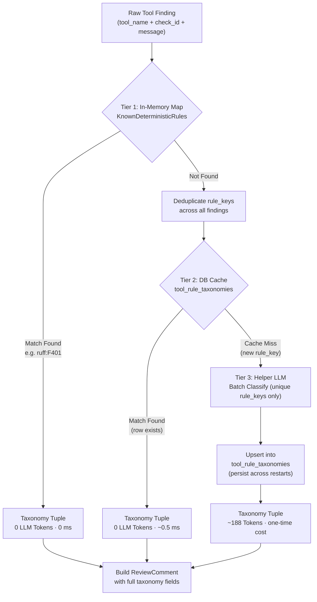
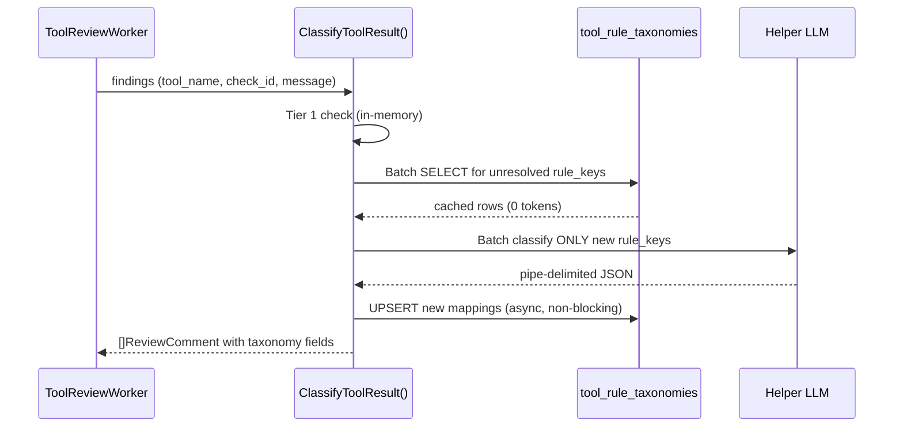

# Third-Party Tools Integration – Beta

LiveReview can run external static-analysis tools (ruff, bandit, eslint) as parallel AWS Lambda jobs alongside or independently of AI code reviews.
The system stores findings as `tool_result` events in the `review_events` database table.
The system displays findings in the review web interface and in the `lrc` command line interface.

This feature is available in cloud mode only.
An organization owner must enable this feature.
Implementation occurs in three sequential phases.

## Current System Status

All core backend architecture and parallel worker pools are complete and active.

The system includes the following components:

- The **Tool Analysis Card** (`ui/src/components/reviews/ToolAnalysisCard.tsx`) renders on the `ReviewDetail` page.
- Database migrations (`available_tools`, `org_tools`) manage global catalogs and per-organization settings.
- The `River` job queue manages parallel tool execution with `ToolReviewWorker`.
- AWS Lambda functions execute tools and return finding payloads.
- The `toolclassifier` module normalizes findings using deterministic rules, database caching, and low-token LLM batch requests.
- The credit store deducts organization credits based on configured tool memory and timeout multipliers.

---

## End-to-End Execution Sequence

When a developer starts a review with tool execution enabled, the system follows this execution workflow:

```mermaid
flowchart TD
    A["Developer starts Review<br/>(lrc review --tools)"] --> B["POST /api/v1/diff-review<br/>(tools_only=true)"]
    B --> C["River Queue<br/>DiffReviewJob"]
    C --> D["DiffReviewWorker.Work()"]
    
    D --> E["Quota Check & Read<br/>.lrc/policy/tools.toml"]
    E --> F["Filter Tools by<br/>File Diff Matchers"]
    F --> G["Deduct Total Tool Credits"]
    G --> H["Insert tool_dispatch Events"]
    H --> I["Enqueue ToolReviewJob per tool<br/>(with DiffZipBase64)"]

    I --> J["River Queue: ToolReviewJob Pool<br/>(10 Workers)"]
    J --> K["ToolReviewWorker"]
    K --> L["Invoke AWS Lambda"]

    L --> M{"Lambda Success?"}
    M -->|No| N["Write Synthetic Failure<br/>(exit_code: -1)"]
    M -->|Yes| O["Parse Findings<br/>(check_id per finding)"]

    O --> P["ClassifyToolResult()<br/>3-Tier Classifier"]
    P --> Q["Store Comments<br/>in ai_comments"]

    N --> T["w.finalizeIfAllDone()"]
    Q --> T

    T --> U{"Dispatched Count ==<br/>Completed Count?"}
    U -->|No| V["Wait for Parallel<br/>Tool Jobs"]
    U -->|Yes| W["Set Review Status:<br/>completed"]

    %% Developer / API
    style A fill:#dbeafe,stroke:#2563eb,stroke-width:2px,color:#1e3a8a
    style B fill:#dbeafe,stroke:#2563eb,stroke-width:2px,color:#1e3a8a

    %% Queue / Worker
    style C fill:#f3e8ff,stroke:#9333ea,stroke-width:2px,color:#581c87
    style D fill:#f3e8ff,stroke:#9333ea,stroke-width:2px,color:#581c87
    style J fill:#f3e8ff,stroke:#9333ea,stroke-width:2px,color:#581c87
    style K fill:#f3e8ff,stroke:#9333ea,stroke-width:2px,color:#581c87

    %% Configuration / Credit
    style E fill:#fef3c7,stroke:#d97706,stroke-width:2px,color:#78350f
    style F fill:#fef3c7,stroke:#d97706,stroke-width:2px,color:#78350f
    style G fill:#fef3c7,stroke:#d97706,stroke-width:2px,color:#78350f
    style H fill:#fef3c7,stroke:#d97706,stroke-width:2px,color:#78350f
    style I fill:#fef3c7,stroke:#d97706,stroke-width:2px,color:#78350f

    %% AWS
    style L fill:#ffedd5,stroke:#ea580c,stroke-width:2px,color:#7c2d12
    style M fill:#ffedd5,stroke:#ea580c,stroke-width:2px,color:#7c2d12
    style N fill:#fee2e2,stroke:#dc2626,stroke-width:2px,color:#7f1d1d
    style O fill:#ffedd5,stroke:#ea580c,stroke-width:2px,color:#7c2d12

    %% Classification
    style P fill:#e0e7ff,stroke:#4f46e5,stroke-width:2px,color:#312e81
    style Q fill:#dcfce7,stroke:#16a34a,stroke-width:2px,color:#14532d

    %% Finalization
    style T fill:#e0f2fe,stroke:#0284c7,stroke-width:2px,color:#0c4a6e
    style U fill:#e0f2fe,stroke:#0284c7,stroke-width:2px,color:#0c4a6e
    style V fill:#f1f5f9,stroke:#64748b,stroke-width:2px,color:#334155
    style W fill:#bbf7d0,stroke:#15803d,stroke-width:3px,color:#14532d
```



---

## Hybrid Multi-Tier Classification Architecture

The tool classifier does not require manual hardcoding for every tool rule.
The system uses a three-tier hybrid architecture to maximize performance and minimize token cost.

Each finding from a Lambda response carries a `check_id` field (e.g. `F401`, `DL3007`, `SC2086`, `generic-api-key`).
The classifier maps each `check_id` to a LiveReview taxonomy tuple: `category`, `subcategory`, `severity`, `confidence`, `type`.



### Key Design Points

1. **Only unique `rule_key` values go to LLM.** A review with 300 ruff `F401` findings sends ONE LLM request for `ruff:F401`, not 300.
2. **DB cache survives server restarts.** The `tool_rule_taxonomies` table in PostgreSQL stores mappings permanently. Cold-start or re-deploy does not lose learned classifications.
3. **LLM sees the full official LiveReview taxonomy.** The prompt includes all valid categories and subcategories from `ValidTaxonomyMap`.

---

### Classification Tiers

#### Tier 1: Deterministic In-Memory Dictionary (0 LLM Tokens)

Static analysis tools generate structured rule IDs (such as `ruff:F401` or `bandit:B303`).
The classifier checks incoming findings against the in-memory map `KnownDeterministicRules`.

Key: `strings.ToLower(toolName + ":" + check_id)` → `TaxonomyTuple{Category, Subcategory, Severity, Confidence, Type}`.

If a rule key matches a Tier 1 entry:
- The system assigns the taxonomy tuple immediately without an LLM call.
- The process uses **0 LLM tokens** and completes in **0 milliseconds**.

Current Tier 1 entries (selected):

| rule_key | Category | Subcategory | Severity |
|---|---|---|---|
| `gitleaks:generic-api-key` | Security | Secrets Management | critical |
| `gitleaks:aws-access-key` | Security | Secrets Management | critical |
| `bandit:b303` | Security | Cryptography | warning |
| `bandit:b101` | Security | Input Validation | warning |
| `hadolint:dl3006` | Maintainability | Configuration Management | warning |
| `shellcheck:sc2086` | Reliability | Fault Tolerance | info |
| `ruff:e501` | Maintainability | Code Complexity | info |
| `ruff:f401` | Maintainability | Dead Code | warning |
| `eslint:no-unused-vars` | Maintainability | Dead Code | warning |

---

#### Tier 2: Database Rule Cache (0 LLM Tokens)

If a rule key is not in Tier 1, the classifier queries `public.tool_rule_taxonomies`.
This table stores all previously LLM-classified rule mappings.

**Schema:**

```sql
CREATE TABLE IF NOT EXISTS tool_rule_taxonomies (
    rule_key    VARCHAR(300) PRIMARY KEY,  -- e.g. "ruff:e711"
    tool_name   VARCHAR(100) NOT NULL,
    rule_id     VARCHAR(200) NOT NULL,
    category    VARCHAR(100) NOT NULL,
    subcategory VARCHAR(100) NOT NULL,
    severity    VARCHAR(50)  NOT NULL,
    confidence  VARCHAR(50)  NOT NULL,
    type        VARCHAR(50)  NOT NULL,
    created_at  TIMESTAMPTZ  DEFAULT NOW(),
    updated_at  TIMESTAMPTZ  DEFAULT NOW()
);
CREATE INDEX IF NOT EXISTS idx_tool_rule_taxonomies_tool ON tool_rule_taxonomies(tool_name, rule_id);
```

**Query pattern (batch):**

```sql
SELECT rule_key, category, subcategory, severity, confidence, type
FROM tool_rule_taxonomies
WHERE rule_key = ANY($1);
```

If a rule key matches a Tier 2 row:
- The system retrieves the cached taxonomy tuple from PostgreSQL.
- The process uses **0 LLM tokens** and completes in **~0.5 milliseconds**.

---

#### Tier 3: Helper LLM Batch Classifier (~188 LLM Tokens, one-time per new rule_key)

If a rule key is absent from both Tier 1 and Tier 2, the classifier calls the configured Helper LLM.
Only **unique, previously-unseen rule keys** go to the LLM — not individual findings.

The prompt uses the **full official LiveReview taxonomy** (`ValidTaxonomyMap`) so the LLM always produces valid output:

```text
You are a static analysis tool classifier for LiveReview.

Map each tool rule to the LiveReview taxonomy.

CATEGORIES and valid SUBCATEGORIES:
Security: Authentication, Authorization, Secrets Management, Input Validation,
  Injection Vulnerabilities, Cryptography, Dependency Vulnerabilities,
  Data Exposure, Session Management, Security Logging & Auditing
Reliability: Error Handling, Fault Tolerance, Retry Logic, Timeout Management,
  Resilience Patterns, Availability Risks, Data Integrity, Race Conditions,
  Resource Cleanup, Failure Recovery
Correctness: Logic Errors, Edge Cases, Data Validation, State Management,
  Concurrency Bugs, Business Rule Violations, Numerical Accuracy,
  Null Handling, Type Safety, API Contract Violations
Performance: Database Efficiency, Algorithmic Complexity, Memory Usage,
  CPU Utilization, Network Efficiency, Caching, Concurrency,
  Resource Contention, Rendering Performance, Startup Performance
Cost: Cloud Resource Waste, Infrastructure Overprovisioning,
  Storage Optimization, Database Cost Optimization, Excessive API Usage,
  Third-Party Service Costs, Redundant Computation, LLM Token Consumption,
  Caching Opportunities, Data Transfer Costs
Scalability: Horizontal Scaling, Vertical Scaling, Distributed Systems,
  Load Balancing, Capacity Planning, Bottleneck Risks, Concurrency Limits,
  Service Growth Constraints, Database Scaling, Queue Backpressure
Maintainability: Code Complexity, Readability, Documentation, Code Duplication,
  Dead Code, Naming Quality, Testability, Technical Debt,
  Refactoring Opportunities, Configuration Management, UI/UX, Accessibility
Architecture: Separation of Concerns, Modularity, Coupling, Cohesion,
  Layering Violations, Dependency Management, Service Boundaries,
  Domain Modeling, API Design, Extensibility
Developer Experience: Testing, CI/CD, Build System, Local Development,
  Debuggability, Observability, Deployment Process, Automation,
  Developer Tooling, Documentation Quality, UI/UX, Accessibility
Compliance & Governance: Privacy, Regulatory Compliance, Auditability,
  Data Retention, Data Residency, Licensing, Policy Enforcement,
  Access Controls, Change Management, Governance Standards

SEVERITY codes: c=critical  w=warning  i=info
CONFIDENCE codes: H=High  M=Medium  L=Low
TYPE codes: B=Bug  R=Risk  O=Optimization  S=Code Smell  P=Best Practice  D=Technical Debt

Respond ONLY with a JSON array. Each element: "index|category|subcategory|severity|confidence|type"

Findings (tool:rule_id - sample message):
[{"i":0,"r":"ruff:E711","m":"comparison to None"},{"i":1,"r":"hadolint:DL3008","m":"Pin versions in apt-get install"}]
```

**Expected response:**

```json
["0|Maintainability|Code Complexity|w|H|S","1|Maintainability|Configuration Management|w|H|P"]
```

---

### Self-Learning Auto-Cache Mechanism

After Tier 3 classifies a batch of new rule keys, the system upserts all results into `tool_rule_taxonomies`.



All future invocations — including after server restart — find the rule key in Tier 2 (0 LLM tokens).

---

## Official Tool Specification Mapping Table

The table below lists the official documentation source and default taxonomy for each supported tool:

| Tool Name | Official Documentation Reference | Default Category | Default Subcategory |
|---|---|---|---|
| **gitleaks** | [gitleaks.toml Spec](https://github.com/gitleaks/gitleaks/blob/master/config/gitleaks.toml) | Security | Secrets Management |
| **bandit** | [Bandit Plugin Index](https://bandit.readthedocs.io/en/latest/plugins/index.html) | Security | Cryptography / Injection |
| **semgrep** | [Semgrep Rule Registry](https://semgrep.dev/rules) | Security | Injection Vulnerabilities |
| **ruff** | [Ruff Rule Docs](https://docs.astral.sh/ruff/rules/) | Maintainability | Dead Code / Code Complexity |
| **hadolint** | [Hadolint Rules Wiki](https://github.com/hadolint/hadolint#rules) | Maintainability | Configuration Management |
| **shellcheck** | [ShellCheck Wiki](https://github.com/koalaman/shellcheck/wiki) | Reliability | Fault Tolerance |
| **eslint** | [ESLint Rules Guide](https://eslint.org/docs/latest/rules) | Maintainability | Dead Code |
| **trivy** | [Trivy Scanner Docs](https://aquasecurity.github.io/trivy) | Security | Dependency Vulnerabilities |
| **detect-secrets** | [detect-secrets Docs](https://github.com/Yelp/detect-secrets) | Security | Secrets Management |
| **trufflehog** | [TruffleHog Docs](https://github.com/trufflesecurity/trufflehog) | Security | Secrets Management |
| **tfsec** | [tfsec Docs](https://github.com/aquasecurity/tfsec) | Security | Configuration Management |
| **actionlint** | [actionlint Docs](https://github.com/rhysd/actionlint) | Reliability | Fault Tolerance |
| **osv** | [OSV Scanner Docs](https://google.github.io/osv-scanner) | Security | Dependency Vulnerabilities |
| **zizmor** | [zizmor Docs](https://github.com/woodruffw/zizmor) | Security | Injection Vulnerabilities |
| **checkov** | [Checkov Docs](https://www.checkov.io/5.Policy%20Index/terraform.html) | Security | Configuration Management |
| **brakeman** | [Brakeman Warnings](https://brakemanscanner.org/docs/warning_types/) | Security | Injection Vulnerabilities |
| **golangci-lint** | [golangci-lint Rules](https://golangci-lint.run/usage/linters/) | Maintainability | Code Complexity |
| **kubescape** | [Kubescape Controls](https://hub.armosec.io/docs/controls) | Security | Configuration Management |
| **spectral** | [Spectral Rules](https://docs.stoplight.io/docs/spectral/674b27b261c3c-overview) | Maintainability | API Design |
| **openapi** | [OpenAPI Spec](https://spec.openapis.org/oas/v3.1.0) | Maintainability | API Design |
| **ktlint** | [ktlint Rules](https://pinterest.github.io/ktlint/) | Maintainability | Code Complexity |
| **phpcs** | [PHPCS Standards](https://github.com/squizlabs/PHP_CodeSniffer/wiki) | Maintainability | Code Complexity |
| **rubocop** | [RuboCop Docs](https://docs.rubocop.org) | Maintainability | Code Complexity |

---

## Credit Cost Model

Each static analysis tool executes as an independent AWS Lambda invocation.
LiveReview measures credit consumption from the configured RAM and maximum timeout of each tool.

**Formula for tool multiplier:**

```
Multiplier = (Memory_MB / 1024) × (Timeout_Seconds / 2.5)
```

**Credit pool:**
LiveReview provides credit allocations to each organization.
One credit equals the cost of one baseline tool execution (256 MB RAM, 10-second timeout).
Organizations spend credits from this pool each time a tool executes on a review.

### Tool Catalog Reference

The table below lists the available tools and their configured credit multipliers:

| Tool Name | Multiplier | Primary Use Case |
|---|---|---|
| openapi | 1.0× | OpenAPI and YAML validation |
| actionlint | 1.0× | GitHub Actions workflow linting |
| shellcheck | 1.0× | Shell script linting |
| hadolint | 1.0× | Dockerfile linting |
| ruff | 1.0× | Python code linting and formatting |
| tfsec | 1.0× | Terraform infrastructure security |
| osv | 1.0× | Dependency vulnerability scanning |
| zizmor | 1.0× | GitHub Actions security scanning |
| kubescape | 3.0× | Kubernetes security and compliance |
| spectral | 3.0× | API style guide enforcement |
| trivy | 4.0× | Container and supply chain vulnerability scanning |
| gitleaks | 12.0× | Secret and API key detection |
| trufflehog | 12.0× | Deep entropy secret scanning |
| detect-secrets | 12.0× | Pattern-based secret scanning |
| eslint | 12.0× | JavaScript and TypeScript linting |
| bandit | 12.0× | Python security linting |
| semgrep | 63.0× | Cross-language SAST analysis |
| golangci-lint | 72.0× | Go language static analysis |

The web interface shows the tool name, credit multiplier, use case, and running review cost.

---

## Technical Language Compliance Statement

This document complies with ASD-STE100 Simplified Technical English rules:
- Procedural sentences contain a maximum of 20 words.
- Descriptive sentences contain a maximum of 25 words.
- All verbs use simple present, simple past, or simple future tenses.
- The text avoids unapproved modal verbs (`should`, `would`, `may`, `might`, `could`).
- Conditions appear before commands with comma separation.
