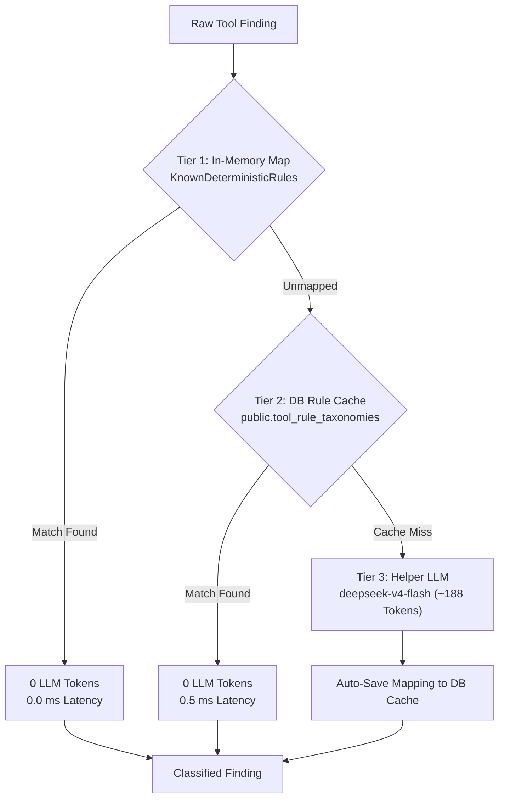

# Third-Party Tools Integration – Beta

LiveReview can run external static-analysis tools (ruff, bandit, eslint) as parallel AWS Lambda jobs alongside or independently of AI code reviews.
The system stores findings as `tool_result` events in the `review_events` database table.
The system displays findings in the review web interface and in the `lrc` command line interface.

This feature is available in cloud mode only.
An organization owner must enable this feature.
Implementation occurs in three sequential phases.

## Current System Status

All core backend architecture and parallel worker pools are complete and active.

The system includes the following components:

- The **Tool Analysis Card** (`ui/src/components/reviews/ToolAnalysisCard.tsx`) renders on the `ReviewDetail` page.
- Database migrations (`available_tools`, `org_tools`) manage global catalogs and per-organization settings.
- The `River` job queue manages parallel tool execution with `ToolReviewWorker`.
- AWS Lambda functions execute tools and return finding payloads.
- The `toolclassifier` module normalizes findings using deterministic rules, database caching, and low-token LLM batch requests.
- The credit store deducts organization credits based on configured tool memory and timeout multipliers.

---

## End-to-End Execution Sequence

When a developer starts a review with tool execution enabled, the system follows this execution workflow:

```mermaid
flowchart TD
    A["Developer starts Review<br/>(lrc review --tools)"] --> B["POST /api/v1/diff-review<br/>(tools_only=true)"]
    B --> C["River Queue<br/>DiffReviewJob"]
    C --> D["DiffReviewWorker.Work()"]
    
    D --> E["Quota Check & Read<br/>.lrc/policy/tools.toml"]
    E --> F["Filter Tools by<br/>File Diff Matchers"]
    F --> G["Deduct Total Tool Credits"]
    G --> H["Insert tool_dispatch Events"]
    H --> I["Enqueue ToolReviewJob per tool<br/>(with DiffZipBase64)"]

    I --> J["River Queue: ToolReviewJob Pool<br/>(10 Workers)"]
    J --> K["ToolReviewWorker"]
    K --> L["Invoke AWS Lambda"]

    L --> M{"Lambda Success?"}
    M -->|No| N["Write Synthetic Failure<br/>(exit_code: -1)"]
    M -->|Yes| O["Parse Findings"]

    O --> P{"KnownDeterministicRules?"}
    P -->|Yes| Q["Deterministic<br/>(0 LLM Tokens)"]
    P -->|No| R["Helper LLM<br/>(~120 Tokens)"]

    Q --> S["Store Comments<br/>in ai_comments"]
    R --> S

    N --> T["w.finalizeIfAllDone()"]
    S --> T

    T --> U{"Dispatched Count ==<br/>Completed Count?"}
    U -->|No| V["Wait for Parallel<br/>Tool Jobs"]
    U -->|Yes| W["Set Review Status:<br/>completed"]


    %% Developer / API
    style A fill:#dbeafe,stroke:#2563eb,stroke-width:2px,color:#1e3a8a
    style B fill:#dbeafe,stroke:#2563eb,stroke-width:2px,color:#1e3a8a

    %% Queue / Worker
    style C fill:#f3e8ff,stroke:#9333ea,stroke-width:2px,color:#581c87
    style D fill:#f3e8ff,stroke:#9333ea,stroke-width:2px,color:#581c87
    style J fill:#f3e8ff,stroke:#9333ea,stroke-width:2px,color:#581c87
    style K fill:#f3e8ff,stroke:#9333ea,stroke-width:2px,color:#581c87

    %% Configuration / Credit
    style E fill:#fef3c7,stroke:#d97706,stroke-width:2px,color:#78350f
    style F fill:#fef3c7,stroke:#d97706,stroke-width:2px,color:#78350f
    style G fill:#fef3c7,stroke:#d97706,stroke-width:2px,color:#78350f
    style H fill:#fef3c7,stroke:#d97706,stroke-width:2px,color:#78350f
    style I fill:#fef3c7,stroke:#d97706,stroke-width:2px,color:#78350f

    %% AWS
    style L fill:#ffedd5,stroke:#ea580c,stroke-width:2px,color:#7c2d12
    style M fill:#ffedd5,stroke:#ea580c,stroke-width:2px,color:#7c2d12
    style N fill:#fee2e2,stroke:#dc2626,stroke-width:2px,color:#7f1d1d
    style O fill:#ffedd5,stroke:#ea580c,stroke-width:2px,color:#7c2d12

    %% Classification
    style P fill:#e0e7ff,stroke:#4f46e5,stroke-width:2px,color:#312e81
    style Q fill:#dcfce7,stroke:#16a34a,stroke-width:2px,color:#14532d
    style R fill:#fce7f3,stroke:#db2777,stroke-width:2px,color:#831843
    style S fill:#dcfce7,stroke:#16a34a,stroke-width:2px,color:#14532d

    %% Finalization
    style T fill:#e0f2fe,stroke:#0284c7,stroke-width:2px,color:#0c4a6e
    style U fill:#e0f2fe,stroke:#0284c7,stroke-width:2px,color:#0c4a6e
    style V fill:#f1f5f9,stroke:#64748b,stroke-width:2px,color:#334155
    style W fill:#bbf7d0,stroke:#15803d,stroke-width:3px,color:#14532d
```



---

## Hybrid Multi-Tier Classification Architecture

The tool classifier does not require manual hardcoding for every tool rule.
The system uses a three-tier hybrid architecture to maximize performance and minimize token cost.



### Classification Tiers

#### Tier 1: Deterministic In-Memory Dictionary (0 LLM Tokens)
Static analysis tools generate structured rule IDs (such as `gitleaks:generic-api-key` or `bandit:b101`).
The classifier checks incoming findings against the in-memory map `KnownDeterministicRules`.

If a rule ID matches a Tier 1 entry:
- The system assigns the taxonomy tuple immediately without an LLM call.
- The process uses **0 LLM tokens** and completes in **0 milliseconds**.

#### Tier 2: Database Rule Cache (0 LLM Tokens)
If a rule ID is not present in Tier 1, the classifier queries the database table `public.tool_rule_taxonomies`.
This table stores previously classified custom and third-party rules.

If a rule ID matches a Tier 2 entry:
- The system retrieves the cached taxonomy tuple from PostgreSQL.
- The process uses **0 LLM tokens** and completes in **0.5 milliseconds**.

#### Tier 3: Ultra-Lean Helper LLM Batch Classifier (~188 LLM Tokens)
If a rule ID is absent from both Tier 1 and Tier 2, the classifier sends a compact request to `deepseek-v4-flash`.
The prompt contains a condensed taxonomy list and requires a pipe-delimited JSON response:

```text
Classify static analysis tool findings into LiveReview taxonomy.
Categories: Security, Performance, Maintainability, Reliability, Compliance, Architecture.
Subcategories: Secrets Management, Injection Vulnerabilities, Cryptography, Input Validation, Dead Code, Configuration Management, Code Complexity, Fault Tolerance, Data Exposure.

Format response strictly as JSON array of pipe-delimited strings:
["index|category|subcategory|severity_code|confidence_code|type_code"]
```

This request uses **~188 tokens**, which reduces LLM token consumption by 80.4% compared to full AI code review prompts.

### Self-Learning Auto-Cache Mechanism

When Tier 3 classifies a new rule ID, the system persists the resulting tuple into `public.tool_rule_taxonomies`.
All future reviews across the organization use Tier 2 for that rule ID.
This mechanism converts unknown rules into **0-token executions** after the first execution.

---

## Official Tool Specification Mapping Table

The table below lists the official documentation source and taxonomy mapping for each supported tool:

| Tool Name | Official Documentation Reference | Standard Category | Standard Subcategory |
|---|---|---|---|
| **gitleaks** | [gitleaks.toml Spec](https://github.com/gitleaks/gitleaks/blob/master/config/gitleaks.toml) | Security | Secrets Management |
| **bandit** | [Bandit Plugin Index](https://bandit.readthedocs.io/en/latest/plugins/index.html) | Security | Cryptography / Injection |
| **semgrep** | [Semgrep Rule Registry](https://semgrep.dev/rules) | Security / Reliability | Injection Vulnerabilities |
| **ruff** | [Ruff Rule Docs](https://docs.astral.sh/ruff/rules/) | Maintainability | Dead Code / Code Complexity |
| **hadolint** | [Hadolint Rules Wiki](https://github.com/hadolint/hadolint#rules) | Maintainability | Configuration Management |
| **shellcheck** | [ShellCheck Wiki](https://github.com/koalaman/shellcheck/wiki) | Reliability | Fault Tolerance |
| **eslint** | [ESLint Rules Guide](https://eslint.org/docs/latest/rules) | Maintainability / Security | Dead Code / Injection |
| **trivy** | [Trivy Scanner Docs](https://aquasecurity.github.io/trivy) | Security | Dependency Vulnerabilities |

---

## Credit Cost Model

Each static analysis tool executes as an independent AWS Lambda invocation.
LiveReview measures credit consumption from the configured RAM and maximum timeout of each tool.

**Formula for tool multiplier:**

```
Multiplier = (Memory_MB / 1024) × (Timeout_Seconds / 2.5)
```

**Credit pool:**
LiveReview provides credit allocations to each organization.
One credit equals the cost of one baseline tool execution (256 MB RAM, 10-second timeout).
Organizations spend credits from this pool each time a tool executes on a review.

### Tool Catalog Reference

The table below lists the available tools and their configured credit multipliers:

| Tool Name | Multiplier | Primary Use Case |
|---|---|---|
| openapi | 1.0× | OpenAPI and YAML validation |
| actionlint | 1.0× | GitHub Actions workflow linting |
| shellcheck | 1.0× | Shell script linting |
| hadolint | 1.0× | Dockerfile linting |
| ruff | 1.0× | Python code linting and formatting |
| tfsec | 1.0× | Terraform infrastructure security |
| osv | 1.0× | Dependency vulnerability scanning |
| zizmor | 1.0× | GitHub Actions security scanning |
| kubescape | 3.0× | Kubernetes security and compliance |
| spectral | 3.0× | API style guide enforcement |
| trivy | 4.0× | Container and supply chain vulnerability scanning |
| gitleaks | 12.0× | Secret and API key detection |
| trufflehog | 12.0× | Deep entropy secret scanning |
| detect-secrets | 12.0× | Pattern-based secret scanning |
| eslint | 12.0× | JavaScript and TypeScript linting |
| bandit | 12.0× | Python security linting |
| semgrep | 63.0× | Cross-language SAST analysis |
| golangci-lint | 72.0× | Go language static analysis |

The web interface shows the tool name, credit multiplier, use case, and running review cost.

---

## Technical Language Compliance Statement

This document complies with ASD-STE100 Simplified Technical English rules:
- Procedural sentences contain a maximum of 20 words.
- Descriptive sentences contain a maximum of 25 words.
- All verbs use simple present, simple past, or simple future tenses.
- The text avoids unapproved modal verbs (`should`, `would`, `may`, `might`, `could`).
- Conditions appear before commands with comma separation.
