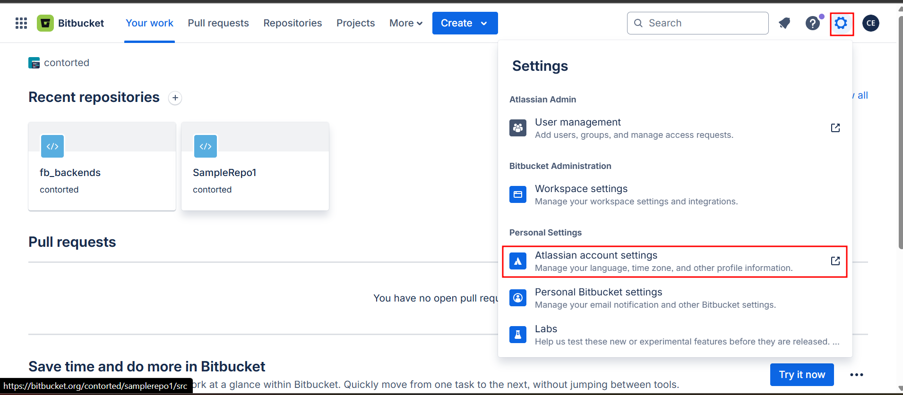
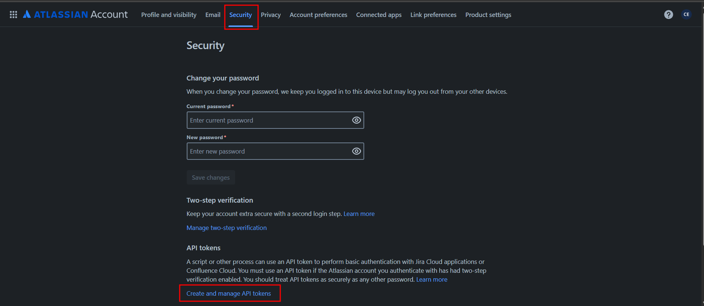
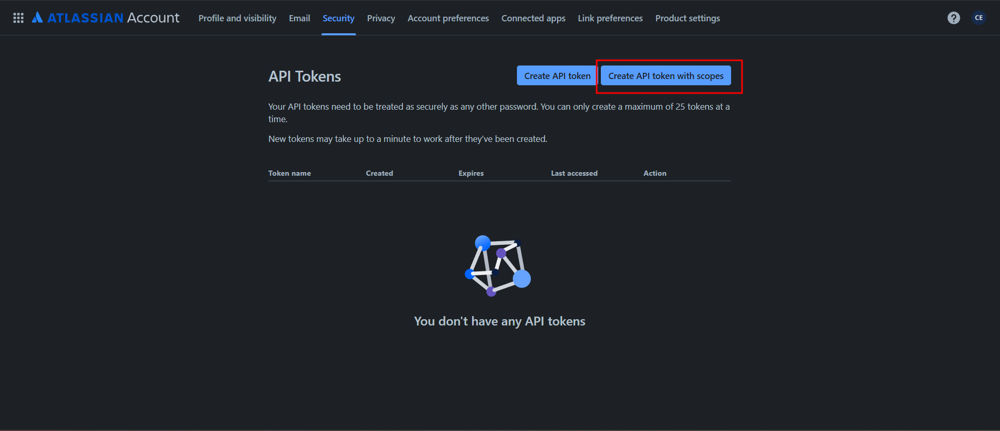
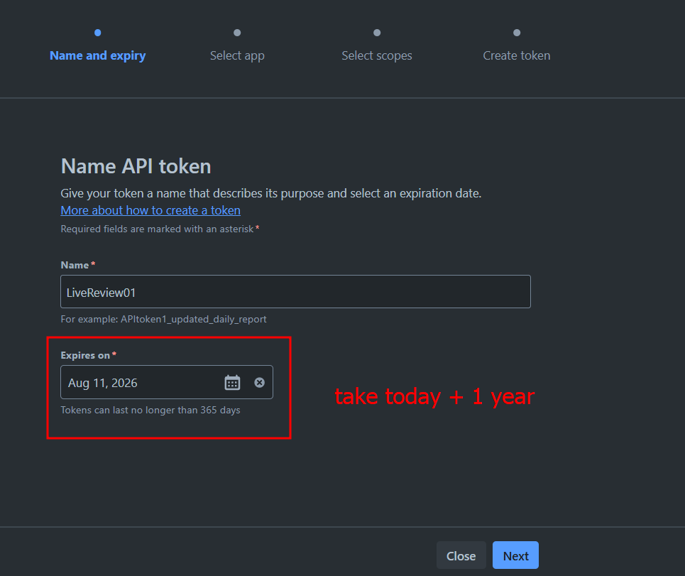
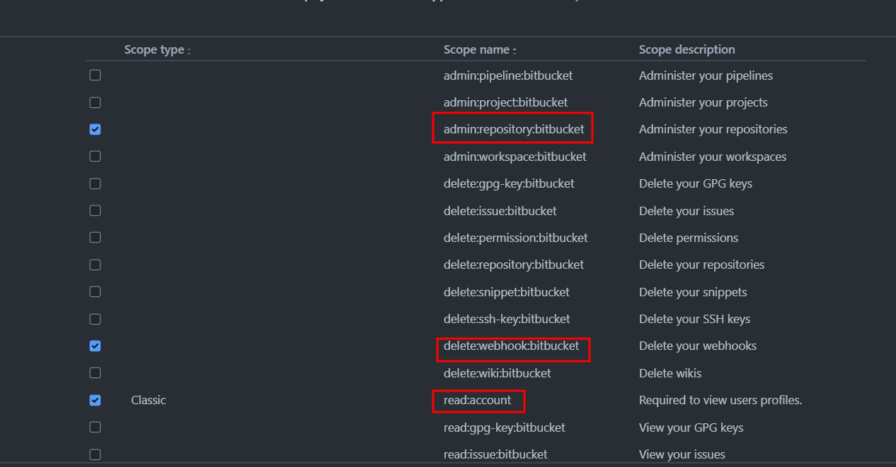
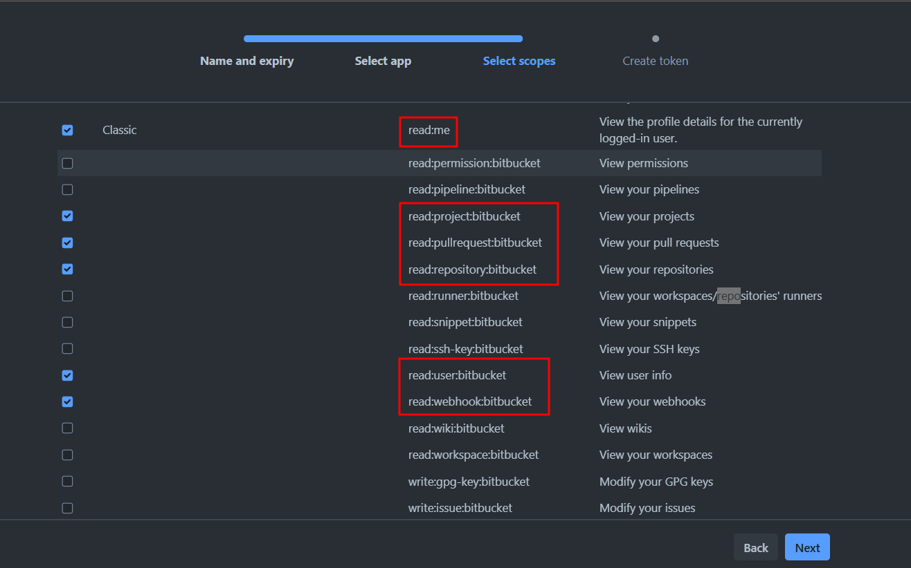
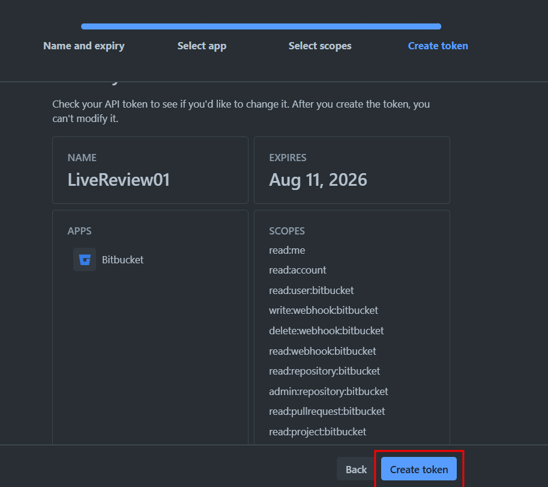

## Required Scopes for LiveReview

For full functionality including project discovery, the following scopes are required:

### Essential Scopes (Required):
```
read:me
read:account
read:user:bitbucket
read:repository:bitbucket
read:pullrequest:bitbucket
write:pullrequest:bitbucket
read:project:bitbucket
write:webhook:bitbucket
delete:webhook:bitbucket
read:webhook:bitbucket
admin:repository:bitbucket
read:workspace:bitbucket
```

**Note**: The `read:workspace:bitbucket` scope is optional. If not granted, LiveReview will still discover repositories you have direct access to, but may not find all repositories in shared workspaces.