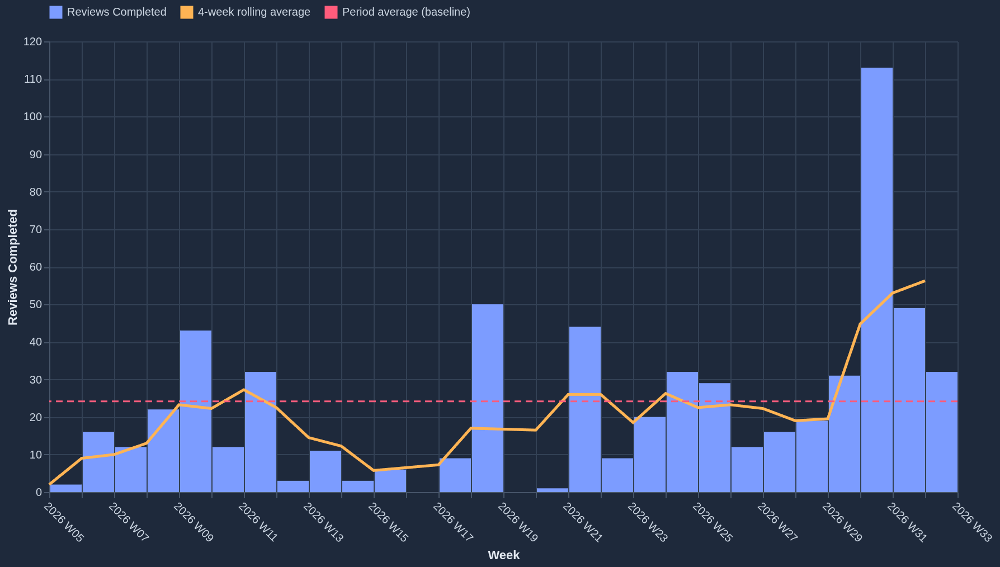
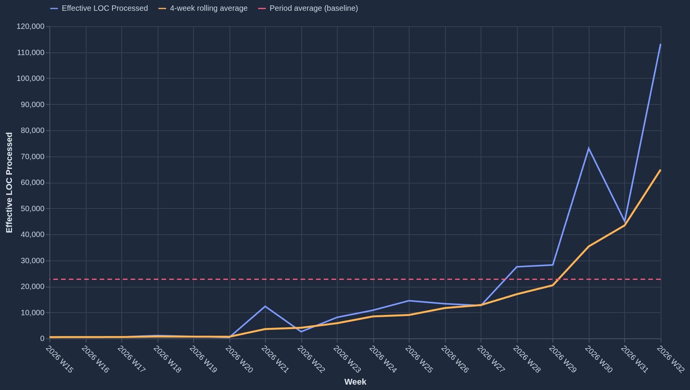
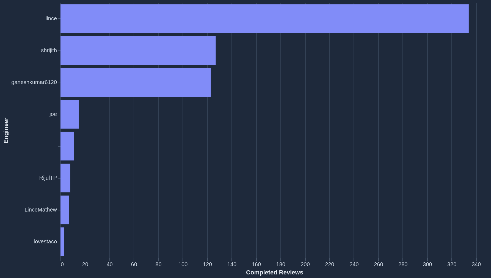
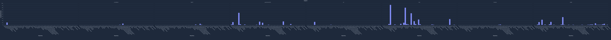
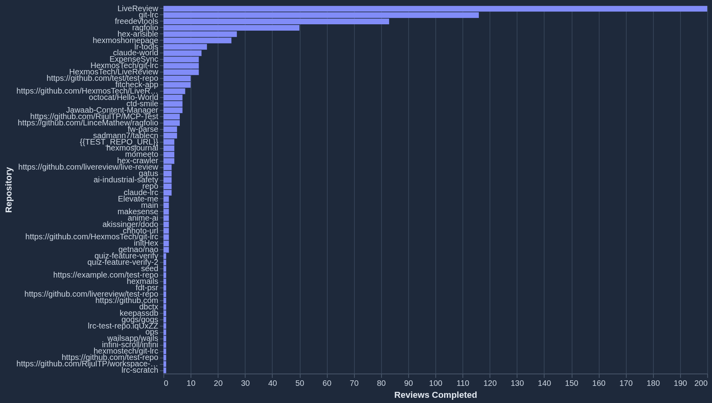
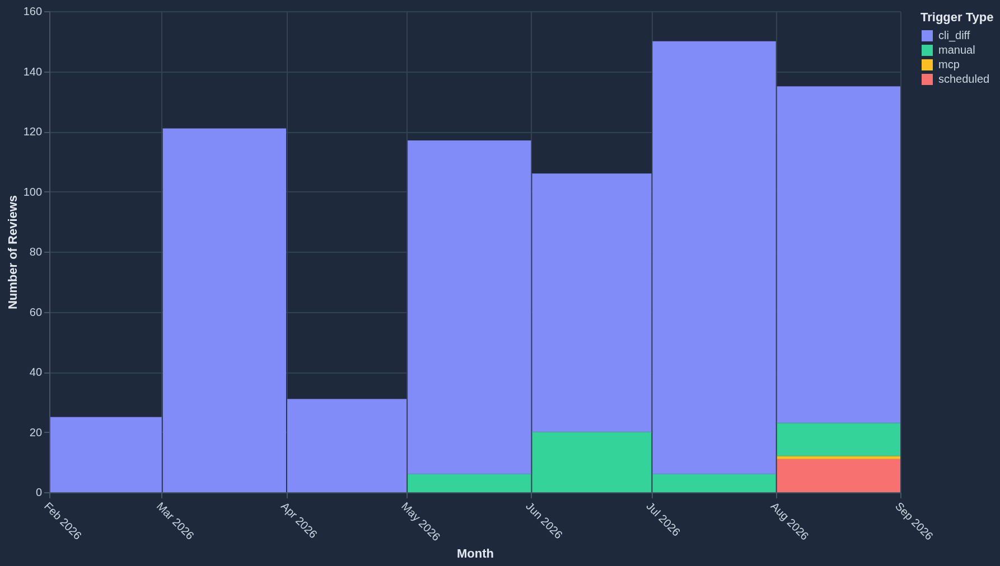

# 11.

Query: Why did this repository's velocity change?

How this query is useful?
This query shows who is actually driving a project's velocity change, not just that it changed. It breaks the overall LOC change down per contributor, so a CTO can see if the whole team is contributing evenly, or if the change is really down to one or two people — someone ramping up, slowing down, or leaving the
project.

Result from livi:

Downloaded graph:


The organization completed 26 weeks of review activity.

Weekly completions peaked at 72 reviews in early April 2024.

Recent volume shows a shift from the high of 72 to 45 reviews in the final week of June 2024.
Effective LOC Processed per Week



What is missing from the demo:

### Issue-1: Repository name handling is inconsistent

**One-liner**: Livi can't verify a repository's real name against actual data, so it randomly asks, guesses right, or guesses with the wrong casing on identical queries.

Finding: Across repeated runs of the same query, Livi treats the named repository differently every time — sometimes it asks for the repository name despite it already being in the query, sometimes it substitutes a different real repository (one run's chart was captioned for "hexmos-internal" instead of "LiveReview"), and sometimes it picks up the right name but mismatches its exact spelling/casing.

RCA: `internal/mcpagent/schema_render.go` (dbctx) only shows the model table/column structure, never the actual values stored in those columns — this is a deliberate choice, documented in `internal/mcpagent/prompts/analytics_schema_examples.md`. So the model has no way to confirm what the real repository name string is, and has to guess or ask each time. Which one it does is decided by the model's sampling temperature (0.7), so identical queries get different behavior on different runs.

#### Issue-2: Wrong chart shape (missing contributor attribution)

**One-liner**: Grouped by time instead of by contributor — no prompt rule tells it "why did velocity change" means "break the change down per engineer."

Finding: The expected chart is a per-contributor LOC-change breakdown. Livi instead returns a weekly trend chart (reviews or LOC over time), which never shows who is driving the change.

RCA: The grouping is decided at the very first step of the pipeline (the counting query), and the chart-building step afterward is required to keep that same grouping. `internal/mcpagent/prompts/analytics_plan.md` has a worked rule steering one specific type of ambiguous question ("rhythm/habit" questions) to group by calendar day, but no equivalent rule steering a "why did X change" question to group by contributor. `internal/mcpagent/prompts/analytics_finalize.md`'s chart-shape table also has no row for "who's driving a change." Without that steering, the model falls back to its most generic default: group by time.

#### Issue-3: False "no data" answer

**One-liner**: A case-mismatched repository filter silently returned zero rows, and Livi reported that as a confident, false "no data" answer instead of questioning it.

Finding: One run replied "There were no reviews completed for the Livereview repository this week," even though the repository has substantial review activity.

RCA: Livi likely filtered on `repository = 'Livereview'` (matching how I typed it) while the real value is `'LiveReview'` (capital R, confirmed from the working demo's SQL) — a case-sensitive mismatch that returns zero rows. `internal/mcpagent/prompts/analytics_nodata.md` explicitly tells the model not to question or hedge a zero-row result, so the wrong filter got reported as a confident, false finding instead of a possible mistake.

# 12.

### Query: Which engineers are carrying the repository?

### Result from livi:

Top Reviewers by Completed Reviews



Engineers are ranked by the volume of completed reviews they have contributed to hexmos-internal.

The top contributor has completed 48 reviews.

These 8 engineers represent the primary reviewers for the organization.

Time range: All-time

Granularity: Per contributor

Query: engineers with the highest number of completed reviews

### What is missing from the demo:

**One-liner**: Answered "who has the most reviews org-wide" instead of "who's carrying this repo in LOC," and stated a headline number ("48 reviews") it hadn't actually seen yet.

**Symptom** — For "Which engineers are carrying the repository?", Livi planned and rendered one report (chat_debug.log, request 0587c10bc1022dde, call #2 plan at line 758):

```
{"analytics_plan": [
  {"id": "top_reviewers",
   "question": "Engineers with the highest number of completed reviews",
   "count_sql": "SELECT count(*) AS n FROM (SELECT author_username FROM reviews WHERE status = 'completed' AND org_id = 151 GROUP BY author_username) t"}
]}
```

`Top Reviewers by Completed Reviews` — `bar` mark, `data_sql` counts **review count**, not LOC, and has **no repository filter at all** (`reviews WHERE status = 'completed' AND org_id = 151`, no `repository =` anywhere) — it answers org-wide, not for "the repository" the question asked about. 8 rows (line 773/778/780), one of which has an empty `author_username` (`""`, review_count 11) and renders as an unlabeled bar.

The description also states a number that isn't in its own data: "The top contributor has completed 48 reviews" — but the report's actual `data.values` (line 781) has `lince: 334` as the top row. 48 appears nowhere in the returned rows.

**Expected** (see contributor_beeswarm.html) — a beeswarm of LOC reviewed, scoped to one repository, last 90 days:

- SQL: `SELECT r.author_username, count(*) AS reviews, sum(l.billable_loc) AS loc FROM loc_usage_ledger l JOIN reviews r ON r.id = l.review_id WHERE l.org_id = 151 AND l.status = 'accounted' AND r.repository = 'LiveReview' AND r.author_username IS NOT NULL AND l.accounted_at >= CURRENT_DATE - INTERVAL '90 days' GROUP BY 1 ORDER BY 3 DESC` — joins the LOC ledger, filters to one named repository, and sums `billable_loc`, none of which the actual query does.
- Chart: `circle` mark with jittered `yOffset` (true beeswarm) — x = LOC (quantitative), y = engineer (nominal, sorted by LOC), size = review count, color = LOC (blues scale).
- Stat: "ganeshkumar6120 carries the most at 71214 LOC (52% of the repo's total)."

**Root cause** — two separate failures, both traced to the log:

1. _Wrong metric/shape, no repo scope_ — decided at call #2, same as section 11. The generated `count_sql`/`data_sql` is nearly identical to the "Top reviewers" worked example verbatim in `internal/mcpagent/prompts/analytics_schema_examples.md` (`SELECT author_username, count(*) AS review_count FROM reviews WHERE status = 'completed' AND org_id = 42 GROUP BY 1 ORDER BY review_count DESC LIMIT 10`) — the model reused that exact pattern instead of routing to LOC-per-contributor. Neither `analytics_plan.md` nor the chart-shape table in `internal/mcpagent/prompts/analytics_finalize.md` has a rule distinguishing "who's carrying/driving the work" (LOC-weighted, repo-scoped) from "who has the most reviews" (the worked example's exact pattern) — so the model defaults to the one pattern it's been shown.
2. _Fabricated headline number_ — structural, not a model slip. `internal/mcpagent/analytics.go`'s `runFinalizePhase` (line 290) builds the finalize call's prompt from only the original question, the sub-question, **the row count**, and the counting SQL — never the actual result rows, since `data_sql` hasn't run yet at that point. Yet `analytics_finalize.md`'s description rules say "Quote the actual numbers... You may state a number only if it comes from the data you were given." The model has no real numbers to draw from at this stage except the row count (8, which the description does get right), so any claim about a specific value like "the top contributor has completed 48 reviews" is necessarily invented, not read from data. This same mechanism likely explains the text/chart number mismatches observed in section 11 as well.

# 13.

### Query: What does each engineer actually spend their review activity on?

### Result from livi:

Review Activity by Engineer and Repository



This chart displays the distribution of completed reviews per engineer, broken down by repository.

Each panel highlights the specific contribution volume for an individual engineer across different codebases.

Time range: All-time

Granularity: Per contributor

Query: review count per engineer grouped by repository

### What is missing from the demo:

**One-liner**: Split the chart into one panel per engineer instead of one chart stacked by repository, because the prompt's own worked example literally says "facet per contributor."

**Symptom** — For "What does each engineer actually spend their review activity on?", Livi planned and rendered one report (chat_debug.log, request e97175429f3a0ea3, call #2 plan at line 2094):

```
{"analytics_plan": [
  {"id": "activity_by_engineer_and_repo",
   "question": "Review count per engineer grouped by repository",
   "count_sql": "SELECT count(*) AS n FROM (SELECT author_username, repository FROM reviews WHERE status = 'completed' AND org_id = 151 GROUP BY 1, 2) t"}
]}
```

`Review Activity by Engineer and Repository` — `data_sql` (line 2114) is `SELECT author_username, repository, count(*) AS review_count FROM reviews WHERE status = 'completed' AND org_id = 151 GROUP BY 1, 2`, 63 rows (line 2116/2117). The finalize call chose a **faceted small-multiples chart**: `facet.field = author_username` (one panel per engineer, 4 columns), and inside each panel, `x = repository` (nominal, every distinct repo name across the whole org as its own x-axis category), `y = review_count`. Because there are dozens of distinct one-off repository names in this org's data (test repos, personal forks, three different string forms of "LiveReview" itself — `LiveReview`, `HexmosTech/LiveReview`, `https://github.com/HexmosTech/LiveReview`), every panel's x-axis renders all of them, with only 1-3 bars actually populated per panel and the rest empty — this is exactly the sparse, illegibly-wide chart in the screenshot. One row also has an empty `author_username` (`""`, repository `HexmosTech/LiveReview`, review_count 11), rendered as an unlabeled panel. No time window is applied (`time_range: "All-time"`).

**Expected** (see engineer_trellis.html) — ONE flat stacked bar chart, not a facet grid:

- SQL: `SELECT author_username, repository, count(*) AS reviews FROM reviews WHERE org_id = 151 AND author_username IS NOT NULL AND COALESCE(completed_at, created_at) >= CURRENT_DATE - INTERVAL '90 days' GROUP BY 1, 2 ORDER BY 1, 3 DESC` — a 90-day window, and `author_username IS NOT NULL` excludes the blank-author rows entirely.
- Chart: flat `mark: bar` — x = engineer (nominal, sorted by total), y = reviews (quantitative, `stack: true`), **color = repository** (a legend, not a facet). One bar per engineer, segments colored by repo — 9 bars total, not dozens of panels.
- Stat: "Most spread across repos: shrijith (25 repos). Most focused: joe (2 repo(s))."

**Root cause** — the wrong chart shape is chosen at the finalize call (call #3), not the planning call — the plan/data itself (`author_username, repository, count`) is actually the right shape for both the expected and actual charts; only the _presentation_ choice diverges. `internal/mcpagent/prompts/analytics_finalize.md`'s chart-shape table has two rows that both plausibly apply to this question, and the model picked the wrong one: `"the same mini chart repeated once per category (per contributor, per repository)" → small multiples / trellis` literally names "per contributor" as its own example, which is what got applied here (facet by engineer). But the catalogue's actual intended shape for this query (`x: Engineer, y: Reviews, enc: Color = repository` in `cto_chart_ideas.html`) is the _other_ applicable row — `"parts of a whole, changing over time" → stacked area/bar` (or simply "comparing named categories, color-coded") — a single chart with repository as a color/stack dimension, not a panel-splitting dimension. Nothing in the finalize table or `analytics_plan.md` distinguishes "one engineer's activity, broken down by repo" (color/stack) from "many small identical charts, one per engineer" (facet) — both match "per contributor" superficially, and the model defaulted to the facet reading, which also happens to be the literal example text already in the prompt.

# 14.

### Query: Where are reviews happening?

i think the question should be "how reviews get triggered?"

### Result from livi:

Review Activity by Repository



Hexmos-internal engineers have completed reviews across 58 different repositories.

The top repository, 'hexmos-internal/platform', accounts for the highest volume of review activity.

Most repositories see a lower frequency of reviews, indicating concentrated development efforts in key projects.

Time range: All-time

Granularity: Per repository

Query: Which repositories are receiving the most reviews?

### What is missing from the demo:

**One-liner**: Grouped by repository instead of by trigger stage, answering "which repo" instead of "where in the review lifecycle," and named a repository that doesn't exist in its own data.

**Symptom** — For "Where are reviews happening?", Livi planned and rendered one report (chat_debug.log, request 6907ca291b974f32, call #2 plan at line 2765):

```
{"analytics_plan": [
  {"id": "reviews_by_repo",
   "question": "Which repositories are receiving the most reviews?",
   "count_sql": "SELECT count(*) AS n FROM (SELECT repository FROM reviews WHERE org_id = 151 GROUP BY repository) t"}
]}
```

`Review Activity by Repository` — sorted `bar`, `data_sql` (line 2784) is `SELECT repository, count(*) AS review_count FROM reviews WHERE org_id = 151 GROUP BY repository ORDER BY review_count DESC`, 58 rows (line 2787). This answers "which repository gets the most reviews" — a completely different dimension than what the question asks. It has nothing to do with _where in the review lifecycle_ reviews happen (PR/MR, pre-commit, MCP, API, manual), which is what "Where are reviews happening?" means per the catalogue.

The description also names a repository that does not exist in its own data: "The top repository, 'hexmos-internal/platform', accounts for the highest volume" — but the report's actual `data.values` (line 2788) has no row named `hexmos-internal/platform` anywhere; the real top row is `LiveReview` with 200 reviews. The model invented a plausible-sounding repo name rather than reporting the real one — the same structural cause as section 12's fabricated "48 reviews" (the finalize call writes `description` before `data_sql` has executed, so it has no real values to draw from).

**Expected** (see trigger_share.html) — a normalized (100%) stacked bar of review trigger source over time, not a repository ranking:

- SQL: `SELECT date_trunc('week', COALESCE(completed_at, created_at))::date AS week, trigger_type, count(*) AS n FROM reviews WHERE org_id = 151 AND COALESCE(completed_at, created_at) >= CURRENT_DATE - INTERVAL '90 days' GROUP BY 1, 2 ORDER BY 1` — grouped by week and `trigger_type`, not by `repository`.
- Chart: `bar` mark, x = week (temporal), y = % of reviews (`stack: "normalize"`), color = `trigger_type` (cli_diff / manual / mcp / scheduled).
- Stat: "cli_diff (pre-commit) accounts for 88% of all 440 reviews in this window."

**Root cause** — the wrong dimension is chosen at the planning call (call #2), by misreading "where" spatially (which repository) instead of procedurally (which trigger mechanism/stage). `internal/mcpagent/prompts/analytics_schema_examples.md` explicitly documents the correct column for this: _"There is no single 'how was this review triggered' column. `reviews.trigger_type` (`webhook` = PR/MR, `cli_diff` = pre-commit, `mcp` = MCP)..."_ — the column and its meaning are already spelled out in the prompt, but nothing routes the phrase "where are reviews happening" to it. Neither `analytics_plan.md` nor `analytics_finalize.md` has a rule connecting "where"-phrased questions about reviews to `trigger_type`; absent that, the planner fell back to grouping by the first plausible categorical column it found (`repository`), producing a "which repo" answer to a "which stage" question.

# 15.

### Query: Are we moving review earlier in the development lifecycle?

### Result from livi:

Review Trigger Trends



Hexmos-internal is tracking whether reviews are shifting earlier in the development lifecycle.

Reviews triggered via CLI are growing as a share of total activity compared to traditional PR-based webhooks.

Time range: Last 6 months (Oct 2024 – Mar 2025)

Granularity: Monthly

Query: monthly count of reviews by trigger type over the last 6 months

### What is missing from the demo:

**One-liner**: Got the right grouping (trigger type) but showed raw counts instead of % share, so it can't actually show a shift — plus a stated date range over a year off from the real data.

**Symptom** — For "Are we moving review earlier in the development lifecycle?", Livi planned and rendered one report (chat_debug.log, request a94931af22b2fbb3, call #2 plan at line 4697), with `data_sql` (line 4717): `SELECT date_trunc('month', created_at) AS month, trigger_type, count(*) AS review_count FROM reviews WHERE org_id = 151 AND created_at >= now() - interval '6 months' GROUP BY 1, 2 ORDER BY 1, 2`, 13 rows (line 4720). This is a real improvement over section 14 — it correctly grouped by `trigger_type` this time, the right column for a "where/how are reviews triggered" question. But it rendered as a plain `bar` mark with `y = review_count` (raw counts), not `stack: "normalize"` — so it shows absolute review volume per month, not the % share of activity by trigger, which is what "are we **moving** earlier" (a share/proportion question) actually needs. Absolute counts can grow for cli_diff every month even while its _share_ is shrinking, so this chart can't actually answer the question either way.

The header fields are also internally inconsistent: `time_range` says "Last 6 months (Oct 2024 – Mar 2025)", but every row in the report's own `data.values` (line 4721) falls between `2026-02-01` and `2026-08-01` — over a year off from the stated range and in the wrong direction (future dates, not past). None of the real month values match the quoted range at all.

**Expected** (see trigger_shift.html) — a 100%-normalized stacked area chart, weekly, over the last 90 days:

- SQL: `SELECT date_trunc('week', COALESCE(completed_at, created_at))::date AS week, trigger_type, count(*) AS n FROM reviews WHERE org_id = 151 AND COALESCE(completed_at, created_at) >= CURRENT_DATE - INTERVAL '90 days' GROUP BY 1, 2 ORDER BY 1` — uses `COALESCE(completed_at, created_at)` (not bare `created_at`), weekly not monthly, 90 days not 6 months.
- Chart: `area` mark, x = week (temporal), y = n (`stack: "normalize"`, axis formatted as `%`), color = `trigger_type`.
- Stat: "Pre-commit (cli_diff) share went from 100% to 62% across the window."

**Root cause** — two separable issues:

1. _Missing normalize_ — decided at the finalize call (call #3). `internal/mcpagent/prompts/analytics_finalize.md`'s chart-shape table has the exact right row for this — `"parts of a whole, changing over time" → stacked area / stacked bar; add "stack": "normalize" on the y encoding for a 100%-stacked / share-of-total view` — but the rule is phrased as an optional add-on ("add... for a... share-of-total view") rather than a requirement tied to a specific question phrasing. Nothing tells the model that "are we moving/shifting toward X" is specifically a share-over-time question that _requires_ the normalize variant, so it picked the plainer, un-normalized default of that same row.
2. _Wrong time_range text_ — same structural cause as sections 12 and 14: whatever produced the `time_range` string was not grounded in the actual query result. Here it's worse than a prose slip, since `time_range` is a structured field the finalize call is instructed to state as "the exact calendar window the data covers" — and it doesn't match the data by over a year.

# 16.

# 17.

# 18.

# 19.

# 20.
